# m2.pdf - Markdown Extraction

- Source: `C:/Users/hyeon/Downloads/m2.pdf`
- Pages: 70
- Rendered page images: 70
- Embedded images: 104

> Text is extracted from the PDF and lightly structured into Markdown. Page renders and embedded image assets are linked for visual reference.

## Page 1

Rendered page image

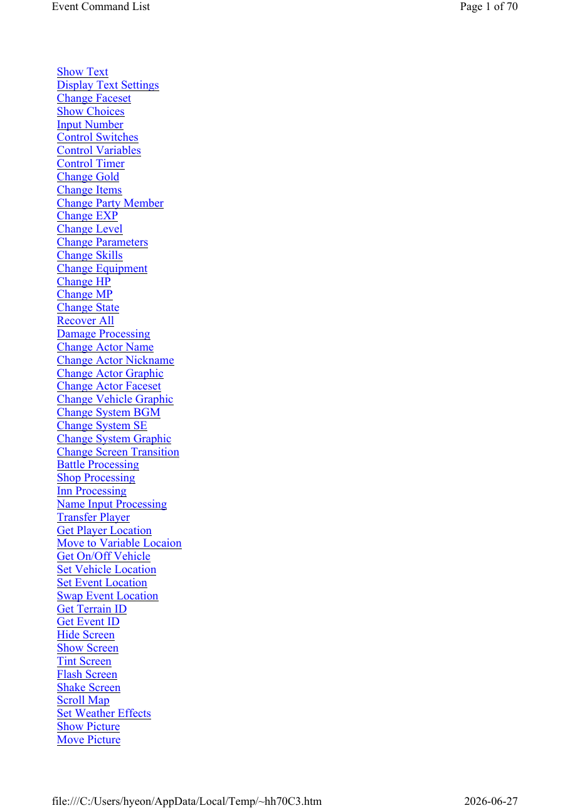

Show Text
Display Text Settings
Change Faceset
Show Choices
Input Number
Control Switches
Control Variables
Control Timer
Change Gold
Change Items
Change Party Member
Change EXP
Change Level
Change Parameters
Change Skills
Change Equipment
Change HP
Change MP
Change State
Recover All
Damage Processing
Change Actor Name
Change Actor Nickname
Change Actor Graphic
Change Actor Faceset
Change Vehicle Graphic
Change System BGM
Change System SE
Change System Graphic
Change Screen Transition
Battle Processing
Shop Processing
Inn Processing
Name Input Processing
Transfer Player
Get Player Location
Move to Variable Locaion
Get On/Off Vehicle
Set Vehicle Location
Set Event Location
Swap Event Location
Get Terrain ID
Get Event ID
Hide Screen
Show Screen
Tint Screen
Flash Screen
Shake Screen
Scroll Map
Set Weather Effects
Show Picture
Move Picture

## Page 2

Rendered page image

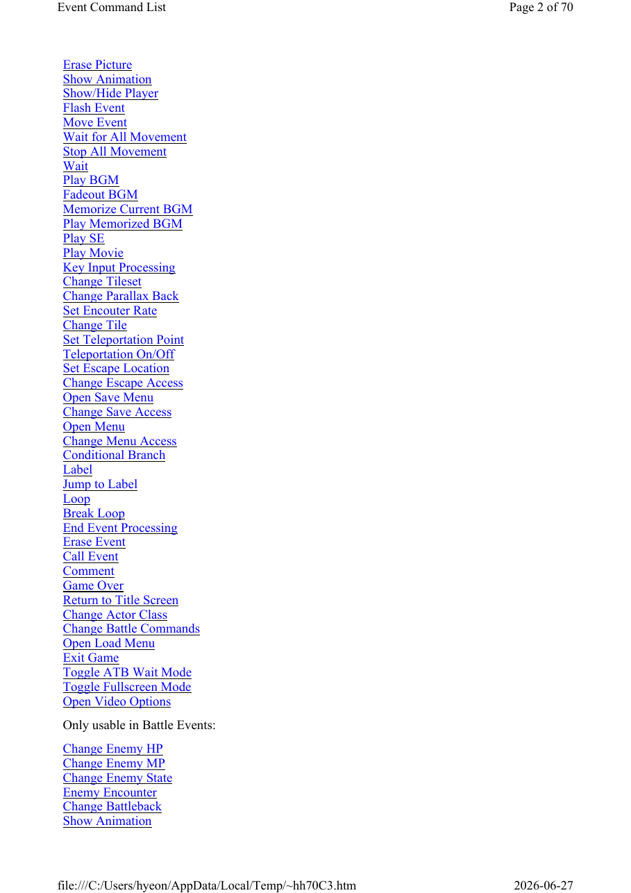

Erase Picture
Show Animation
Show/Hide Player
Flash Event
Move Event
Wait for All Movement
Stop All Movement
Wait
Play BGM
Fadeout BGM
Memorize Current BGM
Play Memorized BGM
Play SE
Play Movie
Key Input Processing
Change Tileset
Change Parallax Back
Set Encouter Rate
Change Tile
Set Teleportation Point
Teleportation On/Off
Set Escape Location
Change Escape Access
Open Save Menu
Change Save Access
Open Menu
Change Menu Access
Conditional Branch
Label
Jump to Label
Loop
Break Loop
End Event Processing
Erase Event
Call Event
Comment
Game Over
Return to Title Screen
Change Actor Class
Change Battle Commands
Open Load Menu
Exit Game
Toggle ATB Wait Mode
Toggle Fullscreen Mode
Open Video Options
#### Only usable in Battle Events
Change Enemy HP
Change Enemy MP
Change Enemy State
Enemy Encounter
Change Battleback
Show Animation

## Page 3

Rendered page image

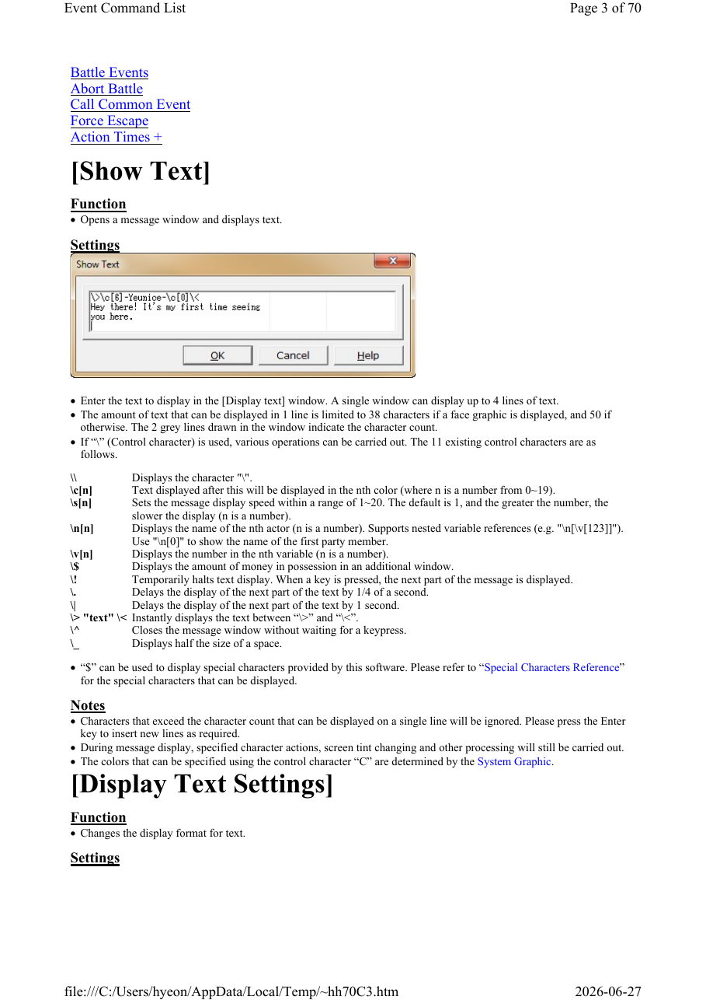

#### Embedded Images

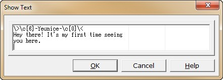

#### Battle Events
Abort Battle
Call Common Event
Force Escape
Action Times +
### Show Text
#### Function
· Opens a message window and displays text.
#### Settings
· Enter the text to display in the [Display text] window. A single window can display up to 4 lines of text.
· The amount of text that can be displayed in 1 line is limited to 38 characters if a face graphic is displayed, and 50 if
otherwise. The 2 grey lines drawn in the window indicate the character count.
· If “\” (Control character) is used, various operations can be carried out. The 11 existing control characters are as
follows.
\\ Displays the character "\".
\c[n] Text displayed after this will be displayed in the nth color (where n is a number from 0~19).
\s[n] Sets the message display speed within a range of 1~20. The default is 1, and the greater the number, the
slower the display (n is a number).
\n[n] Displays the name of the nth actor (n is a number). Supports nested variable references (e.g. "\n[\v[123]]").
Use "\n[0]" to show the name of the first party member.
\v[n] Displays the number in the nth variable (n is a number).
\$ Displays the amount of money in possession in an additional window.
\! Temporarily halts text display. When a key is pressed, the next part of the message is displayed.
\. Delays the display of the next part of the text by 1/4 of a second.
\| Delays the display of the next part of the text by 1 second.
\> "text" \< Instantly displays the text between “\>” and “\<”.
\^ Closes the message window without waiting for a keypress.
\_ Displays half the size of a space.
· “$” can be used to display special characters provided by this software. Please refer to “Special Characters Reference”
for the special characters that can be displayed.
#### Notes
· Characters that exceed the character count that can be displayed on a single line will be ignored. Please press the Enter
key to insert new lines as required.
· During message display, specified character actions, screen tint changing and other processing will still be carried out.
· The colors that can be specified using the control character “C” are determined by the System Graphic.
### Display Text Settings
#### Function
· Changes the display format for text.
#### Settings

## Page 4

Rendered page image

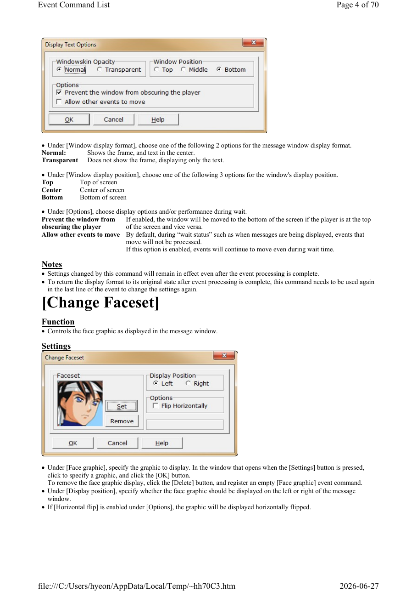

#### Embedded Images

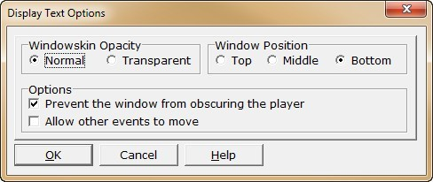

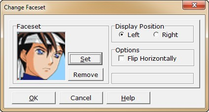

· Under [Window display format], choose one of the following 2 options for the message window display format.
Normal: Shows the frame, and text in the center.
Transparent Does not show the frame, displaying only the text.
· Under [Window display position], choose one of the following 3 options for the window's display position.
Top Top of screen
Center Center of screen
Bottom Bottom of screen
· Under [Options], choose display options and/or performance during wait.
Prevent the window from If enabled, the window will be moved to the bottom of the screen if the player is at the top
obscuring the player of the screen and vice versa.
Allow other events to move By default, during “wait status” such as when messages are being displayed, events that
move will not be processed.
If this option is enabled, events will continue to move even during wait time.
#### Notes
· Settings changed by this command will remain in effect even after the event processing is complete.
· To return the display format to its original state after event processing is complete, this command needs to be used again
in the last line of the event to change the settings again.
### Change Faceset
#### Function
· Controls the face graphic as displayed in the message window.
#### Settings
· Under [Face graphic], specify the graphic to display. In the window that opens when the [Settings] button is pressed,
click to specify a graphic, and click the [OK] button.
To remove the face graphic display, click the [Delete] button, and register an empty [Face graphic] event command.
· Under [Display position], specify whether the face graphic should be displayed on the left or right of the message
window.
· If [Horizontal flip] is enabled under [Options], the graphic will be displayed horizontally flipped.

## Page 5

Rendered page image

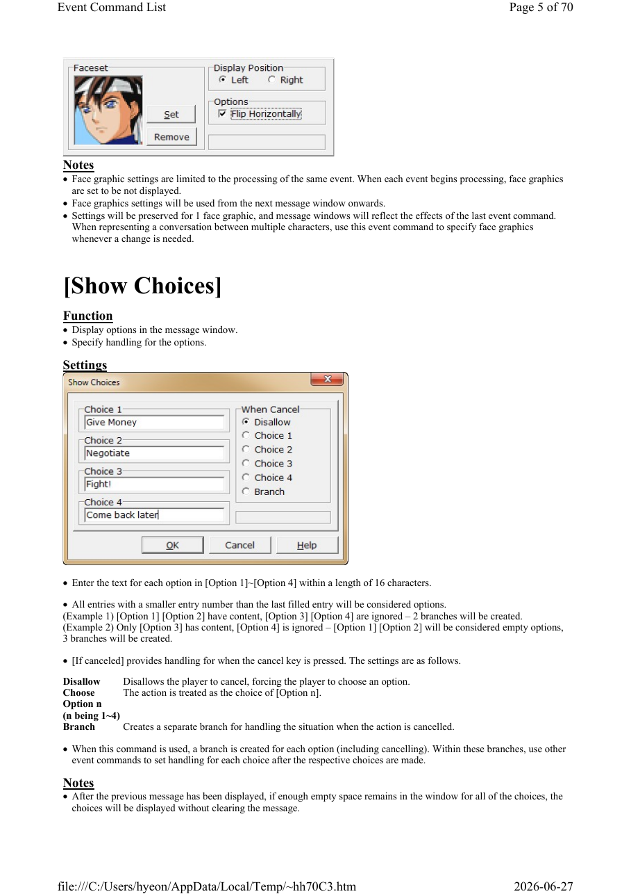

#### Embedded Images

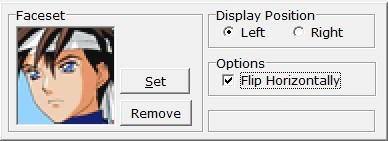

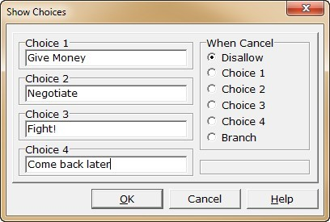

#### Notes
· Face graphic settings are limited to the processing of the same event. When each event begins processing, face graphics
are set to be not displayed.
· Face graphics settings will be used from the next message window onwards.
· Settings will be preserved for 1 face graphic, and message windows will reflect the effects of the last event command.
When representing a conversation between multiple characters, use this event command to specify face graphics
whenever a change is needed.
### Show Choices
#### Function
· Display options in the message window.
· Specify handling for the options.
#### Settings
· Enter the text for each option in [Option 1]~[Option 4] within a length of 16 characters.
· All entries with a smaller entry number than the last filled entry will be considered options.
(Example 1) [Option 1] [Option 2] have content, [Option 3] [Option 4] are ignored – 2 branches will be created.
(Example 2) Only [Option 3] has content, [Option 4] is ignored – [Option 1] [Option 2] will be considered empty options,
3 branches will be created.
· [If canceled] provides handling for when the cancel key is pressed. The settings are as follows.
Disallow Disallows the player to cancel, forcing the player to choose an option.
Choose The action is treated as the choice of [Option n].
Option n
(n being 1~4)
Branch Creates a separate branch for handling the situation when the action is cancelled.
· When this command is used, a branch is created for each option (including cancelling). Within these branches, use other
event commands to set handling for each choice after the respective choices are made.
#### Notes
· After the previous message has been displayed, if enough empty space remains in the window for all of the choices, the
choices will be displayed without clearing the message.

## Page 6

Rendered page image

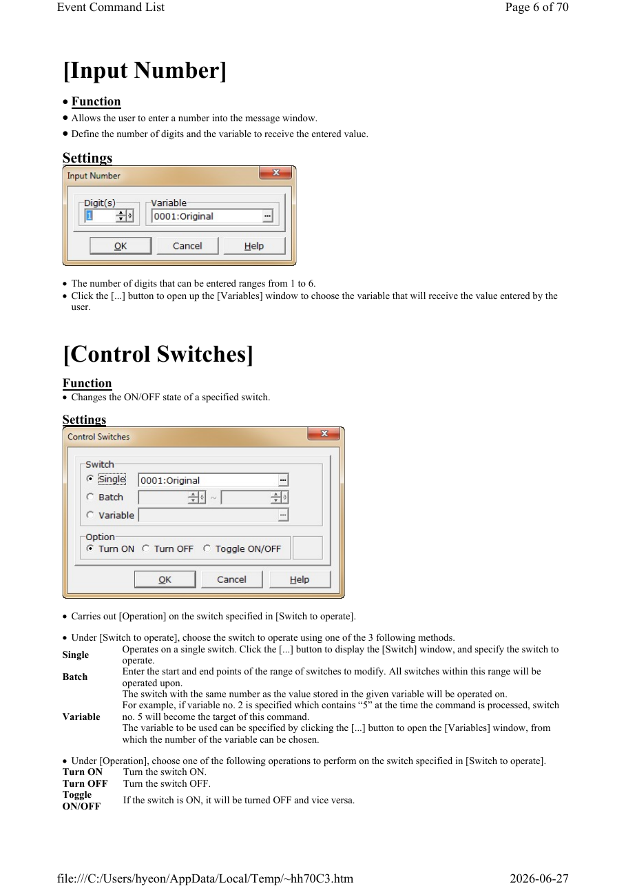

#### Embedded Images

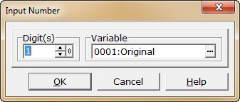

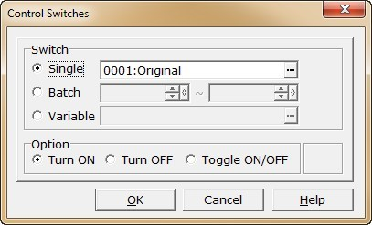

### Input Number
· Function
· Allows the user to enter a number into the message window.
· Define the number of digits and the variable to receive the entered value.
#### Settings
· The number of digits that can be entered ranges from 1 to 6.
· Click the [...] button to open up the [Variables] window to choose the variable that will receive the value entered by the
user.
### Control Switches
#### Function
· Changes the ON/OFF state of a specified switch.
#### Settings
· Carries out [Operation] on the switch specified in [Switch to operate].
· Under [Switch to operate], choose the switch to operate using one of the 3 following methods.
Operates on a single switch. Click the [...] button to display the [Switch] window, and specify the switch to
Single
operate.
Enter the start and end points of the range of switches to modify. All switches within this range will be
Batch
operated upon.
The switch with the same number as the value stored in the given variable will be operated on.
For example, if variable no. 2 is specified which contains “5” at the time the command is processed, switch
Variable no. 5 will become the target of this command.
The variable to be used can be specified by clicking the [...] button to open the [Variables] window, from
which the number of the variable can be chosen.
· Under [Operation], choose one of the following operations to perform on the switch specified in [Switch to operate].
Turn ON Turn the switch ON.
Turn OFF Turn the switch OFF.
Toggle
If the switch is ON, it will be turned OFF and vice versa.
ON/OFF

## Page 7

Rendered page image

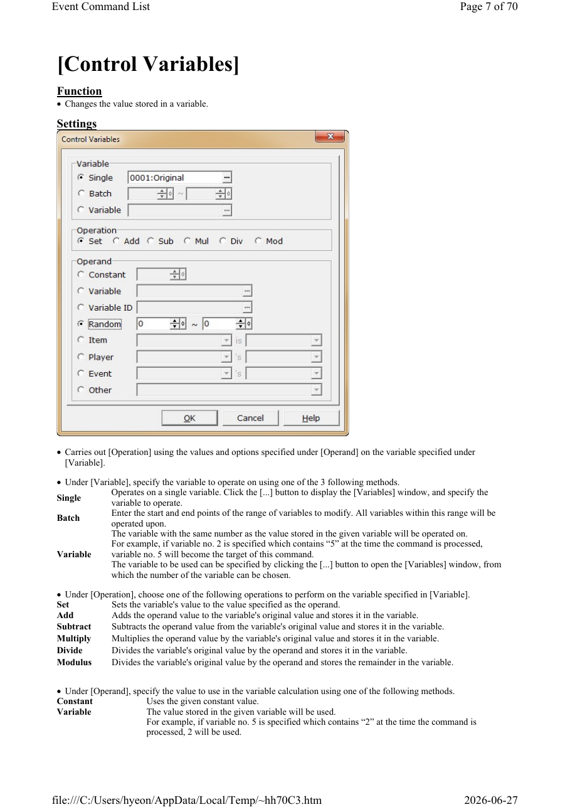

#### Embedded Images

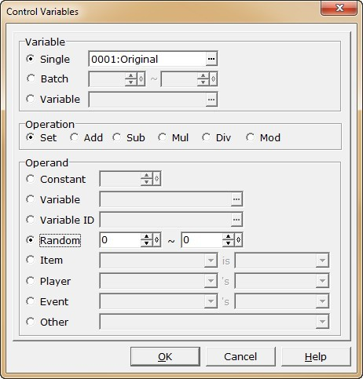

### Control Variables
#### Function
· Changes the value stored in a variable.
#### Settings
· Carries out [Operation] using the values and options specified under [Operand] on the variable specified under
[Variable].
· Under [Variable], specify the variable to operate on using one of the 3 following methods.
Operates on a single variable. Click the [...] button to display the [Variables] window, and specify the
Single
variable to operate.
Enter the start and end points of the range of variables to modify. All variables within this range will be
Batch
operated upon.
The variable with the same number as the value stored in the given variable will be operated on.
For example, if variable no. 2 is specified which contains “5” at the time the command is processed,
Variable variable no. 5 will become the target of this command.
The variable to be used can be specified by clicking the [...] button to open the [Variables] window, from
which the number of the variable can be chosen.
· Under [Operation], choose one of the following operations to perform on the variable specified in [Variable].
Set Sets the variable's value to the value specified as the operand.
Add Adds the operand value to the variable's original value and stores it in the variable.
Subtract Subtracts the operand value from the variable's original value and stores it in the variable.
Multiply Multiplies the operand value by the variable's original value and stores it in the variable.
Divide Divides the variable's original value by the operand and stores it in the variable.
Modulus Divides the variable's original value by the operand and stores the remainder in the variable.
· Under [Operand], specify the value to use in the variable calculation using one of the following methods.
Constant Uses the given constant value.
Variable The value stored in the given variable will be used.
For example, if variable no. 5 is specified which contains “2” at the time the command is
processed, 2 will be used.

## Page 8

Rendered page image

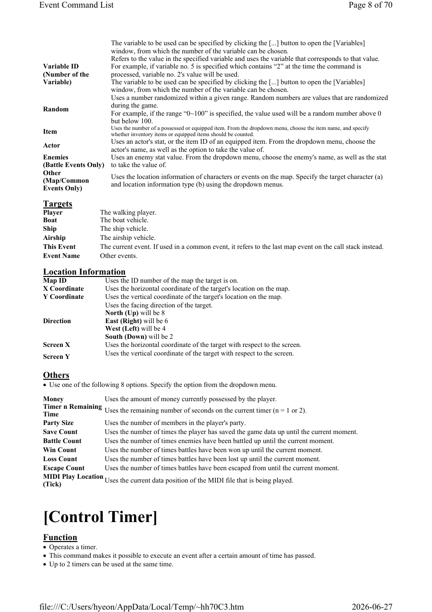

The variable to be used can be specified by clicking the [...] button to open the [Variables]
window, from which the number of the variable can be chosen.
Refers to the value in the specified variable and uses the variable that corresponds to that value.
Variable ID For example, if variable no. 5 is specified which contains “2” at the time the command is
(Number of the processed, variable no. 2's value will be used.
Variable) The variable to be used can be specified by clicking the [...] button to open the [Variables]
window, from which the number of the variable can be chosen.
Uses a number randomized within a given range. Random numbers are values that are randomized
during the game.
Random
For example, if the range “0~100” is specified, the value used will be a random number above 0
but below 100.
Uses the number of a possessed or equipped item. From the dropdown menu, choose the item name, and specify
Item
whether inventory items or equipped items should be counted.
Uses an actor's stat, or the item ID of an equipped item. From the dropdown menu, choose the
Actor
actor's name, as well as the option to take the value of.
Enemies Uses an enemy stat value. From the dropdown menu, choose the enemy's name, as well as the stat
(Battle Events Only) to take the value of.
Other
Uses the location information of characters or events on the map. Specify the target character (a)
(Map/Common
and location information type (b) using the dropdown menus.
Events Only)
#### Targets
Player The walking player.
Boat The boat vehicle.
Ship The ship vehicle.
Airship The airship vehicle.
This Event The current event. If used in a common event, it refers to the last map event on the call stack instead.
Event Name Other events.
#### Location Information
Map ID Uses the ID number of the map the target is on.
X Coordinate Uses the horizontal coordinate of the target's location on the map.
Y Coordinate Uses the vertical coordinate of the target's location on the map.
Uses the facing direction of the target.
North (Up) will be 8
Direction East (Right) will be 6
West (Left) will be 4
South (Down) will be 2
Screen X Uses the horizontal coordinate of the target with respect to the screen.
Uses the vertical coordinate of the target with respect to the screen.
Screen Y
#### Others
· Use one of the following 8 options. Specify the option from the dropdown menu.
Money Uses the amount of money currently possessed by the player.
Timer n Remaining
Uses the remaining number of seconds on the current timer (n = 1 or 2).
Time
Party Size Uses the number of members in the player's party.
Save Count Uses the number of times the player has saved the game data up until the current moment.
Battle Count Uses the number of times enemies have been battled up until the current moment.
Win Count Uses the number of times battles have been won up until the current moment.
Loss Count Uses the number of times battles have been lost up until the current moment.
Escape Count Uses the number of times battles have been escaped from until the current moment.
MIDI Play Location
Uses the current data position of the MIDI file that is being played.
(Tick)
### Control Timer
#### Function
· Operates a timer.
· This command makes it possible to execute an event after a certain amount of time has passed.
· Up to 2 timers can be used at the same time.

## Page 9

Rendered page image

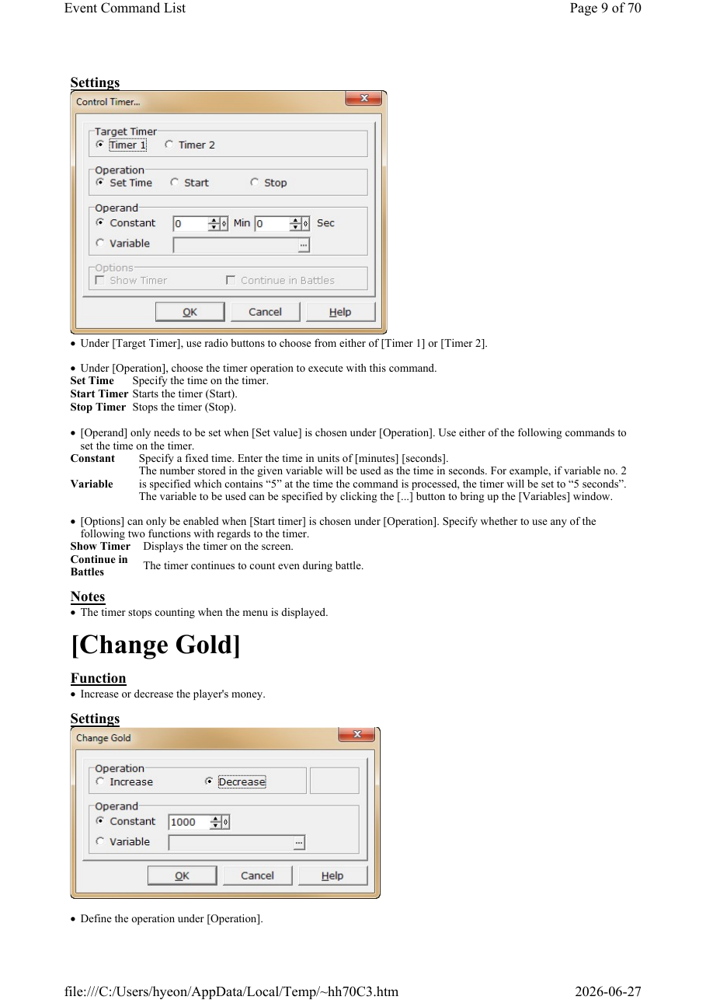

#### Embedded Images

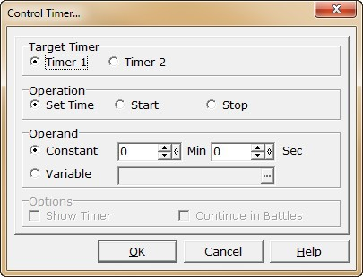

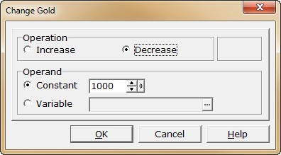

#### Settings
· Under [Target Timer], use radio buttons to choose from either of [Timer 1] or [Timer 2].
· Under [Operation], choose the timer operation to execute with this command.
Set Time Specify the time on the timer.
Start Timer Starts the timer (Start).
Stop Timer Stops the timer (Stop).
· [Operand] only needs to be set when [Set value] is chosen under [Operation]. Use either of the following commands to
set the time on the timer.
Constant Specify a fixed time. Enter the time in units of [minutes] [seconds].
The number stored in the given variable will be used as the time in seconds. For example, if variable no. 2
Variable is specified which contains “5” at the time the command is processed, the timer will be set to “5 seconds”.
The variable to be used can be specified by clicking the [...] button to bring up the [Variables] window.
· [Options] can only be enabled when [Start timer] is chosen under [Operation]. Specify whether to use any of the
following two functions with regards to the timer.
Show Timer Displays the timer on the screen.
Continue in
The timer continues to count even during battle.
Battles
#### Notes
· The timer stops counting when the menu is displayed.
### Change Gold
#### Function
· Increase or decrease the player's money.
#### Settings
· Define the operation under [Operation].

## Page 10

Rendered page image

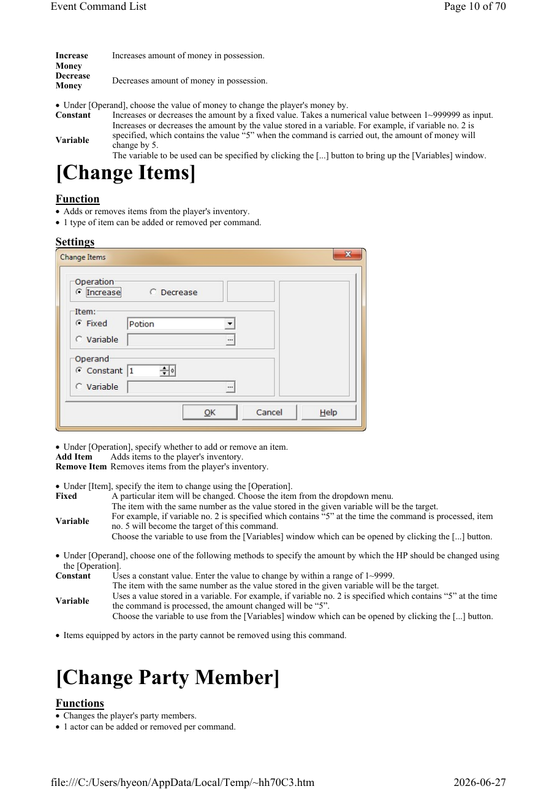

#### Embedded Images

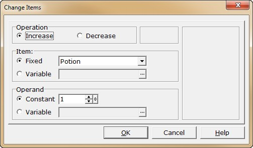

Increase Increases amount of money in possession.
Money
Decrease
Decreases amount of money in possession.
Money
· Under [Operand], choose the value of money to change the player's money by.
Constant Increases or decreases the amount by a fixed value. Takes a numerical value between 1~999999 as input.
Increases or decreases the amount by the value stored in a variable. For example, if variable no. 2 is
specified, which contains the value “5” when the command is carried out, the amount of money will
Variable
change by 5.
The variable to be used can be specified by clicking the [...] button to bring up the [Variables] window.
### Change Items
#### Function
· Adds or removes items from the player's inventory.
· 1 type of item can be added or removed per command.
#### Settings
· Under [Operation], specify whether to add or remove an item.
Add Item Adds items to the player's inventory.
Remove Item Removes items from the player's inventory.
· Under [Item], specify the item to change using the [Operation].
Fixed A particular item will be changed. Choose the item from the dropdown menu.
The item with the same number as the value stored in the given variable will be the target.
For example, if variable no. 2 is specified which contains “5” at the time the command is processed, item
Variable
no. 5 will become the target of this command.
Choose the variable to use from the [Variables] window which can be opened by clicking the [...] button.
· Under [Operand], choose one of the following methods to specify the amount by which the HP should be changed using
the [Operation].
Constant Uses a constant value. Enter the value to change by within a range of 1~9999.
The item with the same number as the value stored in the given variable will be the target.
Uses a value stored in a variable. For example, if variable no. 2 is specified which contains “5” at the time
Variable
the command is processed, the amount changed will be “5”.
Choose the variable to use from the [Variables] window which can be opened by clicking the [...] button.
· Items equipped by actors in the party cannot be removed using this command.
### Change Party Member
#### Functions
· Changes the player's party members.
· 1 actor can be added or removed per command.

## Page 11

Rendered page image

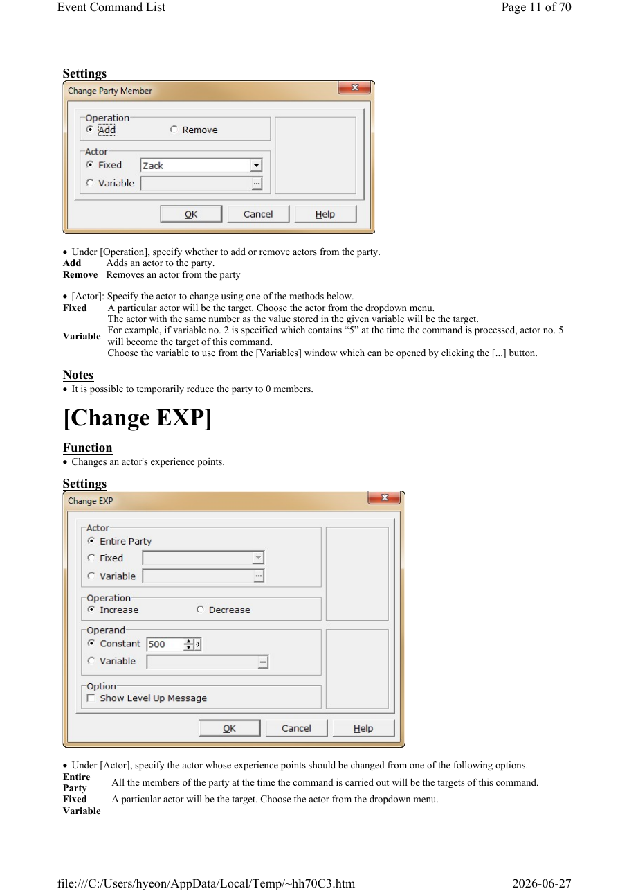

#### Embedded Images

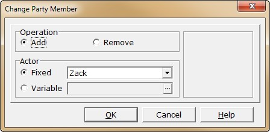

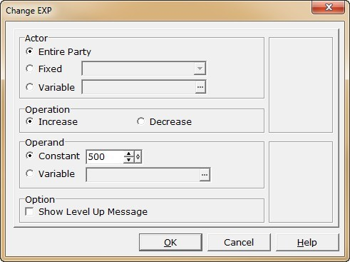

#### Settings
· Under [Operation], specify whether to add or remove actors from the party.
Add Adds an actor to the party.
Remove Removes an actor from the party
· [Actor]: Specify the actor to change using one of the methods below.
Fixed A particular actor will be the target. Choose the actor from the dropdown menu.
The actor with the same number as the value stored in the given variable will be the target.
For example, if variable no. 2 is specified which contains “5” at the time the command is processed, actor no. 5
Variable
will become the target of this command.
Choose the variable to use from the [Variables] window which can be opened by clicking the [...] button.
#### Notes
· It is possible to temporarily reduce the party to 0 members.
### Change EXP
#### Function
· Changes an actor's experience points.
#### Settings
· Under [Actor], specify the actor whose experience points should be changed from one of the following options.
Entire
All the members of the party at the time the command is carried out will be the targets of this command.
Party
Fixed A particular actor will be the target. Choose the actor from the dropdown menu.
Variable

## Page 12

Rendered page image

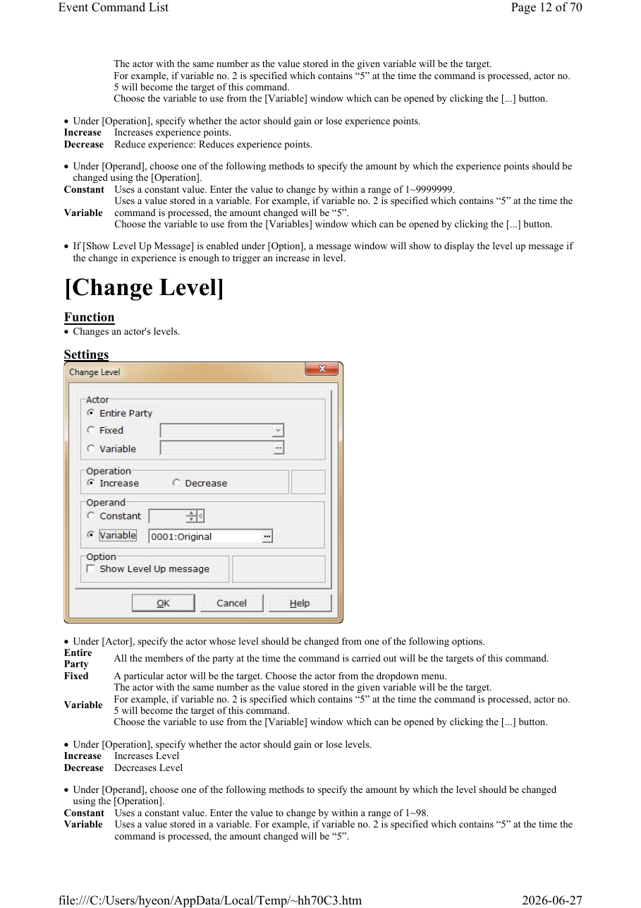

#### Embedded Images

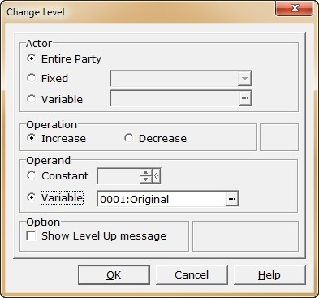

The actor with the same number as the value stored in the given variable will be the target.
For example, if variable no. 2 is specified which contains “5” at the time the command is processed, actor no.
5 will become the target of this command.
Choose the variable to use from the [Variable] window which can be opened by clicking the [...] button.
· Under [Operation], specify whether the actor should gain or lose experience points.
Increase Increases experience points.
Decrease Reduce experience: Reduces experience points.
· Under [Operand], choose one of the following methods to specify the amount by which the experience points should be
changed using the [Operation].
Constant Uses a constant value. Enter the value to change by within a range of 1~9999999.
Uses a value stored in a variable. For example, if variable no. 2 is specified which contains “5” at the time the
Variable command is processed, the amount changed will be “5”.
Choose the variable to use from the [Variables] window which can be opened by clicking the [...] button.
· If [Show Level Up Message] is enabled under [Option], a message window will show to display the level up message if
the change in experience is enough to trigger an increase in level.
### Change Level
#### Function
· Changes an actor's levels.
#### Settings
· Under [Actor], specify the actor whose level should be changed from one of the following options.
Entire
All the members of the party at the time the command is carried out will be the targets of this command.
Party
Fixed A particular actor will be the target. Choose the actor from the dropdown menu.
The actor with the same number as the value stored in the given variable will be the target.
For example, if variable no. 2 is specified which contains “5” at the time the command is processed, actor no.
Variable
5 will become the target of this command.
Choose the variable to use from the [Variable] window which can be opened by clicking the [...] button.
· Under [Operation], specify whether the actor should gain or lose levels.
Increase Increases Level
Decrease Decreases Level
· Under [Operand], choose one of the following methods to specify the amount by which the level should be changed
using the [Operation].
Constant Uses a constant value. Enter the value to change by within a range of 1~98.
Variable Uses a value stored in a variable. For example, if variable no. 2 is specified which contains “5” at the time the
command is processed, the amount changed will be “5”.

## Page 13

Rendered page image

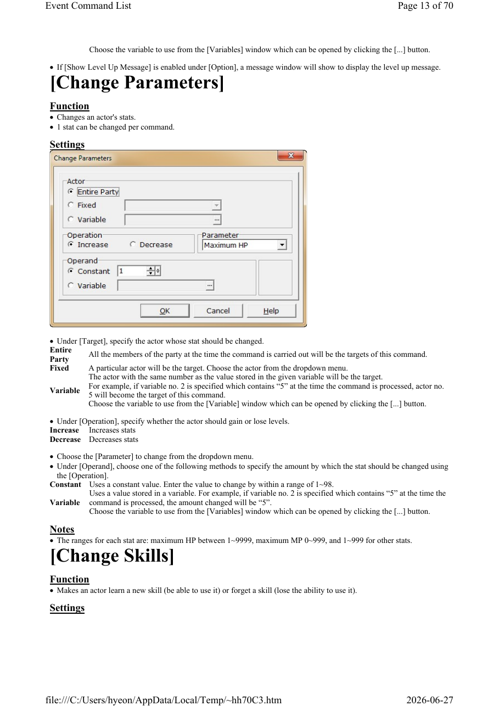

#### Embedded Images

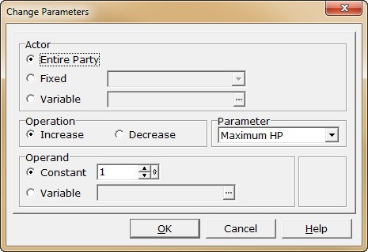

Choose the variable to use from the [Variables] window which can be opened by clicking the [...] button.
· If [Show Level Up Message] is enabled under [Option], a message window will show to display the level up message.
### Change Parameters
#### Function
· Changes an actor's stats.
· 1 stat can be changed per command.
#### Settings
· Under [Target], specify the actor whose stat should be changed.
Entire
All the members of the party at the time the command is carried out will be the targets of this command.
Party
Fixed A particular actor will be the target. Choose the actor from the dropdown menu.
The actor with the same number as the value stored in the given variable will be the target.
For example, if variable no. 2 is specified which contains “5” at the time the command is processed, actor no.
Variable
5 will become the target of this command.
Choose the variable to use from the [Variable] window which can be opened by clicking the [...] button.
· Under [Operation], specify whether the actor should gain or lose levels.
Increase Increases stats
Decrease Decreases stats
· Choose the [Parameter] to change from the dropdown menu.
· Under [Operand], choose one of the following methods to specify the amount by which the stat should be changed using
the [Operation].
Constant Uses a constant value. Enter the value to change by within a range of 1~98.
Uses a value stored in a variable. For example, if variable no. 2 is specified which contains “5” at the time the
Variable command is processed, the amount changed will be “5”.
Choose the variable to use from the [Variables] window which can be opened by clicking the [...] button.
#### Notes
· The ranges for each stat are: maximum HP between 1~9999, maximum MP 0~999, and 1~999 for other stats.
### Change Skills
#### Function
· Makes an actor learn a new skill (be able to use it) or forget a skill (lose the ability to use it).
#### Settings

## Page 14

Rendered page image

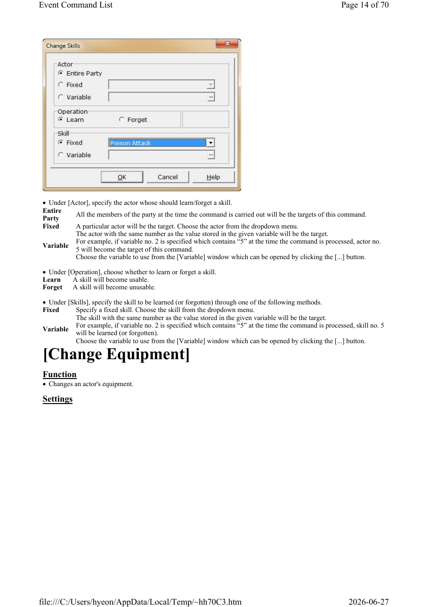

#### Embedded Images

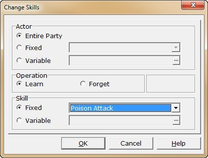

· Under [Actor], specify the actor whose should learn/forget a skill.
Entire
All the members of the party at the time the command is carried out will be the targets of this command.
Party
Fixed A particular actor will be the target. Choose the actor from the dropdown menu.
The actor with the same number as the value stored in the given variable will be the target.
For example, if variable no. 2 is specified which contains “5” at the time the command is processed, actor no.
Variable
5 will become the target of this command.
Choose the variable to use from the [Variable] window which can be opened by clicking the [...] button.
· Under [Operation], choose whether to learn or forget a skill.
Learn A skill will become usable.
Forget A skill will become unusable.
· Under [Skills], specify the skill to be learned (or forgotten) through one of the following methods.
Fixed Specify a fixed skill. Choose the skill from the dropdown menu.
The skill with the same number as the value stored in the given variable will be the target.
For example, if variable no. 2 is specified which contains “5” at the time the command is processed, skill no. 5
Variable
will be learned (or forgotten).
Choose the variable to use from the [Variable] window which can be opened by clicking the [...] button.
### Change Equipment
#### Function
· Changes an actor's equipment.
#### Settings

## Page 15

Rendered page image

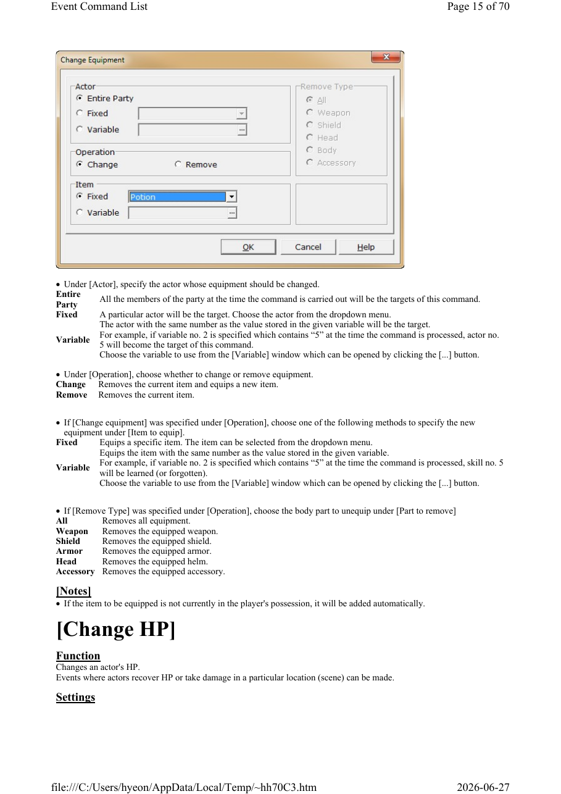

#### Embedded Images

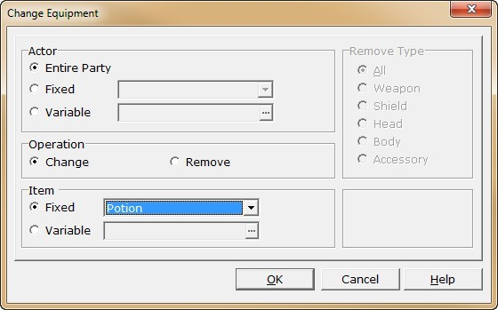

· Under [Actor], specify the actor whose equipment should be changed.
Entire
All the members of the party at the time the command is carried out will be the targets of this command.
Party
Fixed A particular actor will be the target. Choose the actor from the dropdown menu.
The actor with the same number as the value stored in the given variable will be the target.
For example, if variable no. 2 is specified which contains “5” at the time the command is processed, actor no.
Variable
5 will become the target of this command.
Choose the variable to use from the [Variable] window which can be opened by clicking the [...] button.
· Under [Operation], choose whether to change or remove equipment.
Change Removes the current item and equips a new item.
Remove Removes the current item.
· If [Change equipment] was specified under [Operation], choose one of the following methods to specify the new
equipment under [Item to equip].
Fixed Equips a specific item. The item can be selected from the dropdown menu.
Equips the item with the same number as the value stored in the given variable.
For example, if variable no. 2 is specified which contains “5” at the time the command is processed, skill no. 5
Variable
will be learned (or forgotten).
Choose the variable to use from the [Variable] window which can be opened by clicking the [...] button.
· If [Remove Type] was specified under [Operation], choose the body part to unequip under [Part to remove]
All Removes all equipment.
Weapon Removes the equipped weapon.
Shield Removes the equipped shield.
Armor Removes the equipped armor.
Head Removes the equipped helm.
Accessory Removes the equipped accessory.
### Notes
· If the item to be equipped is not currently in the player's possession, it will be added automatically.
### Change HP
#### Function
Changes an actor's HP.
Events where actors recover HP or take damage in a particular location (scene) can be made.
#### Settings

## Page 16

Rendered page image

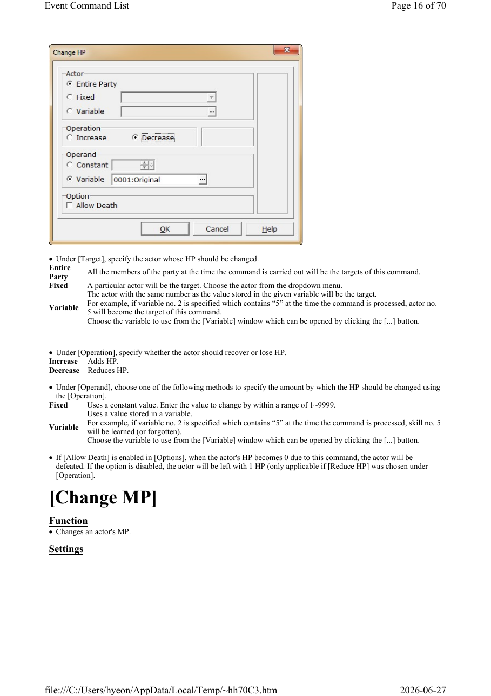

#### Embedded Images

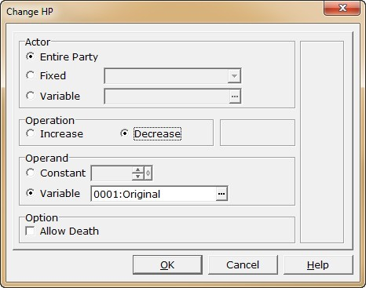

· Under [Target], specify the actor whose HP should be changed.
Entire
All the members of the party at the time the command is carried out will be the targets of this command.
Party
Fixed A particular actor will be the target. Choose the actor from the dropdown menu.
The actor with the same number as the value stored in the given variable will be the target.
For example, if variable no. 2 is specified which contains “5” at the time the command is processed, actor no.
Variable
5 will become the target of this command.
Choose the variable to use from the [Variable] window which can be opened by clicking the [...] button.
· Under [Operation], specify whether the actor should recover or lose HP.
Increase Adds HP.
Decrease Reduces HP.
· Under [Operand], choose one of the following methods to specify the amount by which the HP should be changed using
the [Operation].
Fixed Uses a constant value. Enter the value to change by within a range of 1~9999.
Uses a value stored in a variable.
For example, if variable no. 2 is specified which contains “5” at the time the command is processed, skill no. 5
Variable
will be learned (or forgotten).
Choose the variable to use from the [Variable] window which can be opened by clicking the [...] button.
· If [Allow Death] is enabled in [Options], when the actor's HP becomes 0 due to this command, the actor will be
defeated. If the option is disabled, the actor will be left with 1 HP (only applicable if [Reduce HP] was chosen under
[Operation].
### Change MP
#### Function
· Changes an actor's MP.
#### Settings

## Page 17

Rendered page image

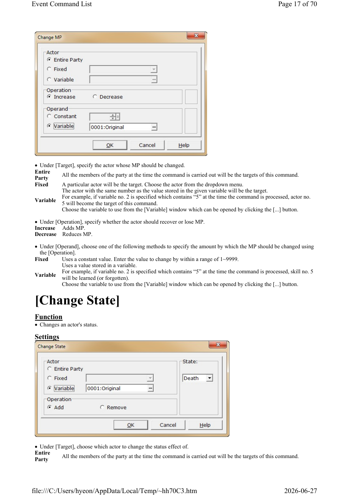

#### Embedded Images

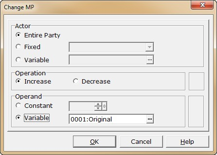

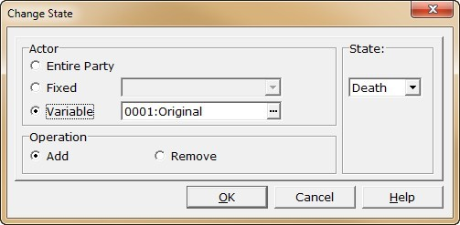

· Under [Target], specify the actor whose MP should be changed.
Entire
All the members of the party at the time the command is carried out will be the targets of this command.
Party
Fixed A particular actor will be the target. Choose the actor from the dropdown menu.
The actor with the same number as the value stored in the given variable will be the target.
For example, if variable no. 2 is specified which contains “5” at the time the command is processed, actor no.
Variable
5 will become the target of this command.
Choose the variable to use from the [Variable] window which can be opened by clicking the [...] button.
· Under [Operation], specify whether the actor should recover or lose MP.
Increase Adds MP.
Decrease Reduces MP.
· Under [Operand], choose one of the following methods to specify the amount by which the MP should be changed using
the [Operation].
Fixed Uses a constant value. Enter the value to change by within a range of 1~9999.
Uses a value stored in a variable.
For example, if variable no. 2 is specified which contains “5” at the time the command is processed, skill no. 5
Variable
will be learned (or forgotten).
Choose the variable to use from the [Variable] window which can be opened by clicking the [...] button.
### Change State
#### Function
· Changes an actor's status.
#### Settings
· Under [Target], choose which actor to change the status effect of.
Entire
All the members of the party at the time the command is carried out will be the targets of this command.
Party

## Page 18

Rendered page image

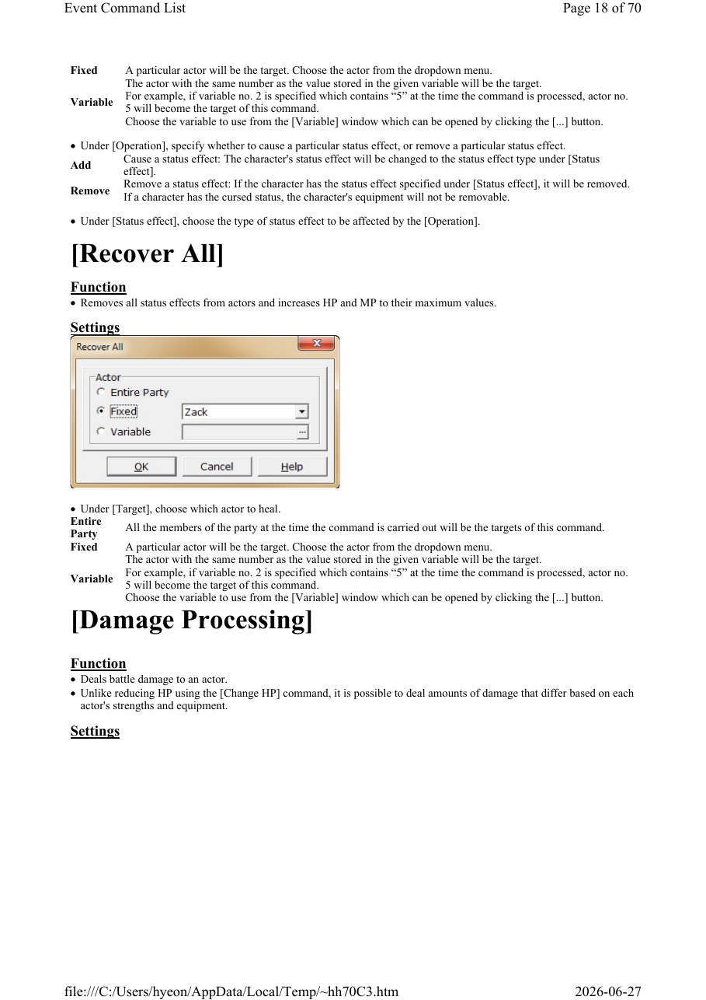

#### Embedded Images

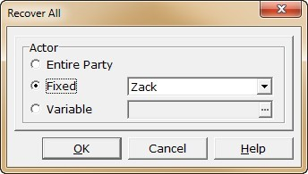

Fixed A particular actor will be the target. Choose the actor from the dropdown menu.
The actor with the same number as the value stored in the given variable will be the target.
For example, if variable no. 2 is specified which contains “5” at the time the command is processed, actor no.
Variable
5 will become the target of this command.
Choose the variable to use from the [Variable] window which can be opened by clicking the [...] button.
· Under [Operation], specify whether to cause a particular status effect, or remove a particular status effect.
Cause a status effect: The character's status effect will be changed to the status effect type under [Status
Add
effect].
Remove a status effect: If the character has the status effect specified under [Status effect], it will be removed.
Remove
If a character has the cursed status, the character's equipment will not be removable.
· Under [Status effect], choose the type of status effect to be affected by the [Operation].
### Recover All
#### Function
· Removes all status effects from actors and increases HP and MP to their maximum values.
#### Settings
· Under [Target], choose which actor to heal.
Entire
All the members of the party at the time the command is carried out will be the targets of this command.
Party
Fixed A particular actor will be the target. Choose the actor from the dropdown menu.
The actor with the same number as the value stored in the given variable will be the target.
For example, if variable no. 2 is specified which contains “5” at the time the command is processed, actor no.
Variable
5 will become the target of this command.
Choose the variable to use from the [Variable] window which can be opened by clicking the [...] button.
### Damage Processing
#### Function
· Deals battle damage to an actor.
· Unlike reducing HP using the [Change HP] command, it is possible to deal amounts of damage that differ based on each
actor's strengths and equipment.
#### Settings

## Page 19

Rendered page image

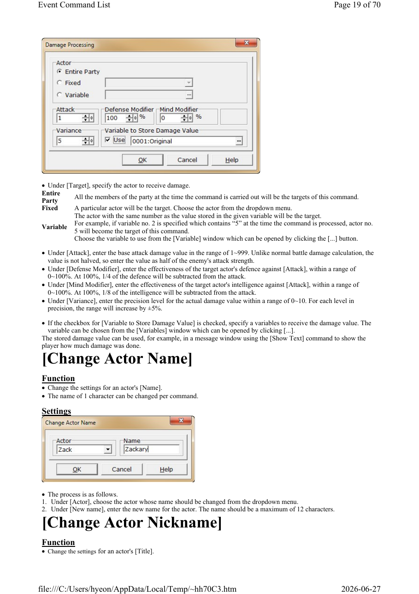

#### Embedded Images

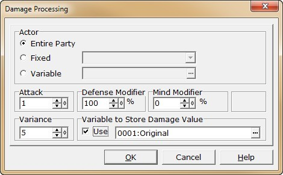

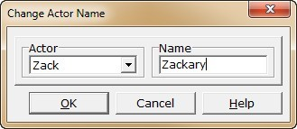

· Under [Target], specify the actor to receive damage.
Entire
All the members of the party at the time the command is carried out will be the targets of this command.
Party
Fixed A particular actor will be the target. Choose the actor from the dropdown menu.
The actor with the same number as the value stored in the given variable will be the target.
For example, if variable no. 2 is specified which contains “5” at the time the command is processed, actor no.
Variable
5 will become the target of this command.
Choose the variable to use from the [Variable] window which can be opened by clicking the [...] button.
· Under [Attack], enter the base attack damage value in the range of 1~999. Unlike normal battle damage calculation, the
value is not halved, so enter the value as half of the enemy's attack strength.
· Under [Defense Modifier], enter the effectiveness of the target actor's defence against [Attack], within a range of
0~100%. At 100%, 1/4 of the defence will be subtracted from the attack.
· Under [Mind Modifier], enter the effectiveness of the target actor's intelligence against [Attack], within a range of
0~100%. At 100%, 1/8 of the intelligence will be subtracted from the attack.
· Under [Variance], enter the precision level for the actual damage value within a range of 0~10. For each level in
precision, the range will increase by ±5%.
· If the checkbox for [Variable to Store Damage Value] is checked, specify a variables to receive the damage value. The
variable can be chosen from the [Variables] window which can be opened by clicking [...].
The stored damage value can be used, for example, in a message window using the [Show Text] command to show the
player how much damage was done.
### Change Actor Name
#### Function
· Change the settings for an actor's [Name].
· The name of 1 character can be changed per command.
#### Settings
· The process is as follows.
1. Under [Actor], choose the actor whose name should be changed from the dropdown menu.
2. Under [New name], enter the new name for the actor. The name should be a maximum of 12 characters.
### Change Actor Nickname
#### Function
· Change the settings for an actor's [Title].

## Page 20

Rendered page image

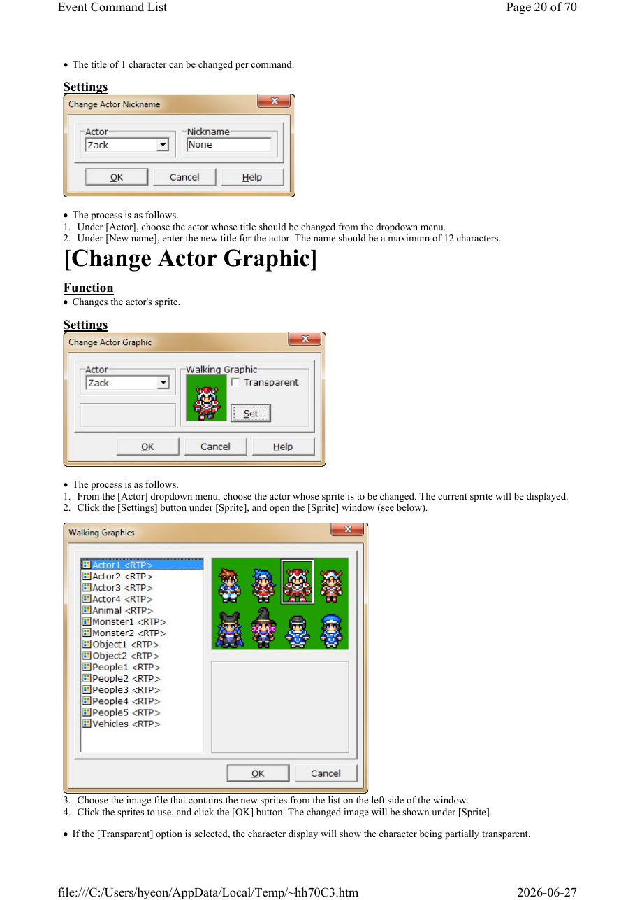

#### Embedded Images

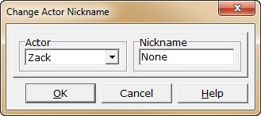

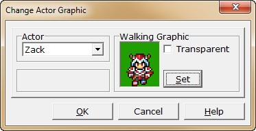

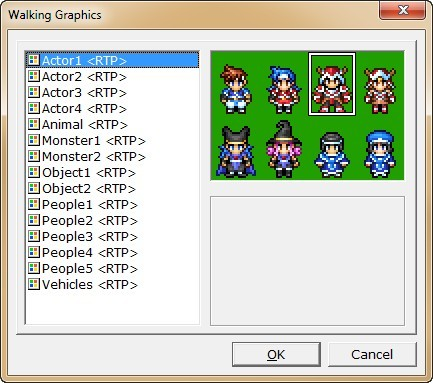

· The title of 1 character can be changed per command.
#### Settings
· The process is as follows.
1. Under [Actor], choose the actor whose title should be changed from the dropdown menu.
2. Under [New name], enter the new title for the actor. The name should be a maximum of 12 characters.
### Change Actor Graphic
#### Function
· Changes the actor's sprite.
#### Settings
· The process is as follows.
1. From the [Actor] dropdown menu, choose the actor whose sprite is to be changed. The current sprite will be displayed.
2. Click the [Settings] button under [Sprite], and open the [Sprite] window (see below).
3. Choose the image file that contains the new sprites from the list on the left side of the window.
4. Click the sprites to use, and click the [OK] button. The changed image will be shown under [Sprite].
· If the [Transparent] option is selected, the character display will show the character being partially transparent.

## Page 21

Rendered page image

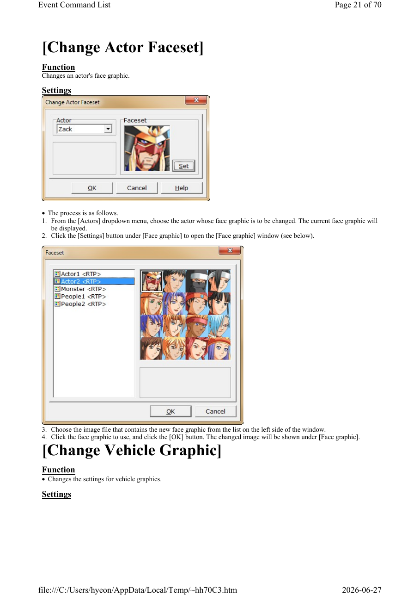

#### Embedded Images

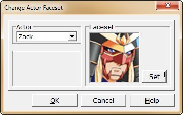

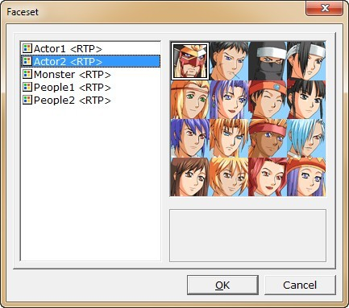

### Change Actor Faceset
#### Function
Changes an actor's face graphic.
#### Settings
· The process is as follows.
1. From the [Actors] dropdown menu, choose the actor whose face graphic is to be changed. The current face graphic will
be displayed.
2. Click the [Settings] button under [Face graphic] to open the [Face graphic] window (see below).
3. Choose the image file that contains the new face graphic from the list on the left side of the window.
4. Click the face graphic to use, and click the [OK] button. The changed image will be shown under [Face graphic].
### Change Vehicle Graphic
#### Function
· Changes the settings for vehicle graphics.
#### Settings

## Page 22

Rendered page image

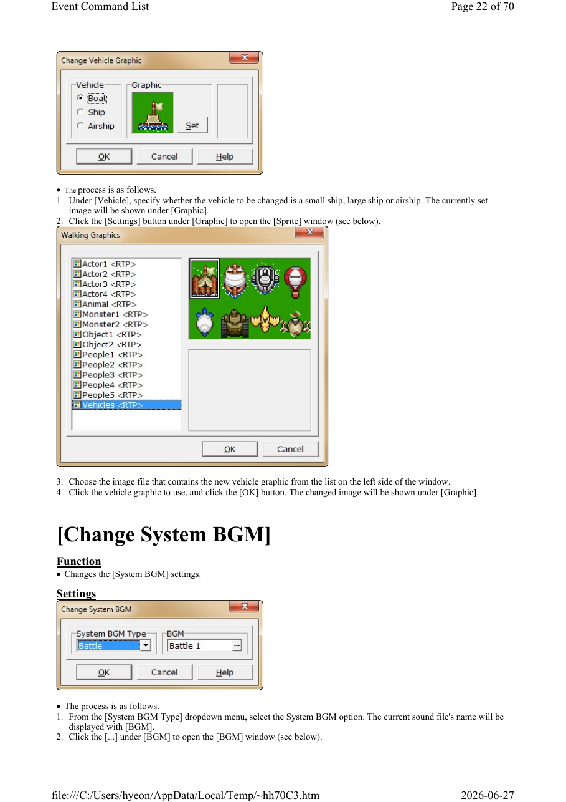

#### Embedded Images

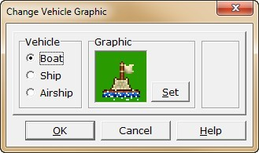

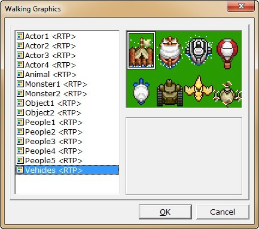

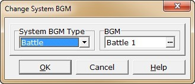

· The process is as follows.
1. Under [Vehicle], specify whether the vehicle to be changed is a small ship, large ship or airship. The currently set
image will be shown under [Graphic].
2. Click the [Settings] button under [Graphic] to open the [Sprite] window (see below).
3. Choose the image file that contains the new vehicle graphic from the list on the left side of the window.
4. Click the vehicle graphic to use, and click the [OK] button. The changed image will be shown under [Graphic].
### Change System BGM
#### Function
· Changes the [System BGM] settings.
#### Settings
· The process is as follows.
1. From the [System BGM Type] dropdown menu, select the System BGM option. The current sound file's name will be
displayed with [BGM].
2. Click the [...] under [BGM] to open the [BGM] window (see below).

## Page 23

Rendered page image

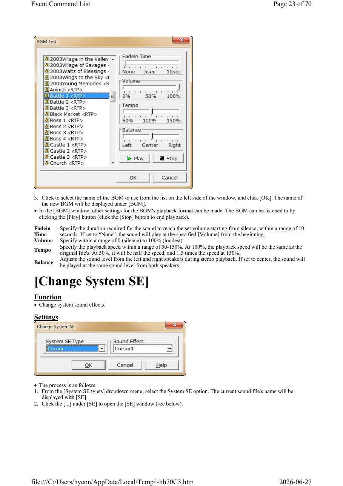

#### Embedded Images

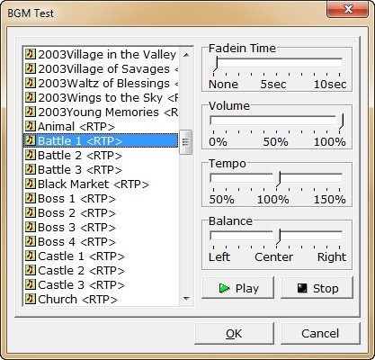

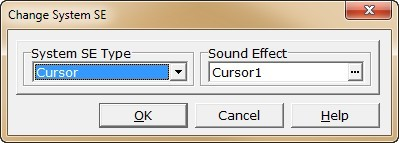

3. Click to select the name of the BGM to use from the list on the left side of the window, and click [OK]. The name of
the new BGM will be displayed under [BGM].
· In the [BGM] window, other settings for the BGM's playback format can be made. The BGM can be listened to by
clicking the [Play] button (click the [Stop] button to end playback).
Fadein Specify the duration required for the sound to reach the set volume starting from silence, within a range of 10
Time seconds. If set to “None”, the sound will play at the specified [Volume] from the beginning.
Volume Specify within a range of 0 (silence) to 100% (loudest).
Specify the playback speed within a range of 50-150%. At 100%, the playback speed will be the same as the
Tempo
original file's. At 50%, it will be half the speed, and 1.5 times the speed at 150%.
Adjusts the sound level from the left and right speakers during stereo playback. If set to center, the sound will
Balance
be played at the same sound level from both speakers.
### Change System SE
#### Function
· Change system sound effects.
#### Settings
· The process is as follows.
1. From the [System SE types] dropdown menu, select the System SE option. The current sound file's name will be
displayed with [SE].
2. Click the [...] under [SE] to open the [SE] window (see below).

## Page 24

Rendered page image

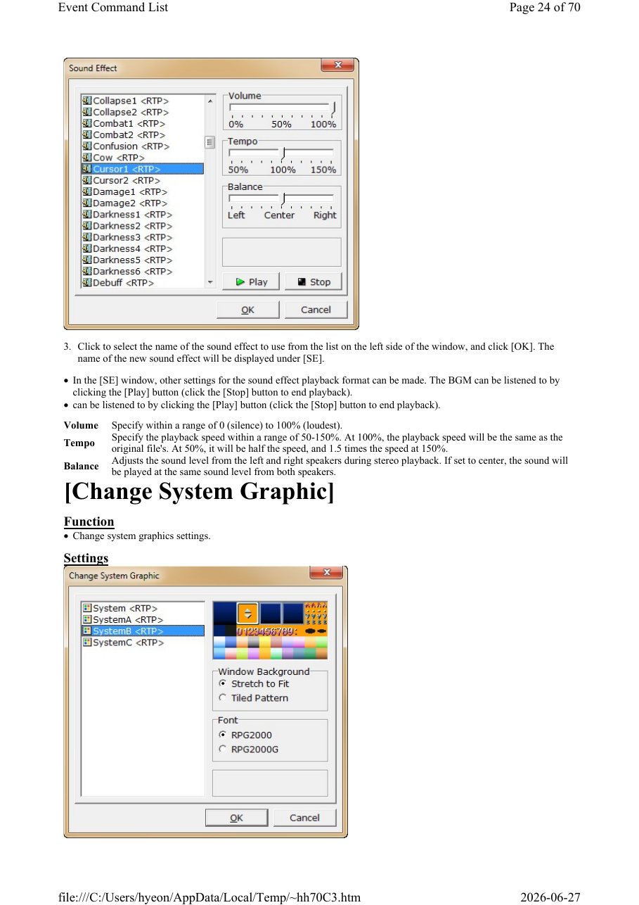

#### Embedded Images

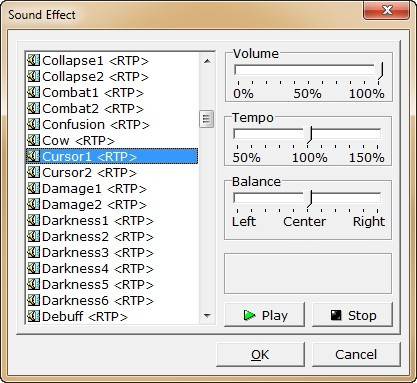

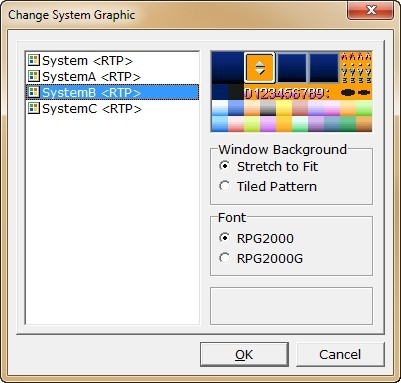

3. Click to select the name of the sound effect to use from the list on the left side of the window, and click [OK]. The
name of the new sound effect will be displayed under [SE].
· In the [SE] window, other settings for the sound effect playback format can be made. The BGM can be listened to by
clicking the [Play] button (click the [Stop] button to end playback).
· can be listened to by clicking the [Play] button (click the [Stop] button to end playback).
Volume Specify within a range of 0 (silence) to 100% (loudest).
Specify the playback speed within a range of 50-150%. At 100%, the playback speed will be the same as the
Tempo
original file's. At 50%, it will be half the speed, and 1.5 times the speed at 150%.
Adjusts the sound level from the left and right speakers during stereo playback. If set to center, the sound will
Balance
be played at the same sound level from both speakers.
### Change System Graphic
#### Function
· Change system graphics settings.
#### Settings

## Page 25

Rendered page image

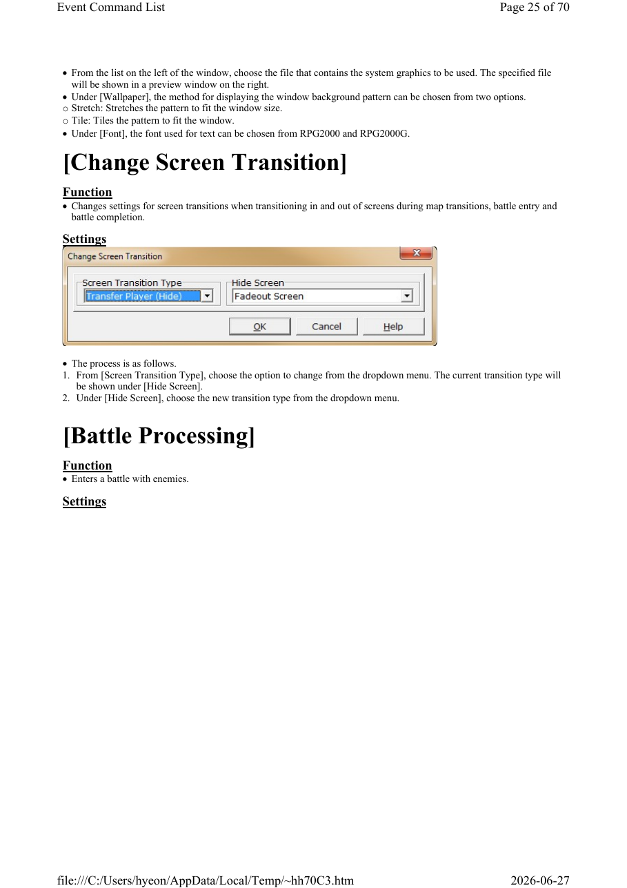

#### Embedded Images

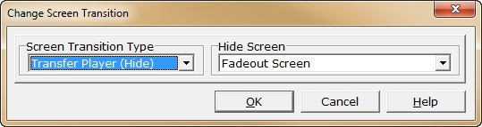

· From the list on the left of the window, choose the file that contains the system graphics to be used. The specified file
will be shown in a preview window on the right.
· Under [Wallpaper], the method for displaying the window background pattern can be chosen from two options.
o Stretch: Stretches the pattern to fit the window size.
o Tile: Tiles the pattern to fit the window.
· Under [Font], the font used for text can be chosen from RPG2000 and RPG2000G.
### Change Screen Transition
#### Function
· Changes settings for screen transitions when transitioning in and out of screens during map transitions, battle entry and
battle completion.
#### Settings
· The process is as follows.
1. From [Screen Transition Type], choose the option to change from the dropdown menu. The current transition type will
be shown under [Hide Screen].
2. Under [Hide Screen], choose the new transition type from the dropdown menu.
### Battle Processing
#### Function
· Enters a battle with enemies.
#### Settings

## Page 26

Rendered page image

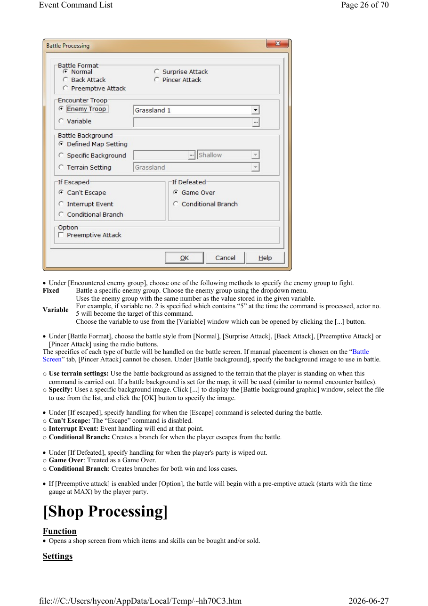

#### Embedded Images

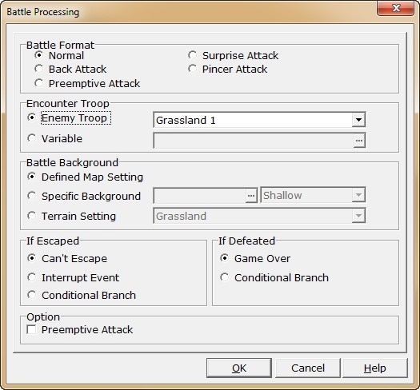

· Under [Encountered enemy group], choose one of the following methods to specify the enemy group to fight.
Fixed Battle a specific enemy group. Choose the enemy group using the dropdown menu.
Uses the enemy group with the same number as the value stored in the given variable.
For example, if variable no. 2 is specified which contains “5” at the time the command is processed, actor no.
Variable
5 will become the target of this command.
Choose the variable to use from the [Variable] window which can be opened by clicking the [...] button.
· Under [Battle Format], choose the battle style from [Normal], [Surprise Attack], [Back Attack], [Preemptive Attack] or
[Pincer Attack] using the radio buttons.
The specifics of each type of battle will be handled on the battle screen. If manual placement is chosen on the “Battle
Screen” tab, [Pincer Attack] cannot be chosen. Under [Battle background], specify the background image to use in battle.
o Use terrain settings: Use the battle background as assigned to the terrain that the player is standing on when this
command is carried out. If a battle background is set for the map, it will be used (similar to normal encounter battles).
o Specify: Uses a specific background image. Click [...] to display the [Battle background graphic] window, select the file
to use from the list, and click the [OK] button to specify the image.
· Under [If escaped], specify handling for when the [Escape] command is selected during the battle.
o Can't Escape: The “Escape” command is disabled.
o Interrupt Event: Event handling will end at that point.
o Conditional Branch: Creates a branch for when the player escapes from the battle.
· Under [If Defeated], specify handling for when the player's party is wiped out.
o Game Over: Treated as a Game Over.
o Conditional Branch: Creates branches for both win and loss cases.
· If [Preemptive attack] is enabled under [Option], the battle will begin with a pre-emptive attack (starts with the time
gauge at MAX) by the player party.
### Shop Processing
#### Function
· Opens a shop screen from which items and skills can be bought and/or sold.
#### Settings

## Page 27

Rendered page image

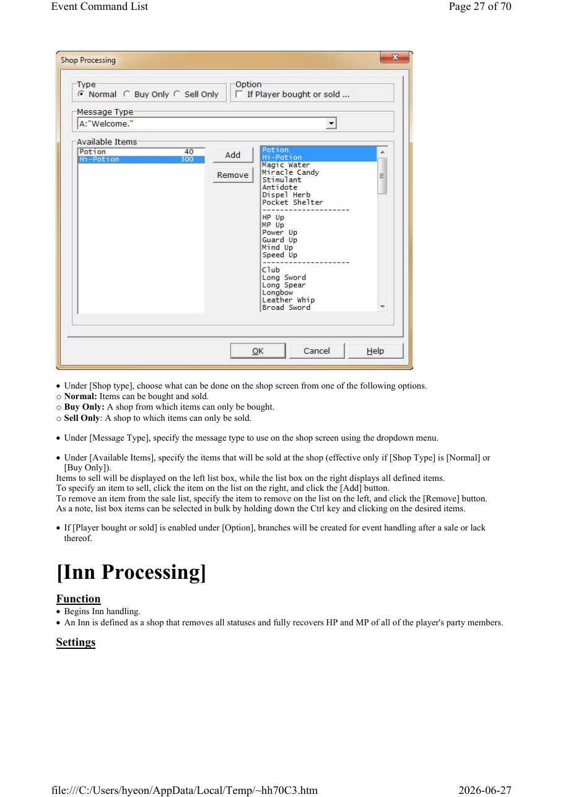

#### Embedded Images

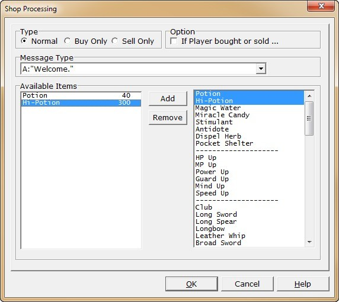

· Under [Shop type], choose what can be done on the shop screen from one of the following options.
o Normal: Items can be bought and sold.
o Buy Only: A shop from which items can only be bought.
o Sell Only: A shop to which items can only be sold.
· Under [Message Type], specify the message type to use on the shop screen using the dropdown menu.
· Under [Available Items], specify the items that will be sold at the shop (effective only if [Shop Type] is [Normal] or
[Buy Only]).
Items to sell will be displayed on the left list box, while the list box on the right displays all defined items.
To specify an item to sell, click the item on the list on the right, and click the [Add] button.
To remove an item from the sale list, specify the item to remove on the list on the left, and click the [Remove] button.
As a note, list box items can be selected in bulk by holding down the Ctrl key and clicking on the desired items.
· If [Player bought or sold] is enabled under [Option], branches will be created for event handling after a sale or lack
thereof.
### Inn Processing
#### Function
· Begins Inn handling.
· An Inn is defined as a shop that removes all statuses and fully recovers HP and MP of all of the player's party members.
#### Settings

## Page 28

Rendered page image

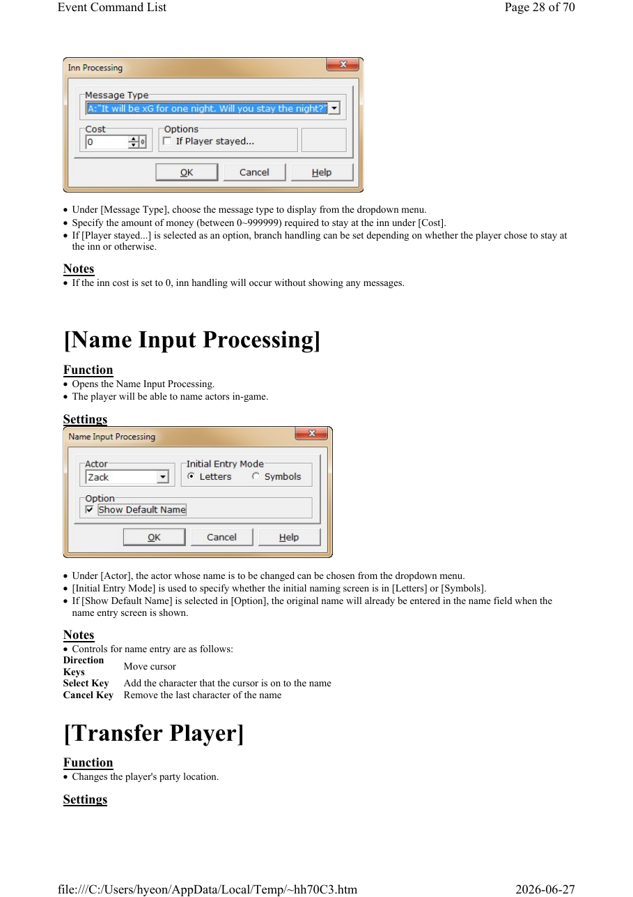

#### Embedded Images

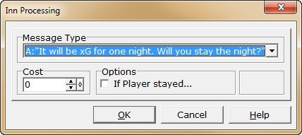

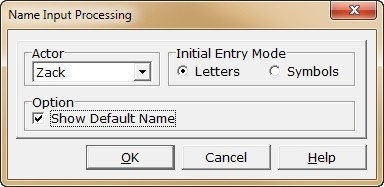

· Under [Message Type], choose the message type to display from the dropdown menu.
· Specify the amount of money (between 0~999999) required to stay at the inn under [Cost].
· If [Player stayed...] is selected as an option, branch handling can be set depending on whether the player chose to stay at
the inn or otherwise.
#### Notes
· If the inn cost is set to 0, inn handling will occur without showing any messages.
### Name Input Processing
#### Function
· Opens the Name Input Processing.
· The player will be able to name actors in-game.
#### Settings
· Under [Actor], the actor whose name is to be changed can be chosen from the dropdown menu.
· [Initial Entry Mode] is used to specify whether the initial naming screen is in [Letters] or [Symbols].
· If [Show Default Name] is selected in [Option], the original name will already be entered in the name field when the
name entry screen is shown.
#### Notes
· Controls for name entry are as follows:
Direction
Move cursor
Keys
Select Key Add the character that the cursor is on to the name
Cancel Key Remove the last character of the name
### Transfer Player
#### Function
· Changes the player's party location.
#### Settings

## Page 29

Rendered page image

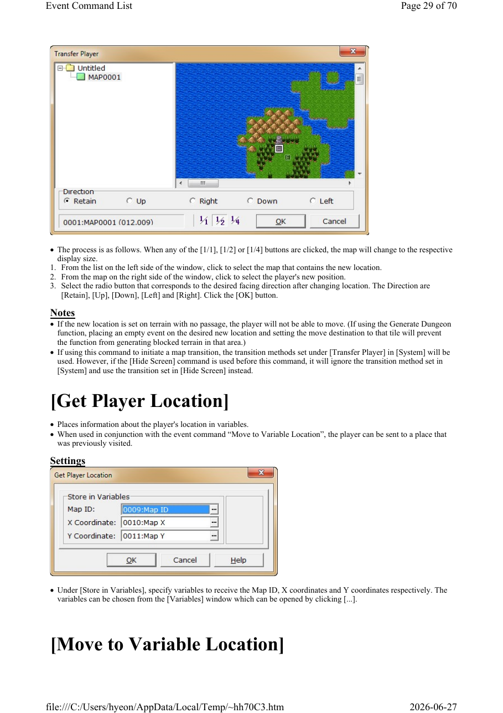

#### Embedded Images

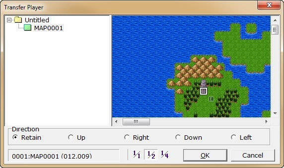

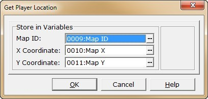

· The process is as follows. When any of the [1/1], [1/2] or [1/4] buttons are clicked, the map will change to the respective
display size.
1. From the list on the left side of the window, click to select the map that contains the new location.
2. From the map on the right side of the window, click to select the player's new position.
3. Select the radio button that corresponds to the desired facing direction after changing location. The Direction are
[Retain], [Up], [Down], [Left] and [Right]. Click the [OK] button.
#### Notes
· If the new location is set on terrain with no passage, the player will not be able to move. (If using the Generate Dungeon
function, placing an empty event on the desired new location and setting the move destination to that tile will prevent
the function from generating blocked terrain in that area.)
· If using this command to initiate a map transition, the transition methods set under [Transfer Player] in [System] will be
used. However, if the [Hide Screen] command is used before this command, it will ignore the transition method set in
[System] and use the transition set in [Hide Screen] instead.
### Get Player Location
· Places information about the player's location in variables.
· When used in conjunction with the event command “Move to Variable Location”, the player can be sent to a place that
was previously visited.
#### Settings
· Under [Store in Variables], specify variables to receive the Map ID, X coordinates and Y coordinates respectively. The
variables can be chosen from the [Variables] window which can be opened by clicking [...].
### Move to Variable Location

## Page 30

Rendered page image

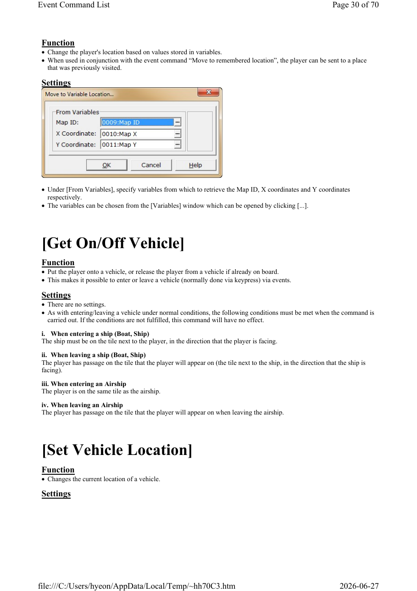

#### Embedded Images

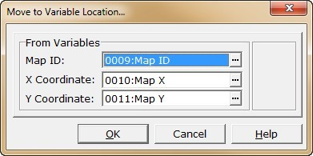

#### Function
· Change the player's location based on values stored in variables.
· When used in conjunction with the event command “Move to remembered location”, the player can be sent to a place
that was previously visited.
#### Settings
· Under [From Variables], specify variables from which to retrieve the Map ID, X coordinates and Y coordinates
respectively.
· The variables can be chosen from the [Variables] window which can be opened by clicking [...].
### Get On/Off Vehicle
#### Function
· Put the player onto a vehicle, or release the player from a vehicle if already on board.
· This makes it possible to enter or leave a vehicle (normally done via keypress) via events.
#### Settings
· There are no settings.
· As with entering/leaving a vehicle under normal conditions, the following conditions must be met when the command is
carried out. If the conditions are not fulfilled, this command will have no effect.
i. When entering a ship (Boat, Ship)
The ship must be on the tile next to the player, in the direction that the player is facing.
ii. When leaving a ship (Boat, Ship)
The player has passage on the tile that the player will appear on (the tile next to the ship, in the direction that the ship is
facing).
iii. When entering an Airship
The player is on the same tile as the airship.
iv. When leaving an Airship
The player has passage on the tile that the player will appear on when leaving the airship.
### Set Vehicle Location
#### Function
· Changes the current location of a vehicle.
#### Settings

## Page 31

Rendered page image

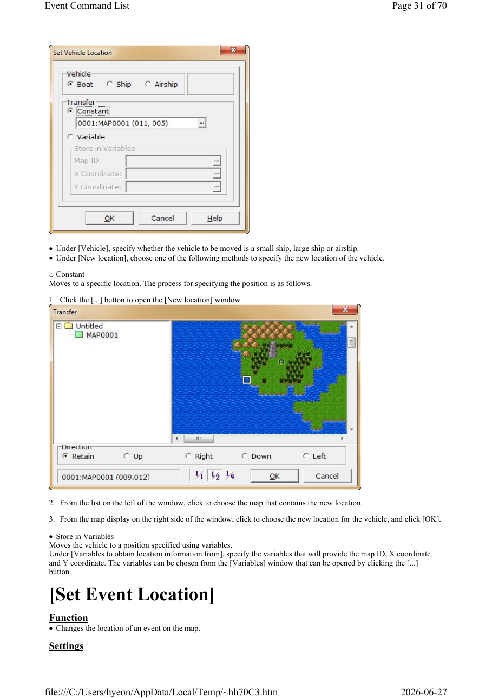

#### Embedded Images

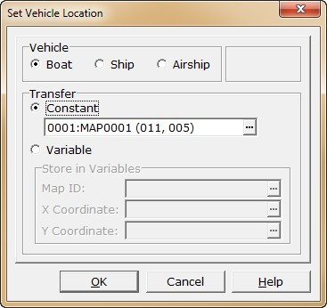

· Under [Vehicle], specify whether the vehicle to be moved is a small ship, large ship or airship.
· Under [New location], choose one of the following methods to specify the new location of the vehicle.
o Constant
Moves to a specific location. The process for specifying the position is as follows.
1. Click the [...] button to open the [New location] window.
2. From the list on the left of the window, click to choose the map that contains the new location.
3. From the map display on the right side of the window, click to choose the new location for the vehicle, and click [OK].
· Store in Variables
Moves the vehicle to a position specified using variables.
Under [Variables to obtain location information from], specify the variables that will provide the map ID, X coordinate
and Y coordinate. The variables can be chosen from the [Variables] window that can be opened by clicking the [...]
button.
### Set Event Location
#### Function
· Changes the location of an event on the map.
#### Settings

## Page 32

Rendered page image

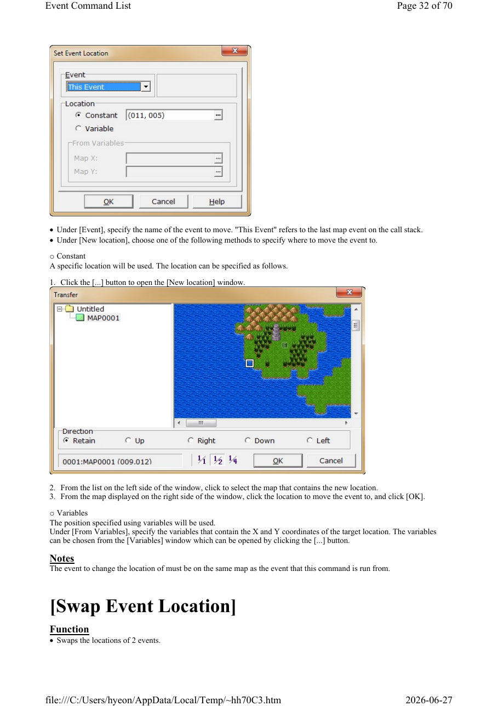

#### Embedded Images

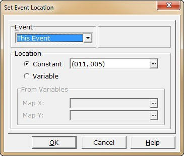

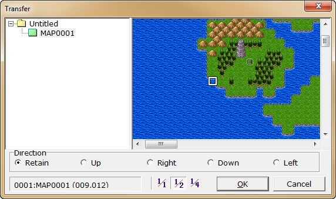

· Under [Event], specify the name of the event to move. "This Event" refers to the last map event on the call stack.
· Under [New location], choose one of the following methods to specify where to move the event to.
o Constant
A specific location will be used. The location can be specified as follows.
1. Click the [...] button to open the [New location] window.
2. From the list on the left side of the window, click to select the map that contains the new location.
3. From the map displayed on the right side of the window, click the location to move the event to, and click [OK].
o Variables
The position specified using variables will be used.
Under [From Variables], specify the variables that contain the X and Y coordinates of the target location. The variables
can be chosen from the [Variables] window which can be opened by clicking the [...] button.
#### Notes
The event to change the location of must be on the same map as the event that this command is run from.
### Swap Event Location
#### Function
· Swaps the locations of 2 events.

## Page 33

Rendered page image

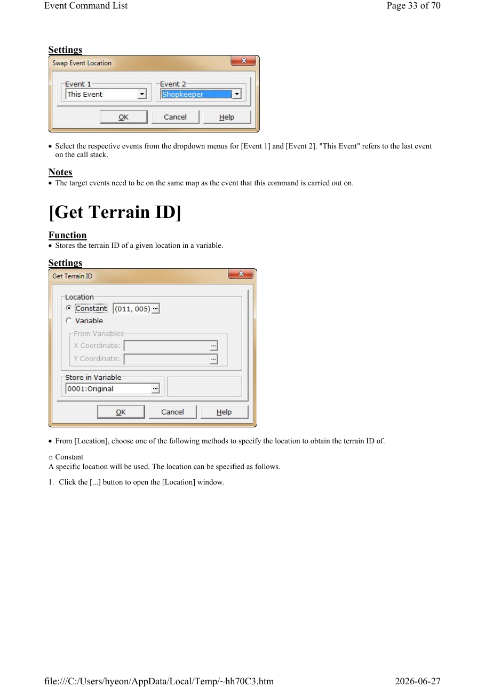

#### Embedded Images

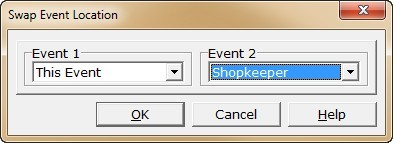

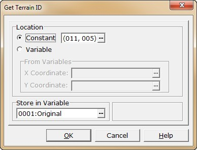

#### Settings
· Select the respective events from the dropdown menus for [Event 1] and [Event 2]. "This Event" refers to the last event
on the call stack.
#### Notes
· The target events need to be on the same map as the event that this command is carried out on.
### Get Terrain ID
#### Function
· Stores the terrain ID of a given location in a variable.
#### Settings
· From [Location], choose one of the following methods to specify the location to obtain the terrain ID of.
o Constant
A specific location will be used. The location can be specified as follows.
1. Click the [...] button to open the [Location] window.

## Page 34

Rendered page image

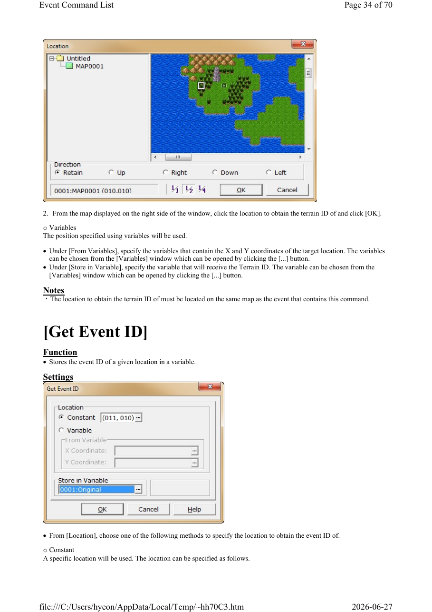

#### Embedded Images

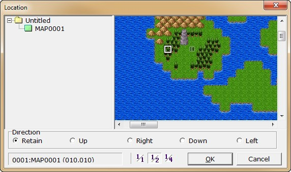

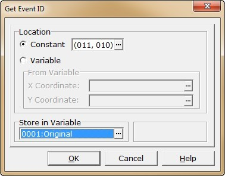

2. From the map displayed on the right side of the window, click the location to obtain the terrain ID of and click [OK].
o Variables
The position specified using variables will be used.
· Under [From Variables], specify the variables that contain the X and Y coordinates of the target location. The variables
can be chosen from the [Variables] window which can be opened by clicking the [...] button.
· Under [Store in Variable], specify the variable that will receive the Terrain ID. The variable can be chosen from the
[Variables] window which can be opened by clicking the [...] button.
#### Notes
・The location to obtain the terrain ID of must be located on the same map as the event that contains this command.
### Get Event ID
#### Function
· Stores the event ID of a given location in a variable.
#### Settings
· From [Location], choose one of the following methods to specify the location to obtain the event ID of.
o Constant
A specific location will be used. The location can be specified as follows.

## Page 35

Rendered page image

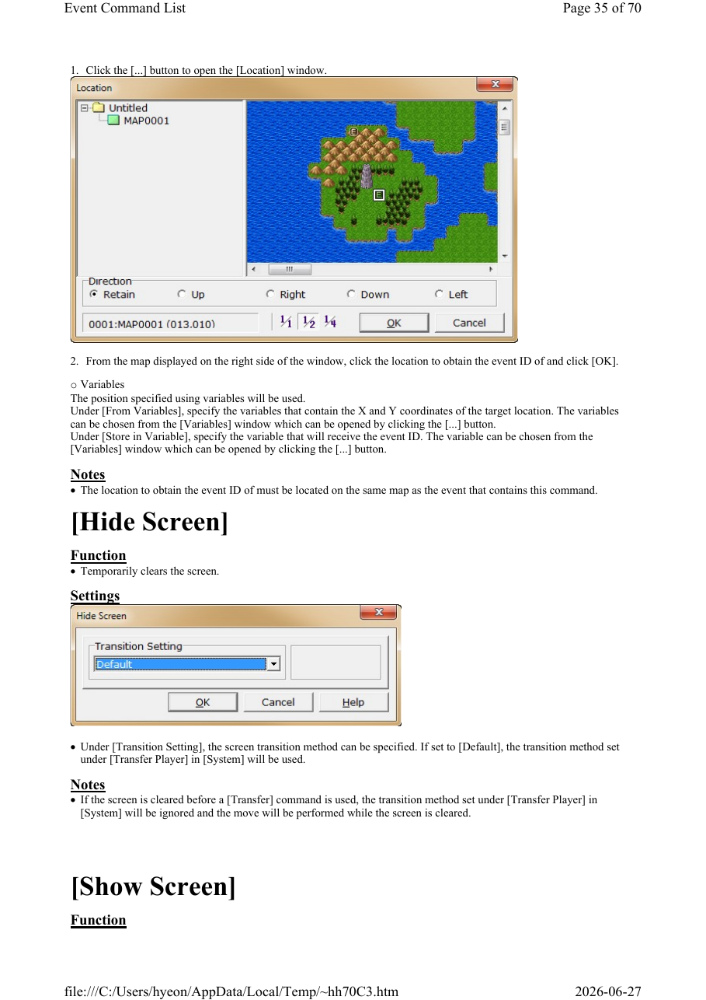

#### Embedded Images

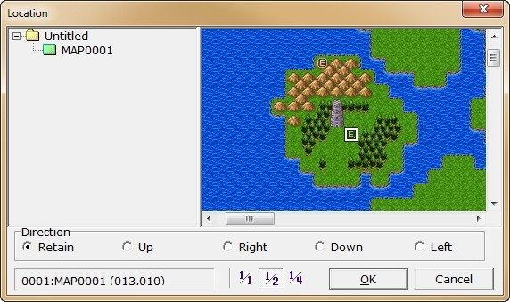

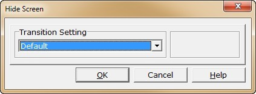

1. Click the [...] button to open the [Location] window.
2. From the map displayed on the right side of the window, click the location to obtain the event ID of and click [OK].
o Variables
The position specified using variables will be used.
Under [From Variables], specify the variables that contain the X and Y coordinates of the target location. The variables
can be chosen from the [Variables] window which can be opened by clicking the [...] button.
Under [Store in Variable], specify the variable that will receive the event ID. The variable can be chosen from the
[Variables] window which can be opened by clicking the [...] button.
#### Notes
· The location to obtain the event ID of must be located on the same map as the event that contains this command.
### Hide Screen
#### Function
· Temporarily clears the screen.
#### Settings
· Under [Transition Setting], the screen transition method can be specified. If set to [Default], the transition method set
under [Transfer Player] in [System] will be used.
#### Notes
· If the screen is cleared before a [Transfer] command is used, the transition method set under [Transfer Player] in
[System] will be ignored and the move will be performed while the screen is cleared.
### Show Screen
#### Function

## Page 36

Rendered page image

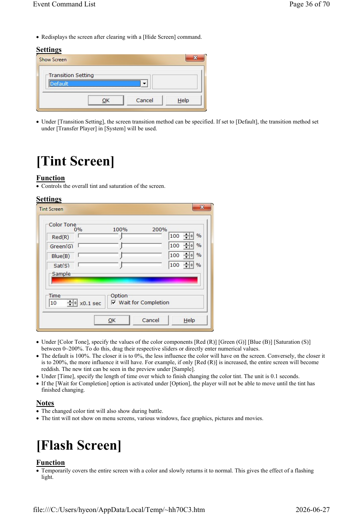

#### Embedded Images

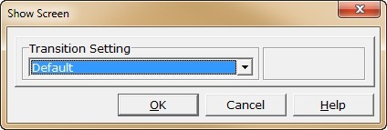

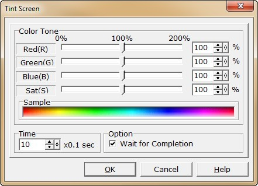

· Redisplays the screen after clearing with a [Hide Screen] command.
#### Settings
· Under [Transition Setting], the screen transition method can be specified. If set to [Default], the transition method set
under [Transfer Player] in [System] will be used.
### Tint Screen
#### Function
· Controls the overall tint and saturation of the screen.
#### Settings
· Under [Color Tone], specify the values of the color components [Red (R)] [Green (G)] [Blue (B)] [Saturation (S)]
between 0~200%. To do this, drag their respective sliders or directly enter numerical values.
· The default is 100%. The closer it is to 0%, the less influence the color will have on the screen. Conversely, the closer it
is to 200%, the more influence it will have. For example, if only [Red (R)] is increased, the entire screen will become
reddish. The new tint can be seen in the preview under [Sample].
· Under [Time], specify the length of time over which to finish changing the color tint. The unit is 0.1 seconds.
· If the [Wait for Completion] option is activated under [Option], the player will not be able to move until the tint has
finished changing.
#### Notes
· The changed color tint will also show during battle.
· The tint will not show on menu screens, various windows, face graphics, pictures and movies.
### Flash Screen
#### Function
· Temporarily covers the entire screen with a color and slowly returns it to normal. This gives the effect of a flashing
light.

## Page 37

Rendered page image

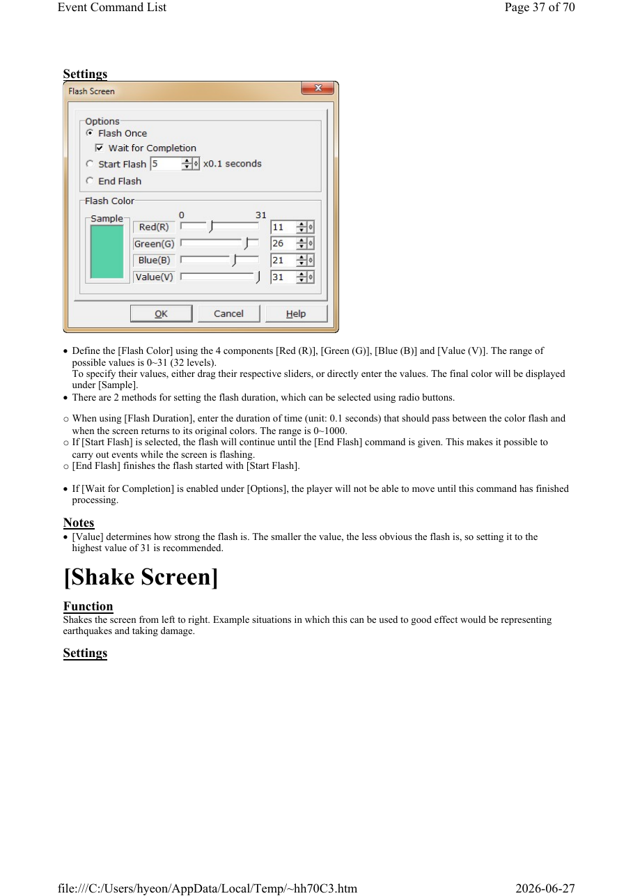

#### Embedded Images

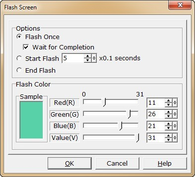

#### Settings
· Define the [Flash Color] using the 4 components [Red (R)], [Green (G)], [Blue (B)] and [Value (V)]. The range of
possible values is 0~31 (32 levels).
To specify their values, either drag their respective sliders, or directly enter the values. The final color will be displayed
under [Sample].
· There are 2 methods for setting the flash duration, which can be selected using radio buttons.
o When using [Flash Duration], enter the duration of time (unit: 0.1 seconds) that should pass between the color flash and
when the screen returns to its original colors. The range is 0~1000.
o If [Start Flash] is selected, the flash will continue until the [End Flash] command is given. This makes it possible to
carry out events while the screen is flashing.
o [End Flash] finishes the flash started with [Start Flash].
· If [Wait for Completion] is enabled under [Options], the player will not be able to move until this command has finished
processing.
#### Notes
· [Value] determines how strong the flash is. The smaller the value, the less obvious the flash is, so setting it to the
highest value of 31 is recommended.
### Shake Screen
#### Function
Shakes the screen from left to right. Example situations in which this can be used to good effect would be representing
earthquakes and taking damage.
#### Settings

## Page 38

Rendered page image

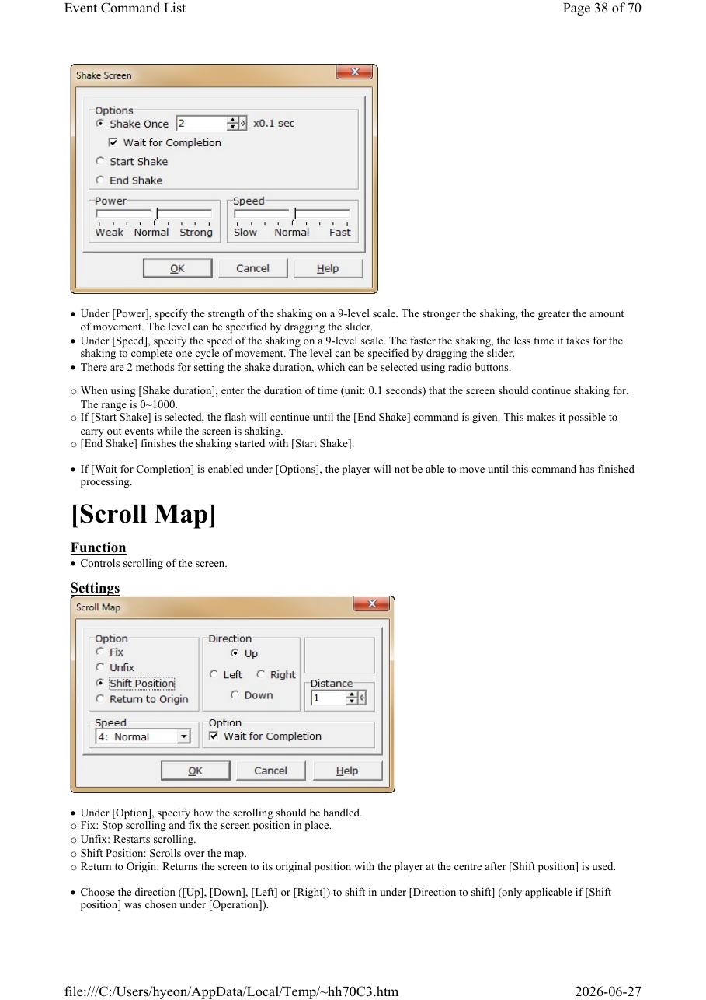

#### Embedded Images

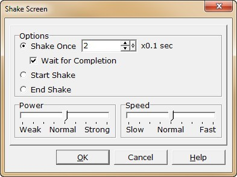

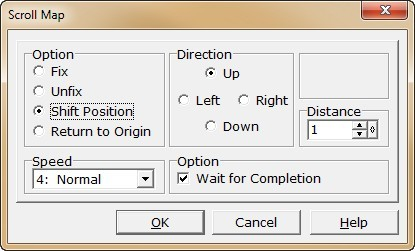

· Under [Power], specify the strength of the shaking on a 9-level scale. The stronger the shaking, the greater the amount
of movement. The level can be specified by dragging the slider.
· Under [Speed], specify the speed of the shaking on a 9-level scale. The faster the shaking, the less time it takes for the
shaking to complete one cycle of movement. The level can be specified by dragging the slider.
· There are 2 methods for setting the shake duration, which can be selected using radio buttons.
o When using [Shake duration], enter the duration of time (unit: 0.1 seconds) that the screen should continue shaking for.
The range is 0~1000.
o If [Start Shake] is selected, the flash will continue until the [End Shake] command is given. This makes it possible to
carry out events while the screen is shaking.
o [End Shake] finishes the shaking started with [Start Shake].
· If [Wait for Completion] is enabled under [Options], the player will not be able to move until this command has finished
processing.
### Scroll Map
#### Function
· Controls scrolling of the screen.
#### Settings
· Under [Option], specify how the scrolling should be handled.
o Fix: Stop scrolling and fix the screen position in place.
o Unfix: Restarts scrolling.
o Shift Position: Scrolls over the map.
o Return to Origin: Returns the screen to its original position with the player at the centre after [Shift position] is used.
· Choose the direction ([Up], [Down], [Left] or [Right]) to shift in under [Direction to shift] (only applicable if [Shift
position] was chosen under [Operation]).

## Page 39

Rendered page image

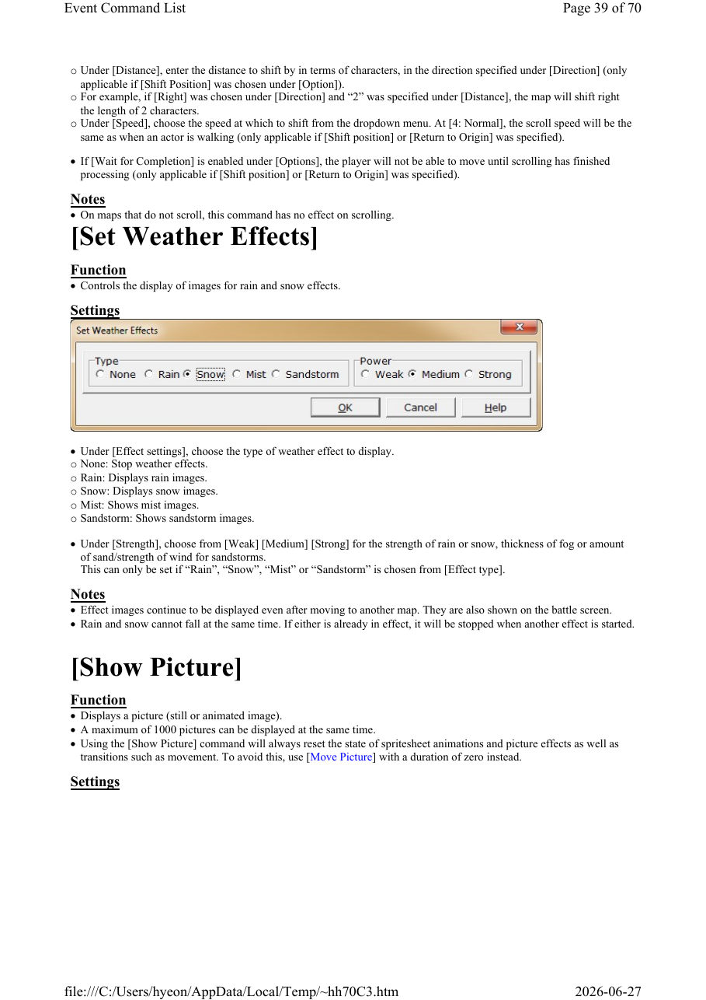

#### Embedded Images

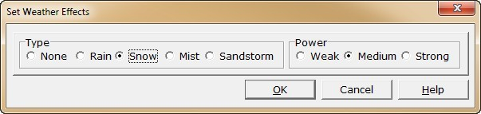

o Under [Distance], enter the distance to shift by in terms of characters, in the direction specified under [Direction] (only
applicable if [Shift Position] was chosen under [Option]).
o For example, if [Right] was chosen under [Direction] and “2” was specified under [Distance], the map will shift right
the length of 2 characters.
o Under [Speed], choose the speed at which to shift from the dropdown menu. At [4: Normal], the scroll speed will be the
same as when an actor is walking (only applicable if [Shift position] or [Return to Origin] was specified).
· If [Wait for Completion] is enabled under [Options], the player will not be able to move until scrolling has finished
processing (only applicable if [Shift position] or [Return to Origin] was specified).
#### Notes
· On maps that do not scroll, this command has no effect on scrolling.
### Set Weather Effects
#### Function
· Controls the display of images for rain and snow effects.
#### Settings
· Under [Effect settings], choose the type of weather effect to display.
o None: Stop weather effects.
o Rain: Displays rain images.
o Snow: Displays snow images.
o Mist: Shows mist images.
o Sandstorm: Shows sandstorm images.
· Under [Strength], choose from [Weak] [Medium] [Strong] for the strength of rain or snow, thickness of fog or amount
of sand/strength of wind for sandstorms.
This can only be set if “Rain”, “Snow”, “Mist” or “Sandstorm” is chosen from [Effect type].
#### Notes
· Effect images continue to be displayed even after moving to another map. They are also shown on the battle screen.
· Rain and snow cannot fall at the same time. If either is already in effect, it will be stopped when another effect is started.
### Show Picture
#### Function
· Displays a picture (still or animated image).
· A maximum of 1000 pictures can be displayed at the same time.
· Using the [Show Picture] command will always reset the state of spritesheet animations and picture effects as well as
transitions such as movement. To avoid this, use [Move Picture] with a duration of zero instead.
#### Settings

## Page 40

Rendered page image

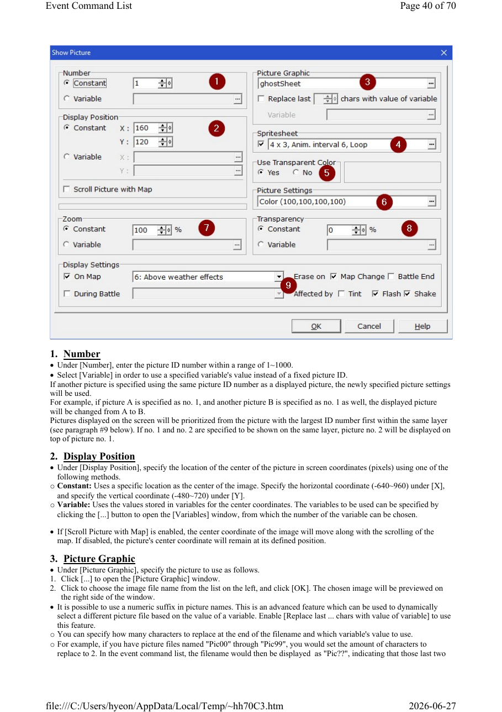

#### Embedded Images

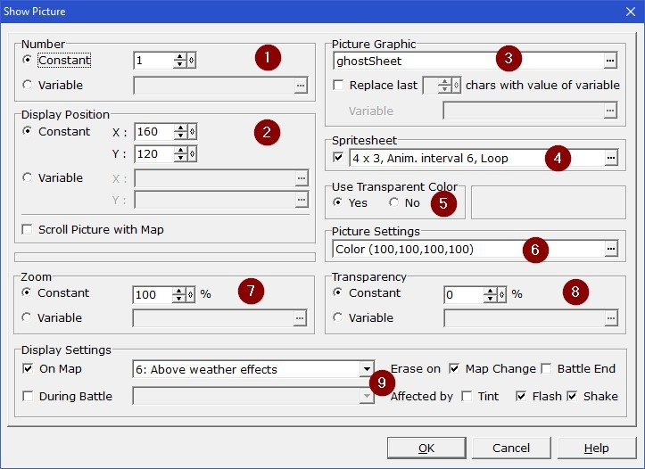

1. Number
· Under [Number], enter the picture ID number within a range of 1~1000.
· Select [Variable] in order to use a specified variable's value instead of a fixed picture ID.
If another picture is specified using the same picture ID number as a displayed picture, the newly specified picture settings
will be used.
For example, if picture A is specified as no. 1, and another picture B is specified as no. 1 as well, the displayed picture
will be changed from A to B.
Pictures displayed on the screen will be prioritized from the picture with the largest ID number first within the same layer
(see paragraph #9 below). If no. 1 and no. 2 are specified to be shown on the same layer, picture no. 2 will be displayed on
top of picture no. 1.
2. Display Position
· Under [Display Position], specify the location of the center of the picture in screen coordinates (pixels) using one of the
following methods.
o Constant: Uses a specific location as the center of the image. Specify the horizontal coordinate (-640~960) under [X],
and specify the vertical coordinate (-480~720) under [Y].
o Variable: Uses the values stored in variables for the center coordinates. The variables to be used can be specified by
clicking the [...] button to open the [Variables] window, from which the number of the variable can be chosen.
· If [Scroll Picture with Map] is enabled, the center coordinate of the image will move along with the scrolling of the
map. If disabled, the picture's center coordinate will remain at its defined position.
3. Picture Graphic
· Under [Picture Graphic], specify the picture to use as follows.
1. Click [...] to open the [Picture Graphic] window.
2. Click to choose the image file name from the list on the left, and click [OK]. The chosen image will be previewed on
the right side of the window.
· It is possible to use a numeric suffix in picture names. This is an advanced feature which can be used to dynamically
select a different picture file based on the value of a variable. Enable [Replace last ... chars with value of variable] to use
this feature.
o You can specify how many characters to replace at the end of the filename and which variable's value to use.
o For example, if you have picture files named "Pic00" through "Pic99", you would set the amount of characters to
replace to 2. In the event command list, the filename would then be displayed as "Pic??", indicating that those last two

## Page 41

Rendered page image

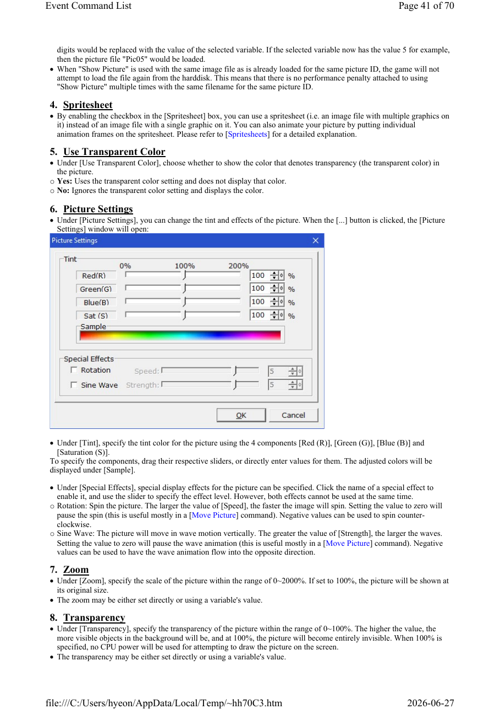

#### Embedded Images

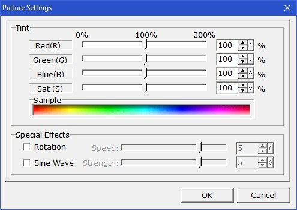

digits would be replaced with the value of the selected variable. If the selected variable now has the value 5 for example,
then the picture file "Pic05" would be loaded.
· When "Show Picture" is used with the same image file as is already loaded for the same picture ID, the game will not
attempt to load the file again from the harddisk. This means that there is no performance penalty attached to using
"Show Picture" multiple times with the same filename for the same picture ID.
4. Spritesheet
· By enabling the checkbox in the [Spritesheet] box, you can use a spritesheet (i.e. an image file with multiple graphics on
it) instead of an image file with a single graphic on it. You can also animate your picture by putting individual
animation frames on the spritesheet. Please refer to [Spritesheets] for a detailed explanation.
5. Use Transparent Color
· Under [Use Transparent Color], choose whether to show the color that denotes transparency (the transparent color) in
the picture.
o Yes: Uses the transparent color setting and does not display that color.
o No: Ignores the transparent color setting and displays the color.
6. Picture Settings
· Under [Picture Settings], you can change the tint and effects of the picture. When the [...] button is clicked, the [Picture
Settings] window will open:
· Under [Tint], specify the tint color for the picture using the 4 components [Red (R)], [Green (G)], [Blue (B)] and
[Saturation (S)].
To specify the components, drag their respective sliders, or directly enter values for them. The adjusted colors will be
displayed under [Sample].
· Under [Special Effects], special display effects for the picture can be specified. Click the name of a special effect to
enable it, and use the slider to specify the effect level. However, both effects cannot be used at the same time.
o Rotation: Spin the picture. The larger the value of [Speed], the faster the image will spin. Setting the value to zero will
pause the spin (this is useful mostly in a [Move Picture] command). Negative values can be used to spin counter-
clockwise.
o Sine Wave: The picture will move in wave motion vertically. The greater the value of [Strength], the larger the waves.
Setting the value to zero will pause the wave animation (this is useful mostly in a [Move Picture] command). Negative
values can be used to have the wave animation flow into the opposite direction.
7. Zoom
· Under [Zoom], specify the scale of the picture within the range of 0~2000%. If set to 100%, the picture will be shown at
its original size.
· The zoom may be either set directly or using a variable's value.
8. Transparency
· Under [Transparency], specify the transparency of the picture within the range of 0~100%. The higher the value, the
more visible objects in the background will be, and at 100%, the picture will become entirely invisible. When 100% is
specified, no CPU power will be used for attempting to draw the picture on the screen.
· The transparency may be either set directly or using a variable's value.

## Page 42

Rendered page image

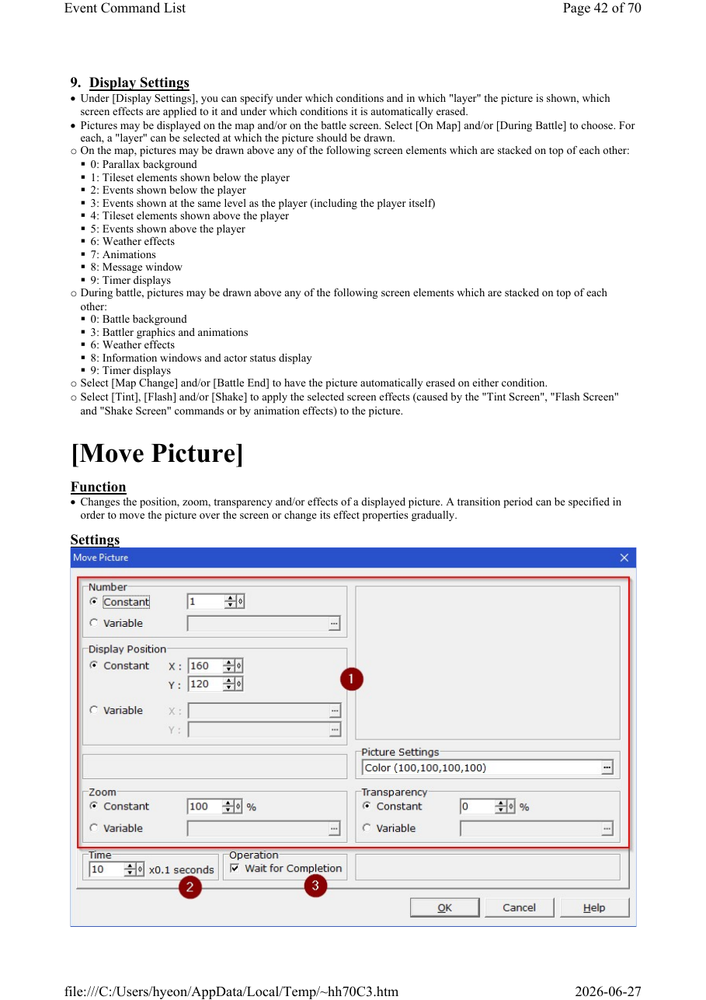

#### Embedded Images

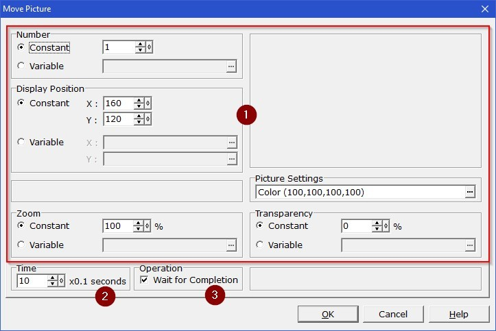

9. Display Settings
· Under [Display Settings], you can specify under which conditions and in which "layer" the picture is shown, which
screen effects are applied to it and under which conditions it is automatically erased.
· Pictures may be displayed on the map and/or on the battle screen. Select [On Map] and/or [During Battle] to choose. For
each, a "layer" can be selected at which the picture should be drawn.
o On the map, pictures may be drawn above any of the following screen elements which are stacked on top of each other:
§ 0: Parallax background
§ 1: Tileset elements shown below the player
§ 2: Events shown below the player
§ 3: Events shown at the same level as the player (including the player itself)
§ 4: Tileset elements shown above the player
§ 5: Events shown above the player
§ 6: Weather effects
§ 7: Animations
§ 8: Message window
§ 9: Timer displays
o During battle, pictures may be drawn above any of the following screen elements which are stacked on top of each
other:
§ 0: Battle background
§ 3: Battler graphics and animations
§ 6: Weather effects
§ 8: Information windows and actor status display
§ 9: Timer displays
o Select [Map Change] and/or [Battle End] to have the picture automatically erased on either condition.
o Select [Tint], [Flash] and/or [Shake] to apply the selected screen effects (caused by the "Tint Screen", "Flash Screen"
and "Shake Screen" commands or by animation effects) to the picture.
### Move Picture
#### Function
· Changes the position, zoom, transparency and/or effects of a displayed picture. A transition period can be specified in
order to move the picture over the screen or change its effect properties gradually.
#### Settings

## Page 43

Rendered page image

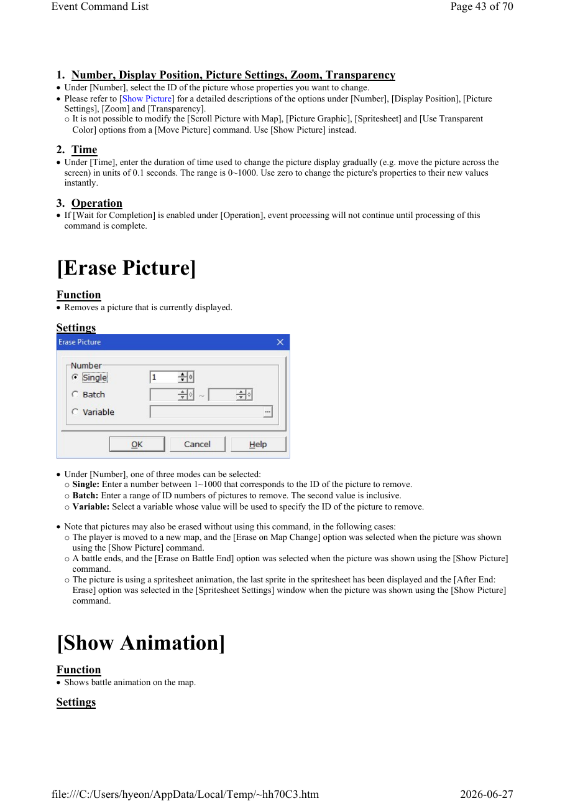

#### Embedded Images

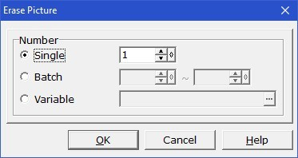

1. Number, Display Position, Picture Settings, Zoom, Transparency
· Under [Number], select the ID of the picture whose properties you want to change.
· Please refer to [Show Picture] for a detailed descriptions of the options under [Number], [Display Position], [Picture
Settings], [Zoom] and [Transparency].
o It is not possible to modify the [Scroll Picture with Map], [Picture Graphic], [Spritesheet] and [Use Transparent
Color] options from a [Move Picture] command. Use [Show Picture] instead.
2. Time
· Under [Time], enter the duration of time used to change the picture display gradually (e.g. move the picture across the
screen) in units of 0.1 seconds. The range is 0~1000. Use zero to change the picture's properties to their new values
instantly.
3. Operation
· If [Wait for Completion] is enabled under [Operation], event processing will not continue until processing of this
command is complete.
### Erase Picture
#### Function
· Removes a picture that is currently displayed.
#### Settings
· Under [Number], one of three modes can be selected:
o Single: Enter a number between 1~1000 that corresponds to the ID of the picture to remove.
o Batch: Enter a range of ID numbers of pictures to remove. The second value is inclusive.
o Variable: Select a variable whose value will be used to specify the ID of the picture to remove.
· Note that pictures may also be erased without using this command, in the following cases:
o The player is moved to a new map, and the [Erase on Map Change] option was selected when the picture was shown
using the [Show Picture] command.
o A battle ends, and the [Erase on Battle End] option was selected when the picture was shown using the [Show Picture]
command.
o The picture is using a spritesheet animation, the last sprite in the spritesheet has been displayed and the [After End:
Erase] option was selected in the [Spritesheet Settings] window when the picture was shown using the [Show Picture]
command.
### Show Animation
#### Function
· Shows battle animation on the map.
#### Settings

## Page 44

Rendered page image

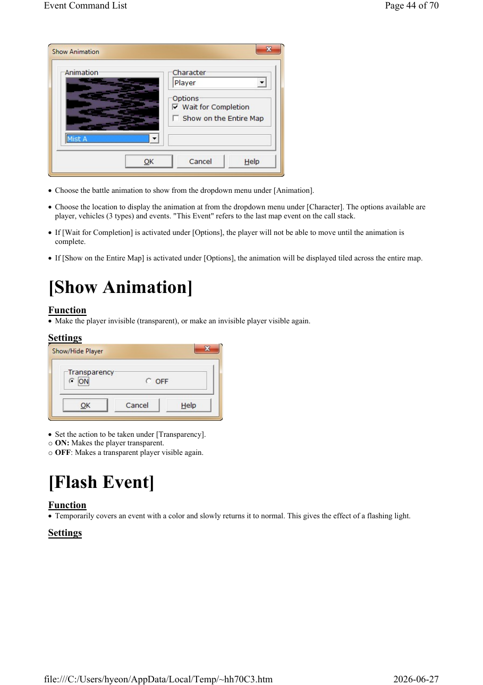

#### Embedded Images

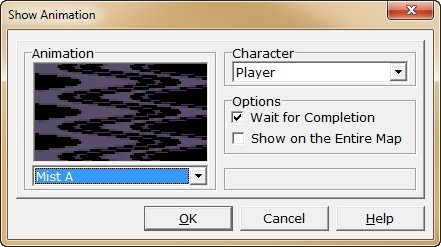

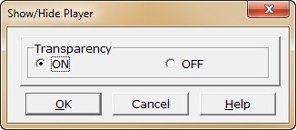

· Choose the battle animation to show from the dropdown menu under [Animation].
· Choose the location to display the animation at from the dropdown menu under [Character]. The options available are
player, vehicles (3 types) and events. "This Event" refers to the last map event on the call stack.
· If [Wait for Completion] is activated under [Options], the player will not be able to move until the animation is
complete.
· If [Show on the Entire Map] is activated under [Options], the animation will be displayed tiled across the entire map.
### Show Animation
#### Function
· Make the player invisible (transparent), or make an invisible player visible again.
#### Settings
· Set the action to be taken under [Transparency].
o ON: Makes the player transparent.
o OFF: Makes a transparent player visible again.
### Flash Event
#### Function
· Temporarily covers an event with a color and slowly returns it to normal. This gives the effect of a flashing light.
#### Settings

## Page 45

Rendered page image

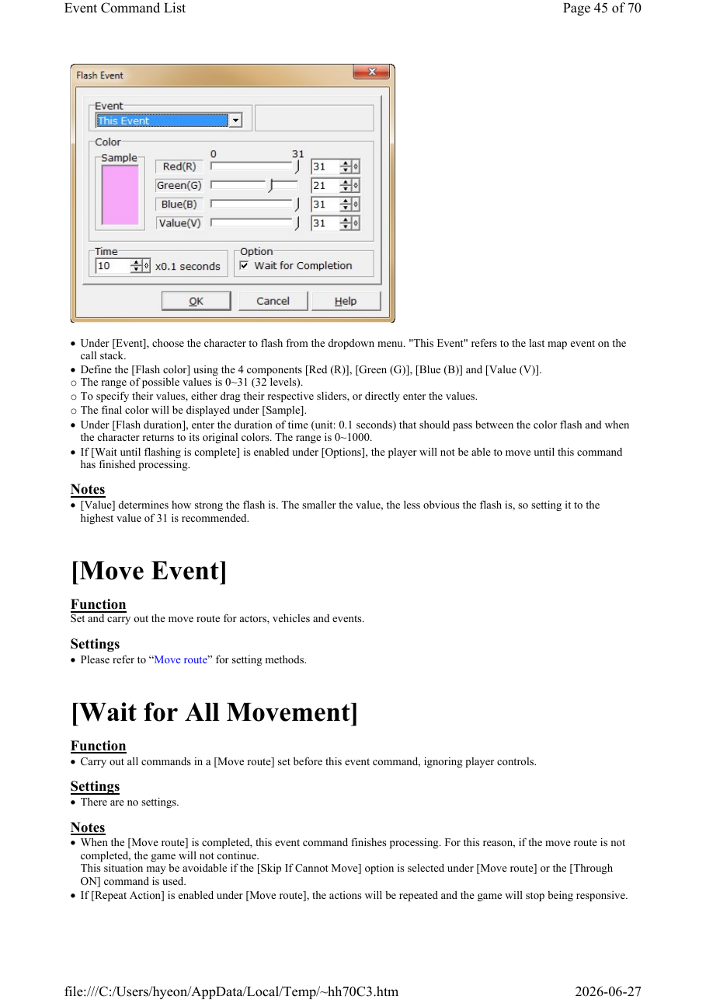

#### Embedded Images

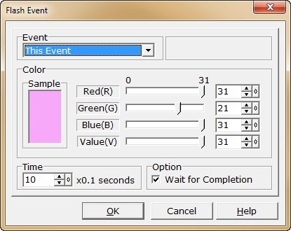

· Under [Event], choose the character to flash from the dropdown menu. "This Event" refers to the last map event on the
call stack.
· Define the [Flash color] using the 4 components [Red (R)], [Green (G)], [Blue (B)] and [Value (V)].
o The range of possible values is 0~31 (32 levels).
o To specify their values, either drag their respective sliders, or directly enter the values.
o The final color will be displayed under [Sample].
· Under [Flash duration], enter the duration of time (unit: 0.1 seconds) that should pass between the color flash and when
the character returns to its original colors. The range is 0~1000.
· If [Wait until flashing is complete] is enabled under [Options], the player will not be able to move until this command
has finished processing.
#### Notes
· [Value] determines how strong the flash is. The smaller the value, the less obvious the flash is, so setting it to the
highest value of 31 is recommended.
### Move Event
#### Function
Set and carry out the move route for actors, vehicles and events.
#### Settings
· Please refer to “Move route” for setting methods.
### Wait for All Movement
#### Function
· Carry out all commands in a [Move route] set before this event command, ignoring player controls.
#### Settings
· There are no settings.
#### Notes
· When the [Move route] is completed, this event command finishes processing. For this reason, if the move route is not
completed, the game will not continue.
This situation may be avoidable if the [Skip If Cannot Move] option is selected under [Move route] or the [Through
ON] command is used.
· If [Repeat Action] is enabled under [Move route], the actions will be repeated and the game will stop being responsive.

## Page 46

Rendered page image

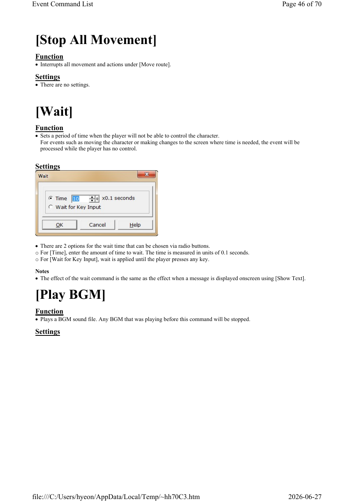

#### Embedded Images

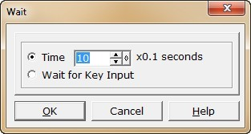

### Stop All Movement
#### Function
· Interrupts all movement and actions under [Move route].
#### Settings
· There are no settings.
### Wait
#### Function
· Sets a period of time when the player will not be able to control the character.
For events such as moving the character or making changes to the screen where time is needed, the event will be
processed while the player has no control.
#### Settings
· There are 2 options for the wait time that can be chosen via radio buttons.
o For [Time], enter the amount of time to wait. The time is measured in units of 0.1 seconds.
o For [Wait for Key Input], wait is applied until the player presses any key.
#### Notes
· The effect of the wait command is the same as the effect when a message is displayed onscreen using [Show Text].
### Play BGM
#### Function
· Plays a BGM sound file. Any BGM that was playing before this command will be stopped.
#### Settings

## Page 47

Rendered page image

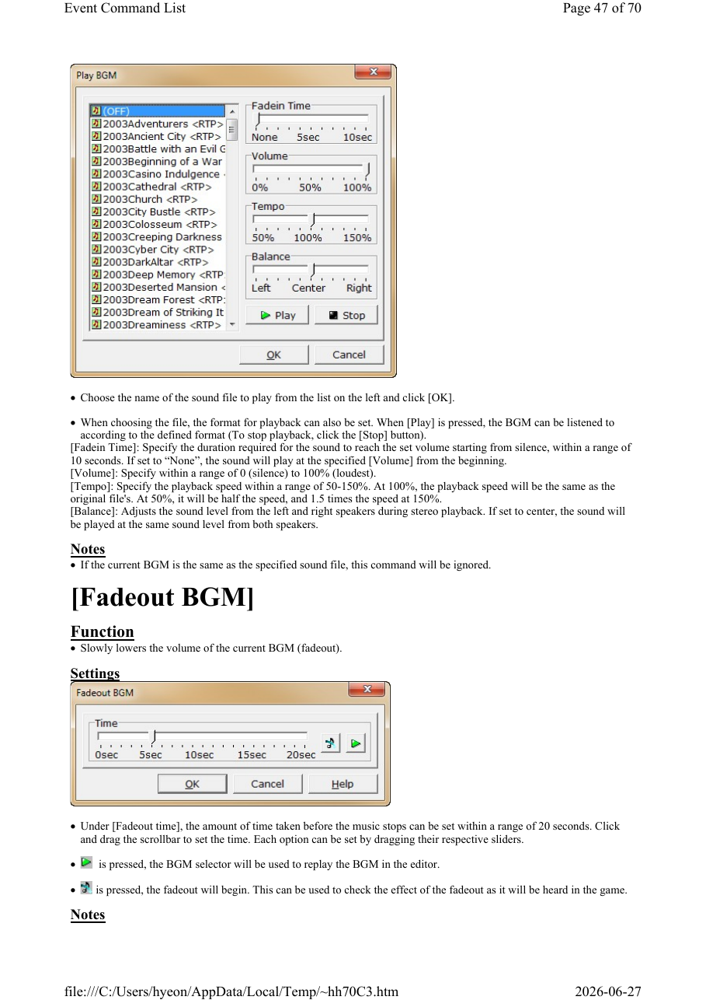

#### Embedded Images

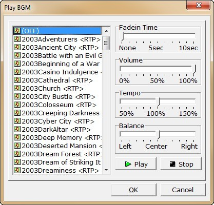

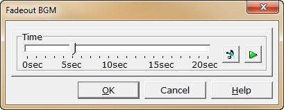

· Choose the name of the sound file to play from the list on the left and click [OK].
· When choosing the file, the format for playback can also be set. When [Play] is pressed, the BGM can be listened to
according to the defined format (To stop playback, click the [Stop] button).
[Fadein Time]: Specify the duration required for the sound to reach the set volume starting from silence, within a range of
10 seconds. If set to “None”, the sound will play at the specified [Volume] from the beginning.
[Volume]: Specify within a range of 0 (silence) to 100% (loudest).
[Tempo]: Specify the playback speed within a range of 50-150%. At 100%, the playback speed will be the same as the
original file's. At 50%, it will be half the speed, and 1.5 times the speed at 150%.
[Balance]: Adjusts the sound level from the left and right speakers during stereo playback. If set to center, the sound will
be played at the same sound level from both speakers.
#### Notes
· If the current BGM is the same as the specified sound file, this command will be ignored.
### Fadeout BGM
#### Function
· Slowly lowers the volume of the current BGM (fadeout).
#### Settings
· Under [Fadeout time], the amount of time taken before the music stops can be set within a range of 20 seconds. Click
and drag the scrollbar to set the time. Each option can be set by dragging their respective sliders.
· is pressed, the BGM selector will be used to replay the BGM in the editor.
· is pressed, the fadeout will begin. This can be used to check the effect of the fadeout as it will be heard in the game.
#### Notes

## Page 48

Rendered page image

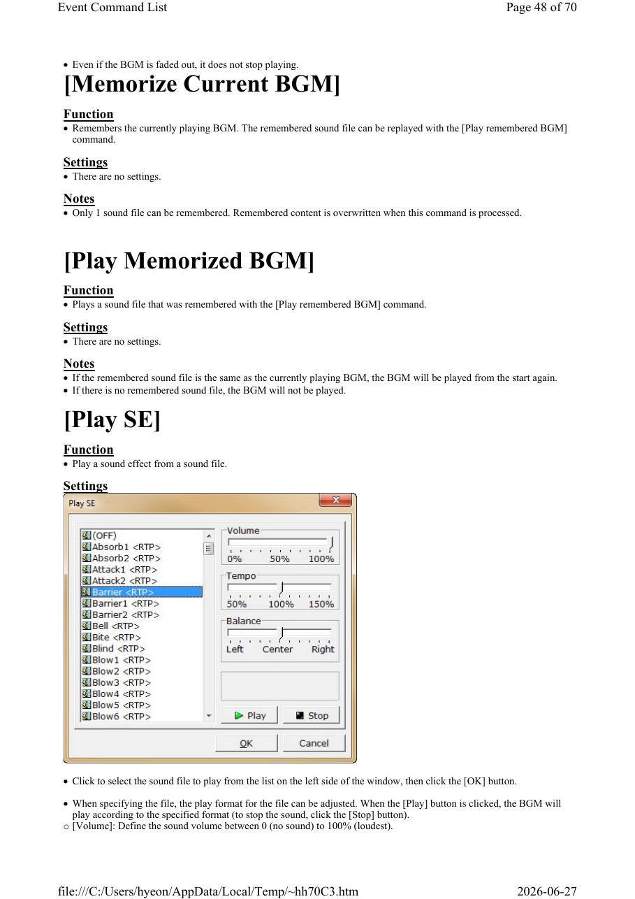

#### Embedded Images

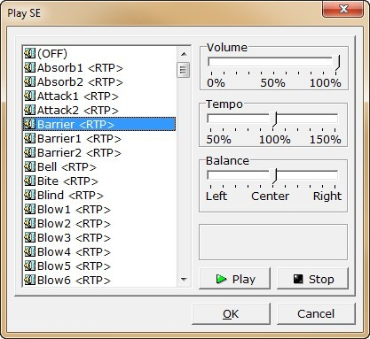

· Even if the BGM is faded out, it does not stop playing.
### Memorize Current BGM
#### Function
· Remembers the currently playing BGM. The remembered sound file can be replayed with the [Play remembered BGM]
command.
#### Settings
· There are no settings.
#### Notes
· Only 1 sound file can be remembered. Remembered content is overwritten when this command is processed.
### Play Memorized BGM
#### Function
· Plays a sound file that was remembered with the [Play remembered BGM] command.
#### Settings
· There are no settings.
#### Notes
· If the remembered sound file is the same as the currently playing BGM, the BGM will be played from the start again.
· If there is no remembered sound file, the BGM will not be played.
### Play SE
#### Function
· Play a sound effect from a sound file.
#### Settings
· Click to select the sound file to play from the list on the left side of the window, then click the [OK] button.
· When specifying the file, the play format for the file can be adjusted. When the [Play] button is clicked, the BGM will
play according to the specified format (to stop the sound, click the [Stop] button).
o [Volume]: Define the sound volume between 0 (no sound) to 100% (loudest).

## Page 49

Rendered page image

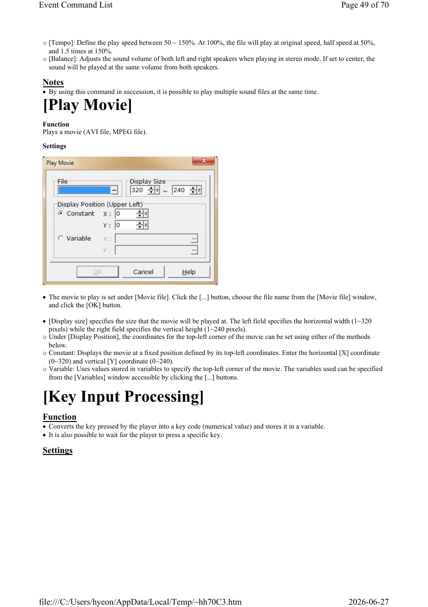

#### Embedded Images

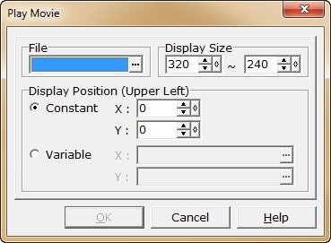

o [Tempo]: Define the play speed between 50 ~ 150%. At 100%, the file will play at original speed, half speed at 50%,
and 1.5 times at 150%.
o [Balance]: Adjusts the sound volume of both left and right speakers when playing in stereo mode. If set to center, the
sound will be played at the same volume from both speakers.
#### Notes
· By using this command in succession, it is possible to play multiple sound files at the same time.
### Play Movie
#### Function
Plays a movie (AVI file, MPEG file).
#### Settings
· The movie to play is set under [Movie file]. Click the [...] button, choose the file name from the [Movie file] window,
and click the [OK] button.
· [Display size] specifies the size that the movie will be played at. The left field specifies the horizontal width (1~320
pixels) while the right field specifies the vertical height (1~240 pixels).
o Under [Display Position], the coordinates for the top-left corner of the movie can be set using either of the methods
below.
o Constant: Displays the movie at a fixed position defined by its top-left coordinates. Enter the horizontal [X] coordinate
(0~320) and vertical [Y] coordinate (0~240).
o Variable: Uses values stored in variables to specify the top-left corner of the movie. The variables used can be specified
from the [Variables] window accessible by clicking the [...] buttons.
### Key Input Processing
#### Function
· Converts the key pressed by the player into a key code (numerical value) and stores it in a variable.
· It is also possible to wait for the player to press a specific key.
#### Settings

## Page 50

Rendered page image

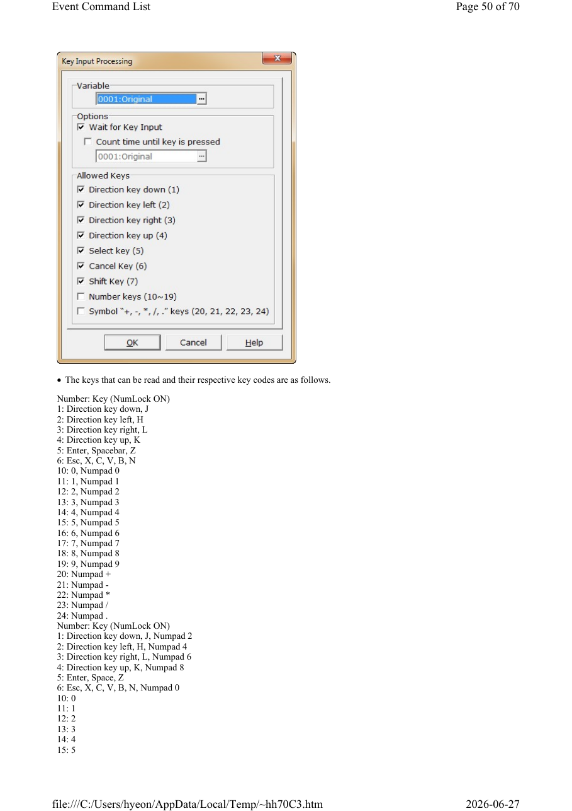

#### Embedded Images

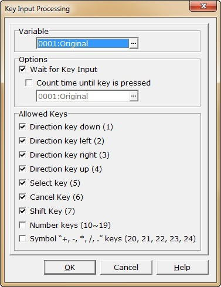

· The keys that can be read and their respective key codes are as follows.
Number: Key (NumLock ON)
1: Direction key down, J
2: Direction key left, H
3: Direction key right, L
4: Direction key up, K
5: Enter, Spacebar, Z
6: Esc, X, C, V, B, N
10: 0, Numpad 0
11: 1, Numpad 1
12: 2, Numpad 2
13: 3, Numpad 3
14: 4, Numpad 4
15: 5, Numpad 5
16: 6, Numpad 6
17: 7, Numpad 7
18: 8, Numpad 8
19: 9, Numpad 9
20: Numpad +
21: Numpad -
22: Numpad *
23: Numpad /
24: Numpad .
Number: Key (NumLock ON)
1: Direction key down, J, Numpad 2
2: Direction key left, H, Numpad 4
3: Direction key right, L, Numpad 6
4: Direction key up, K, Numpad 8
5: Enter, Space, Z
6: Esc, X, C, V, B, N, Numpad 0
10: 0
11: 1
12: 2
13: 3
14: 4
15: 5

## Page 51

Rendered page image

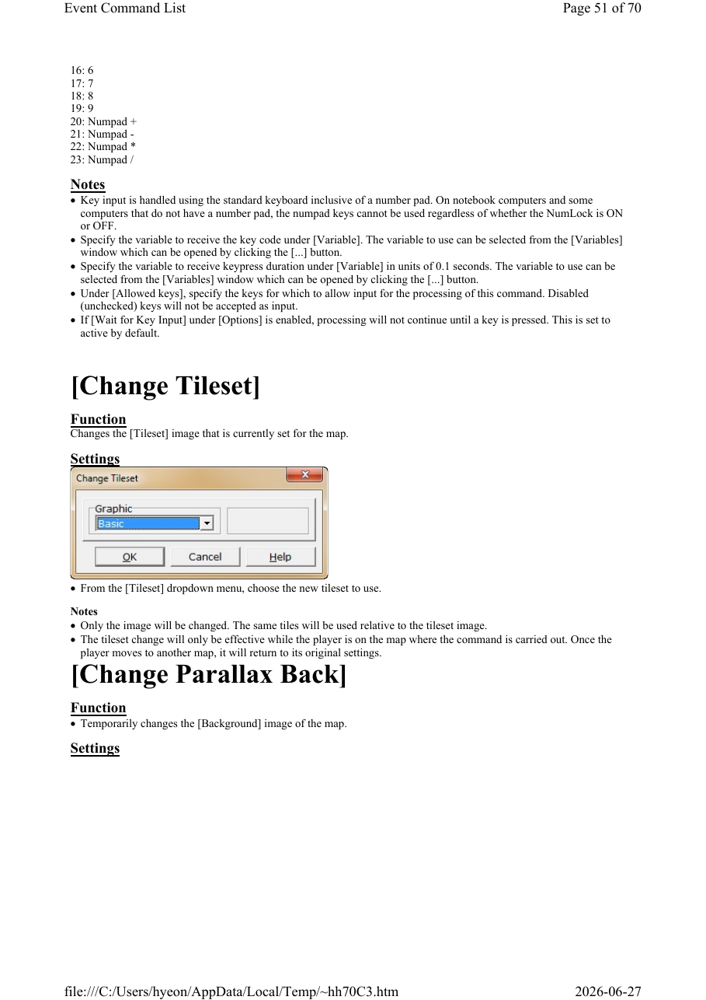

#### Embedded Images

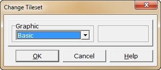

16: 6
17: 7
18: 8
19: 9
20: Numpad +
21: Numpad -
22: Numpad *
23: Numpad /
#### Notes
· Key input is handled using the standard keyboard inclusive of a number pad. On notebook computers and some
computers that do not have a number pad, the numpad keys cannot be used regardless of whether the NumLock is ON
or OFF.
· Specify the variable to receive the key code under [Variable]. The variable to use can be selected from the [Variables]
window which can be opened by clicking the [...] button.
· Specify the variable to receive keypress duration under [Variable] in units of 0.1 seconds. The variable to use can be
selected from the [Variables] window which can be opened by clicking the [...] button.
· Under [Allowed keys], specify the keys for which to allow input for the processing of this command. Disabled
(unchecked) keys will not be accepted as input.
· If [Wait for Key Input] under [Options] is enabled, processing will not continue until a key is pressed. This is set to
active by default.
### Change Tileset
#### Function
Changes the [Tileset] image that is currently set for the map.
#### Settings
· From the [Tileset] dropdown menu, choose the new tileset to use.
#### Notes
· Only the image will be changed. The same tiles will be used relative to the tileset image.
· The tileset change will only be effective while the player is on the map where the command is carried out. Once the
player moves to another map, it will return to its original settings.
### Change Parallax Back
#### Function
· Temporarily changes the [Background] image of the map.
#### Settings

## Page 52

Rendered page image

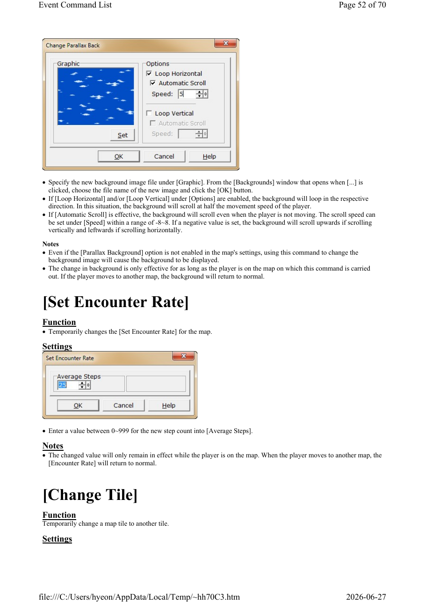

#### Embedded Images

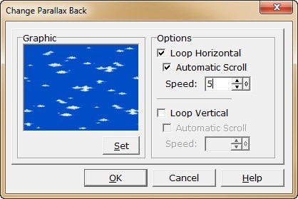

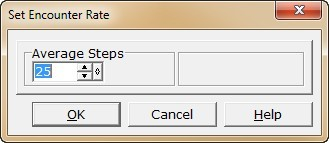

· Specify the new background image file under [Graphic]. From the [Backgrounds] window that opens when [...] is
clicked, choose the file name of the new image and click the [OK] button.
· If [Loop Horizontal] and/or [Loop Vertical] under [Options] are enabled, the background will loop in the respective
direction. In this situation, the background will scroll at half the movement speed of the player.
· If [Automatic Scroll] is effective, the background will scroll even when the player is not moving. The scroll speed can
be set under [Speed] within a range of -8~8. If a negative value is set, the background will scroll upwards if scrolling
vertically and leftwards if scrolling horizontally.
#### Notes
· Even if the [Parallax Background] option is not enabled in the map's settings, using this command to change the
background image will cause the background to be displayed.
· The change in background is only effective for as long as the player is on the map on which this command is carried
out. If the player moves to another map, the background will return to normal.
### Set Encounter Rate
#### Function
· Temporarily changes the [Set Encounter Rate] for the map.
#### Settings
· Enter a value between 0~999 for the new step count into [Average Steps].
#### Notes
· The changed value will only remain in effect while the player is on the map. When the player moves to another map, the
[Encounter Rate] will return to normal.
### Change Tile
#### Function
Temporarily change a map tile to another tile.
#### Settings

## Page 53

Rendered page image

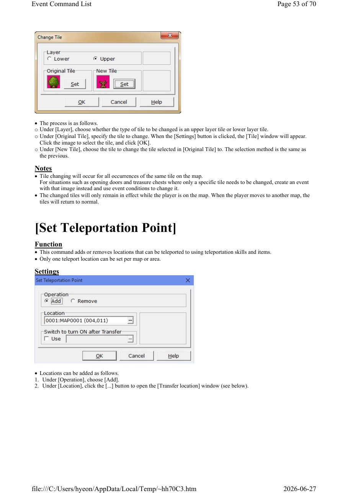

#### Embedded Images

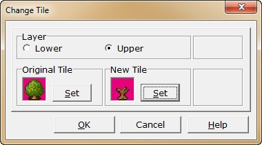

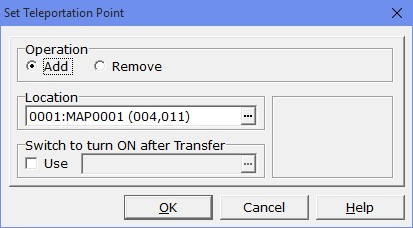

· The process is as follows.
o Under [Layer], choose whether the type of tile to be changed is an upper layer tile or lower layer tile.
o Under [Original Tile], specify the tile to change. When the [Settings] button is clicked, the [Tile] window will appear.
Click the image to select the tile, and click [OK].
o Under [New Tile], choose the tile to change the tile selected in [Original Tile] to. The selection method is the same as
the previous.
#### Notes
· Tile changing will occur for all occurrences of the same tile on the map.
For situations such as opening doors and treasure chests where only a specific tile needs to be changed, create an event
with that image instead and use event conditions to change it.
· The changed tiles will only remain in effect while the player is on the map. When the player moves to another map, the
tiles will return to normal.
### Set Teleportation Point
#### Function
· This command adds or removes locations that can be teleported to using teleportation skills and items.
· Only one teleport location can be set per map or area.
#### Settings
· Locations can be added as follows.
1. Under [Operation], choose [Add].
2. Under [Location], click the [...] button to open the [Transfer location] window (see below).

## Page 54

Rendered page image

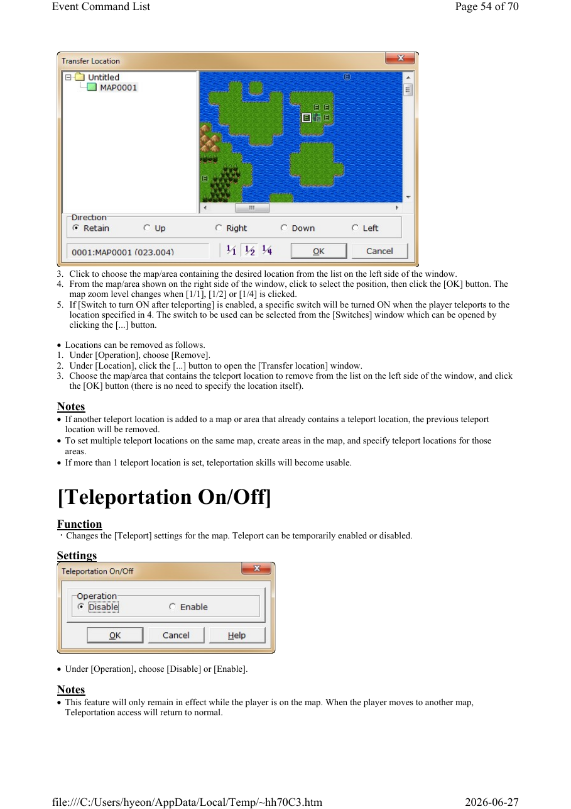

#### Embedded Images

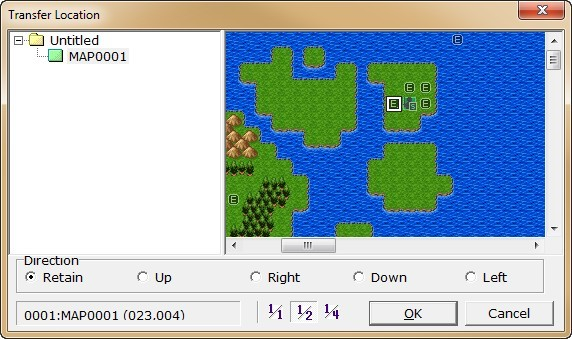

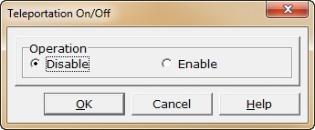

3. Click to choose the map/area containing the desired location from the list on the left side of the window.
4. From the map/area shown on the right side of the window, click to select the position, then click the [OK] button. The
map zoom level changes when [1/1], [1/2] or [1/4] is clicked.
5. If [Switch to turn ON after teleporting] is enabled, a specific switch will be turned ON when the player teleports to the
location specified in 4. The switch to be used can be selected from the [Switches] window which can be opened by
clicking the [...] button.
· Locations can be removed as follows.
1. Under [Operation], choose [Remove].
2. Under [Location], click the [...] button to open the [Transfer location] window.
3. Choose the map/area that contains the teleport location to remove from the list on the left side of the window, and click
the [OK] button (there is no need to specify the location itself).
#### Notes
· If another teleport location is added to a map or area that already contains a teleport location, the previous teleport
location will be removed.
· To set multiple teleport locations on the same map, create areas in the map, and specify teleport locations for those
areas.
· If more than 1 teleport location is set, teleportation skills will become usable.
### Teleportation On/Off
#### Function
・Changes the [Teleport] settings for the map. Teleport can be temporarily enabled or disabled.
#### Settings
· Under [Operation], choose [Disable] or [Enable].
#### Notes
· This feature will only remain in effect while the player is on the map. When the player moves to another map,
Teleportation access will return to normal.

## Page 55

Rendered page image

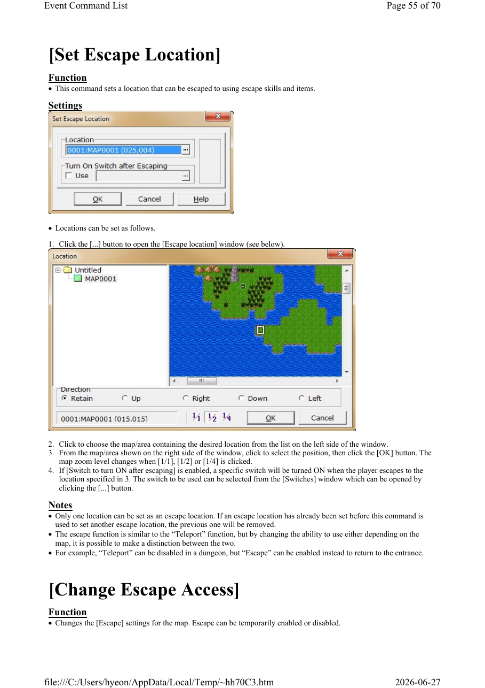

#### Embedded Images

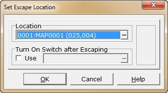

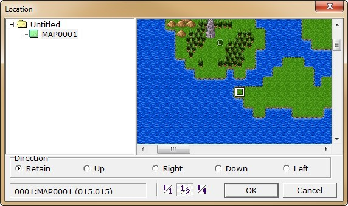

### Set Escape Location
#### Function
· This command sets a location that can be escaped to using escape skills and items.
#### Settings
· Locations can be set as follows.
1. Click the [...] button to open the [Escape location] window (see below).
2. Click to choose the map/area containing the desired location from the list on the left side of the window.
3. From the map/area shown on the right side of the window, click to select the position, then click the [OK] button. The
map zoom level changes when [1/1], [1/2] or [1/4] is clicked.
4. If [Switch to turn ON after escaping] is enabled, a specific switch will be turned ON when the player escapes to the
location specified in 3. The switch to be used can be selected from the [Switches] window which can be opened by
clicking the [...] button.
#### Notes
· Only one location can be set as an escape location. If an escape location has already been set before this command is
used to set another escape location, the previous one will be removed.
· The escape function is similar to the “Teleport” function, but by changing the ability to use either depending on the
map, it is possible to make a distinction between the two.
· For example, “Teleport” can be disabled in a dungeon, but “Escape” can be enabled instead to return to the entrance.
### Change Escape Access
#### Function
· Changes the [Escape] settings for the map. Escape can be temporarily enabled or disabled.

## Page 56

Rendered page image

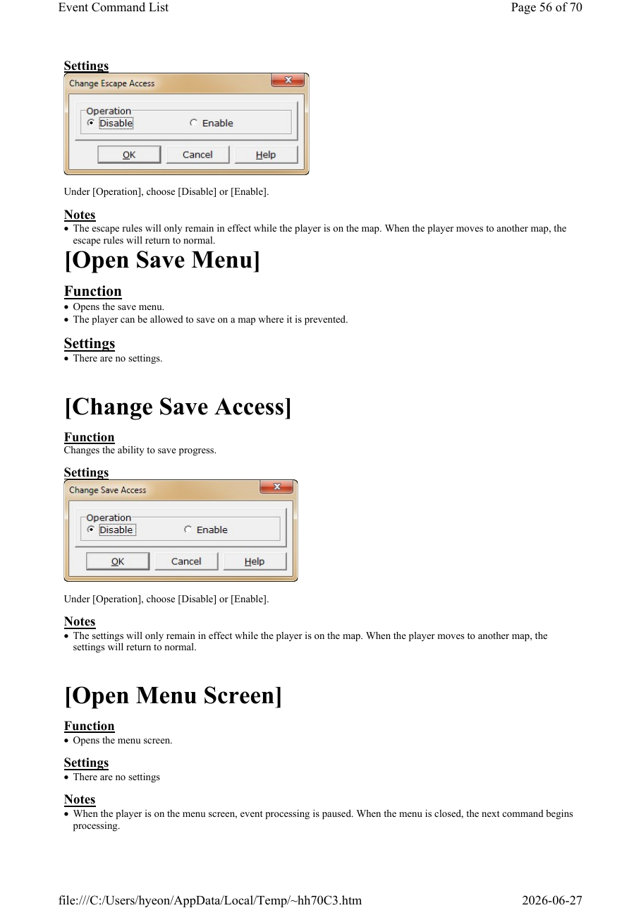

#### Embedded Images

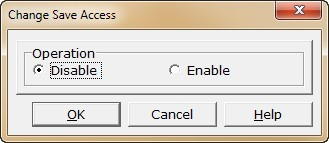

#### Settings
Under [Operation], choose [Disable] or [Enable].
#### Notes
· The escape rules will only remain in effect while the player is on the map. When the player moves to another map, the
escape rules will return to normal.
### Open Save Menu
#### Function
· Opens the save menu.
· The player can be allowed to save on a map where it is prevented.
#### Settings
· There are no settings.
### Change Save Access
#### Function
Changes the ability to save progress.
#### Settings
Under [Operation], choose [Disable] or [Enable].
#### Notes
· The settings will only remain in effect while the player is on the map. When the player moves to another map, the
settings will return to normal.
### Open Menu Screen
#### Function
· Opens the menu screen.
#### Settings
· There are no settings
#### Notes
· When the player is on the menu screen, event processing is paused. When the menu is closed, the next command begins
processing.

## Page 57

Rendered page image

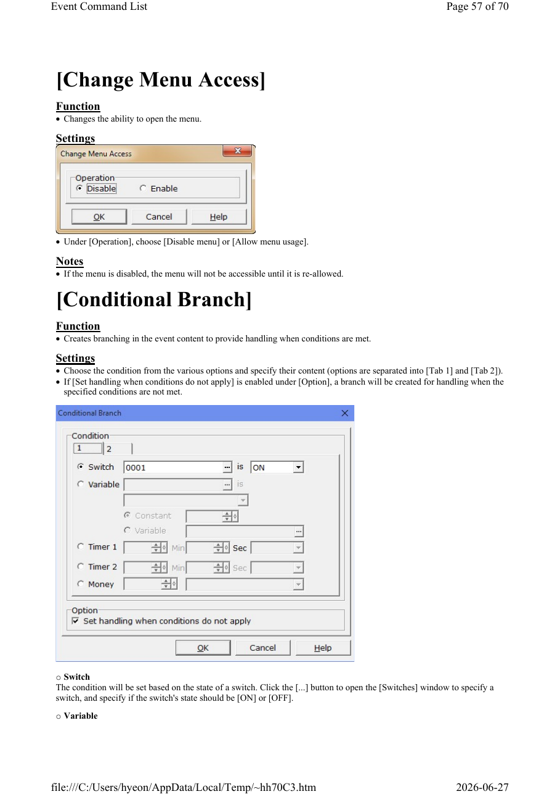

#### Embedded Images

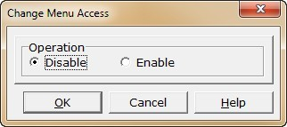

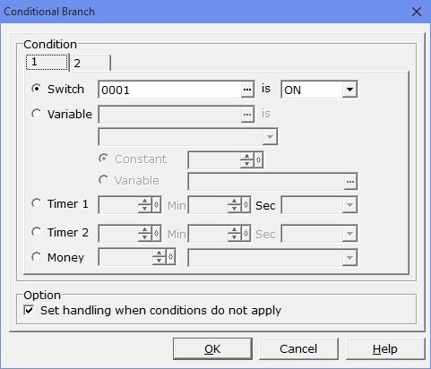

### Change Menu Access
#### Function
· Changes the ability to open the menu.
#### Settings
· Under [Operation], choose [Disable menu] or [Allow menu usage].
#### Notes
· If the menu is disabled, the menu will not be accessible until it is re-allowed.
### Conditional Branch
#### Function
· Creates branching in the event content to provide handling when conditions are met.
#### Settings
· Choose the condition from the various options and specify their content (options are separated into [Tab 1] and [Tab 2]).
· If [Set handling when conditions do not apply] is enabled under [Option], a branch will be created for handling when the
specified conditions are not met.
o Switch
The condition will be set based on the state of a switch. Click the [...] button to open the [Switches] window to specify a
switch, and specify if the switch's state should be [ON] or [OFF].
o Variable

## Page 58

Rendered page image

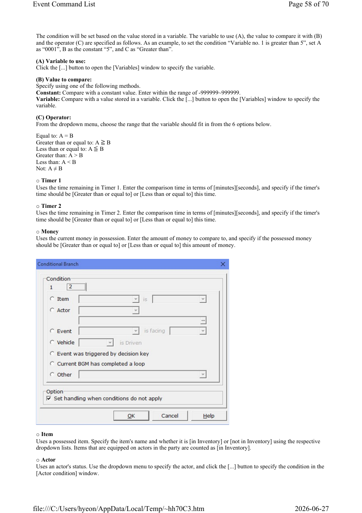

#### Embedded Images

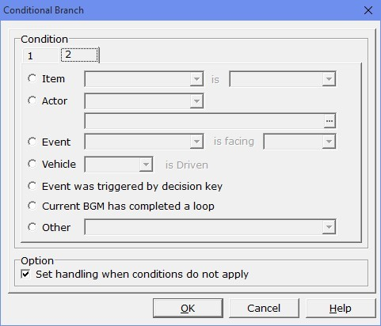

The condition will be set based on the value stored in a variable. The variable to use (A), the value to compare it with (B)
and the operator (C) are specified as follows. As an example, to set the condition “Variable no. 1 is greater than 5”, set A
as “0001”, B as the constant “5”, and C as “Greater than”.
(A) Variable to use:
Click the [...] button to open the [Variables] window to specify the variable.
(B) Value to compare:
Specify using one of the following methods.
Constant: Compare with a constant value. Enter within the range of -999999~999999.
Variable: Compare with a value stored in a variable. Click the [...] button to open the [Variables] window to specify the
variable.
(C) Operator:
From the dropdown menu, choose the range that the variable should fit in from the 6 options below.
Equal to: A = B
Greater than or equal to: A ≧ B
Less than or equal to: A ≦ B
Greater than: A > B
Less than: A < B
Not: A ≠ B
o Timer 1
Uses the time remaining in Timer 1. Enter the comparison time in terms of [minutes][seconds], and specify if the timer's
time should be [Greater than or equal to] or [Less than or equal to] this time.
o Timer 2
Uses the time remaining in Timer 2. Enter the comparison time in terms of [minutes][seconds], and specify if the timer's
time should be [Greater than or equal to] or [Less than or equal to] this time.
o Money
Uses the current money in possession. Enter the amount of money to compare to, and specify if the possessed money
should be [Greater than or equal to] or [Less than or equal to] this amount of money.
o Item
Uses a possessed item. Specify the item's name and whether it is [in Inventory] or [not in Inventory] using the respective
dropdown lists. Items that are equipped on actors in the party are counted as [in Inventory].
o Actor
Uses an actor's status. Use the dropdown menu to specify the actor, and click the [...] button to specify the condition in the
[Actor condition] window.

## Page 59

Rendered page image

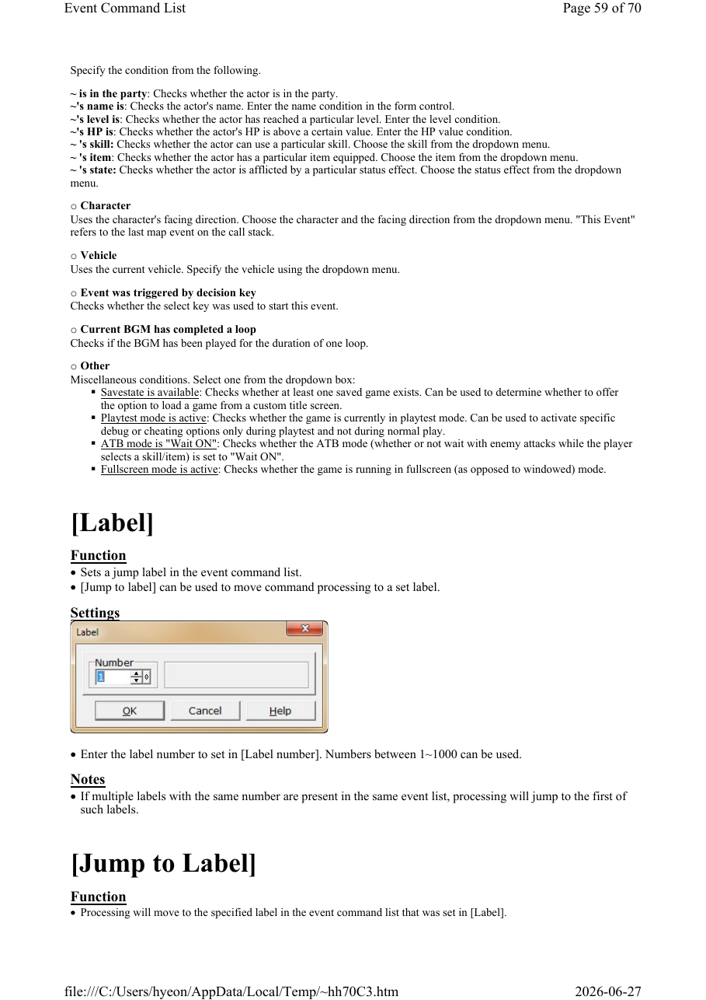

#### Embedded Images

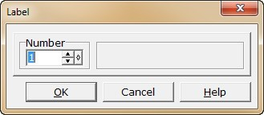

Specify the condition from the following.
~ is in the party: Checks whether the actor is in the party.
~'s name is: Checks the actor's name. Enter the name condition in the form control.
~'s level is: Checks whether the actor has reached a particular level. Enter the level condition.
~'s HP is: Checks whether the actor's HP is above a certain value. Enter the HP value condition.
~ 's skill: Checks whether the actor can use a particular skill. Choose the skill from the dropdown menu.
~ 's item: Checks whether the actor has a particular item equipped. Choose the item from the dropdown menu.
~ 's state: Checks whether the actor is afflicted by a particular status effect. Choose the status effect from the dropdown
menu.
o Character
Uses the character's facing direction. Choose the character and the facing direction from the dropdown menu. "This Event"
refers to the last map event on the call stack.
o Vehicle
Uses the current vehicle. Specify the vehicle using the dropdown menu.
o Event was triggered by decision key
Checks whether the select key was used to start this event.
o Current BGM has completed a loop
Checks if the BGM has been played for the duration of one loop.
o Other
Miscellaneous conditions. Select one from the dropdown box:
§ Savestate is available: Checks whether at least one saved game exists. Can be used to determine whether to offer
the option to load a game from a custom title screen.
§ Playtest mode is active: Checks whether the game is currently in playtest mode. Can be used to activate specific
debug or cheating options only during playtest and not during normal play.
§ ATB mode is "Wait ON": Checks whether the ATB mode (whether or not wait with enemy attacks while the player
selects a skill/item) is set to "Wait ON".
§ Fullscreen mode is active: Checks whether the game is running in fullscreen (as opposed to windowed) mode.
### Label
#### Function
· Sets a jump label in the event command list.
· [Jump to label] can be used to move command processing to a set label.
#### Settings
· Enter the label number to set in [Label number]. Numbers between 1~1000 can be used.
#### Notes
· If multiple labels with the same number are present in the same event list, processing will jump to the first of
such labels.
### Jump to Label
#### Function
· Processing will move to the specified label in the event command list that was set in [Label].

## Page 60

Rendered page image

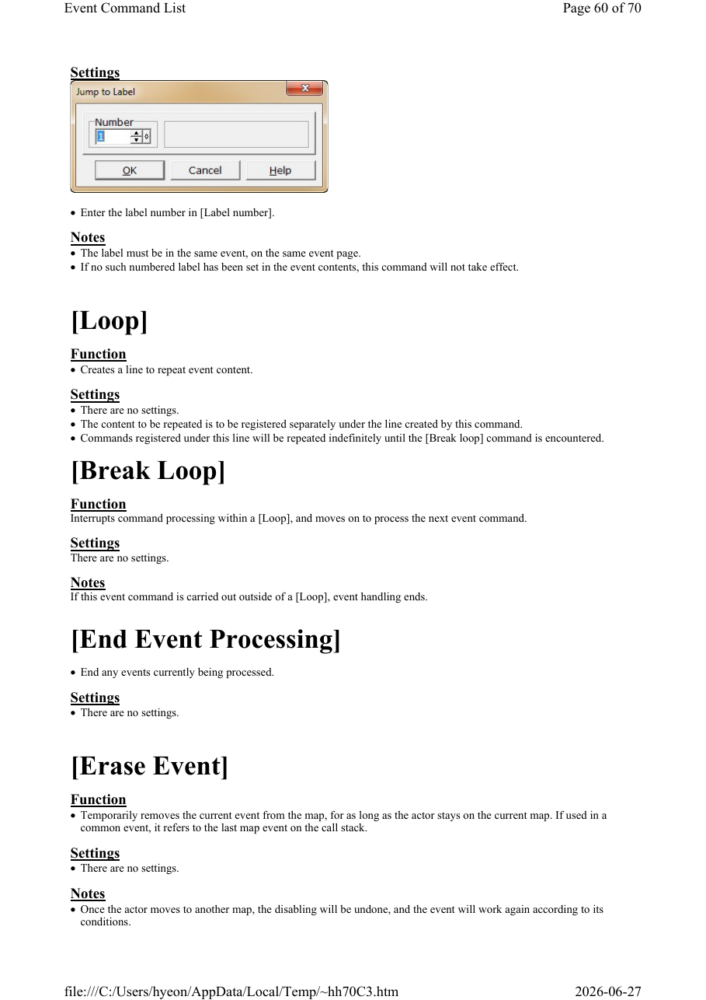

#### Embedded Images

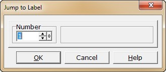

#### Settings
· Enter the label number in [Label number].
#### Notes
· The label must be in the same event, on the same event page.
· If no such numbered label has been set in the event contents, this command will not take effect.
### Loop
#### Function
· Creates a line to repeat event content.
#### Settings
· There are no settings.
· The content to be repeated is to be registered separately under the line created by this command.
· Commands registered under this line will be repeated indefinitely until the [Break loop] command is encountered.
### Break Loop
#### Function
Interrupts command processing within a [Loop], and moves on to process the next event command.
#### Settings
There are no settings.
#### Notes
If this event command is carried out outside of a [Loop], event handling ends.
### End Event Processing
· End any events currently being processed.
#### Settings
· There are no settings.
### Erase Event
#### Function
· Temporarily removes the current event from the map, for as long as the actor stays on the current map. If used in a
common event, it refers to the last map event on the call stack.
#### Settings
· There are no settings.
#### Notes
· Once the actor moves to another map, the disabling will be undone, and the event will work again according to its
conditions.

## Page 61

Rendered page image

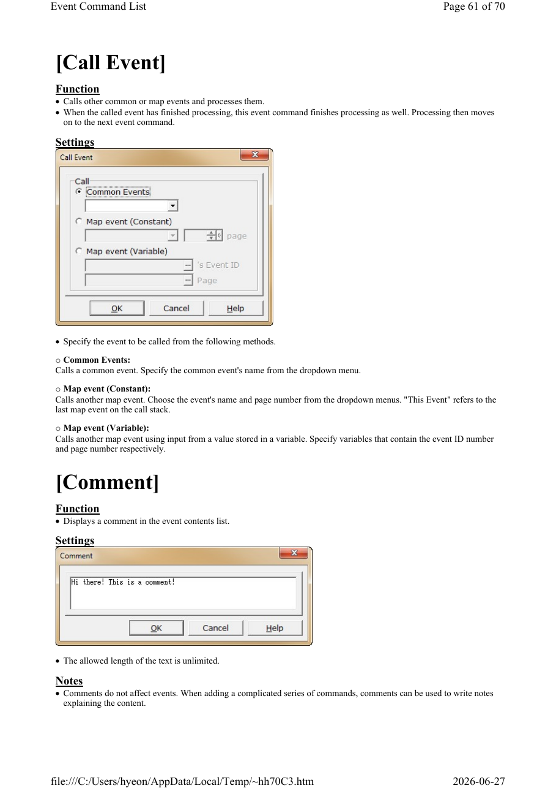

#### Embedded Images

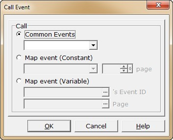

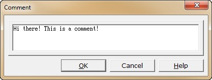

### Call Event
#### Function
· Calls other common or map events and processes them.
· When the called event has finished processing, this event command finishes processing as well. Processing then moves
on to the next event command.
#### Settings
· Specify the event to be called from the following methods.
o Common Events:
Calls a common event. Specify the common event's name from the dropdown menu.
o Map event (Constant):
Calls another map event. Choose the event's name and page number from the dropdown menus. "This Event" refers to the
last map event on the call stack.
o Map event (Variable):
Calls another map event using input from a value stored in a variable. Specify variables that contain the event ID number
and page number respectively.
### Comment
#### Function
· Displays a comment in the event contents list.
#### Settings
· The allowed length of the text is unlimited.
#### Notes
· Comments do not affect events. When adding a complicated series of commands, comments can be used to write notes
explaining the content.

## Page 62

Rendered page image

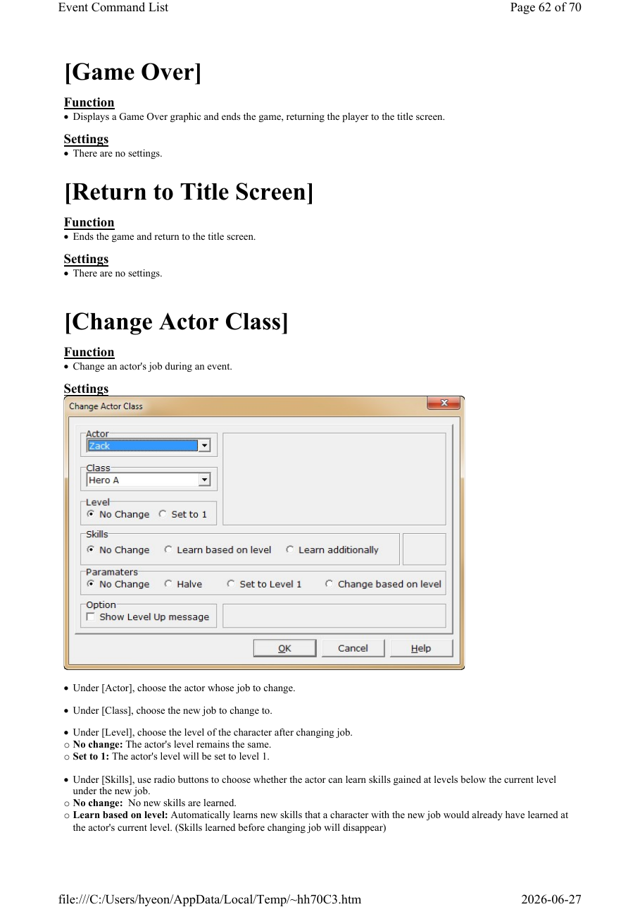

#### Embedded Images

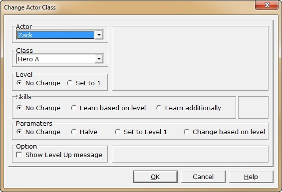

### Game Over
#### Function
· Displays a Game Over graphic and ends the game, returning the player to the title screen.
#### Settings
· There are no settings.
### Return to Title Screen
#### Function
· Ends the game and return to the title screen.
#### Settings
· There are no settings.
### Change Actor Class
#### Function
· Change an actor's job during an event.
#### Settings
· Under [Actor], choose the actor whose job to change.
· Under [Class], choose the new job to change to.
· Under [Level], choose the level of the character after changing job.
o No change: The actor's level remains the same.
o Set to 1: The actor's level will be set to level 1.
· Under [Skills], use radio buttons to choose whether the actor can learn skills gained at levels below the current level
under the new job.
o No change: No new skills are learned.
o Learn based on level: Automatically learns new skills that a character with the new job would already have learned at
the actor's current level. (Skills learned before changing job will disappear)

## Page 63

Rendered page image

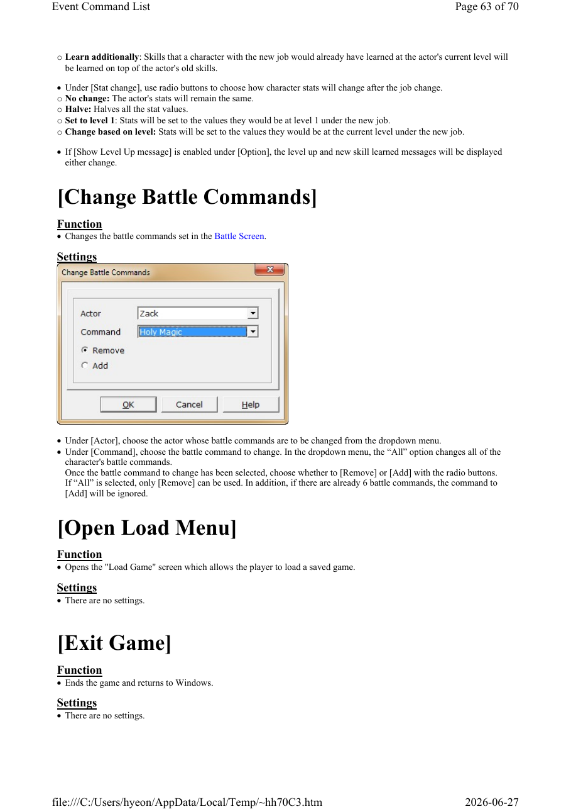

#### Embedded Images

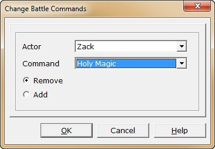

o Learn additionally: Skills that a character with the new job would already have learned at the actor's current level will
be learned on top of the actor's old skills.
· Under [Stat change], use radio buttons to choose how character stats will change after the job change.
o No change: The actor's stats will remain the same.
o Halve: Halves all the stat values.
o Set to level 1: Stats will be set to the values they would be at level 1 under the new job.
o Change based on level: Stats will be set to the values they would be at the current level under the new job.
· If [Show Level Up message] is enabled under [Option], the level up and new skill learned messages will be displayed
either change.
### Change Battle Commands
#### Function
· Changes the battle commands set in the Battle Screen.
#### Settings
· Under [Actor], choose the actor whose battle commands are to be changed from the dropdown menu.
· Under [Command], choose the battle command to change. In the dropdown menu, the “All” option changes all of the
character's battle commands.
Once the battle command to change has been selected, choose whether to [Remove] or [Add] with the radio buttons.
If “All” is selected, only [Remove] can be used. In addition, if there are already 6 battle commands, the command to
[Add] will be ignored.
### Open Load Menu
#### Function
· Opens the "Load Game" screen which allows the player to load a saved game.
#### Settings
· There are no settings.
### Exit Game
#### Function
· Ends the game and returns to Windows.
#### Settings
· There are no settings.

## Page 64

Rendered page image

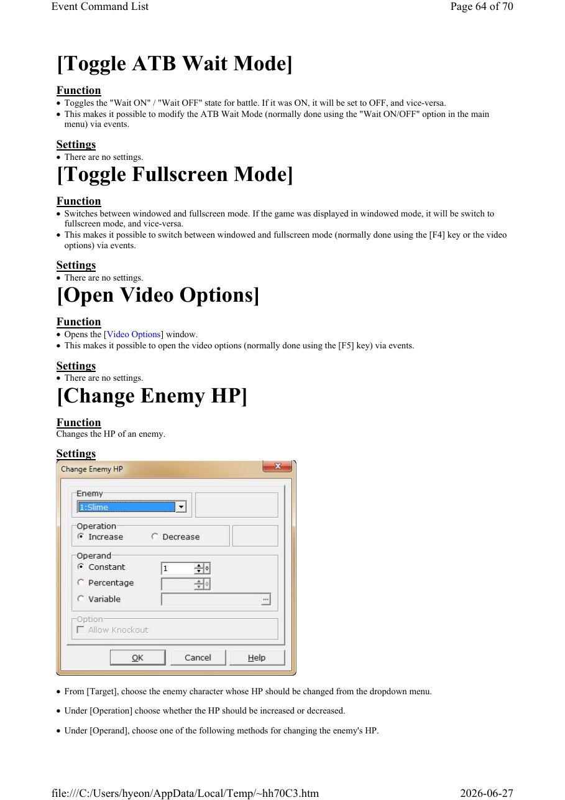

#### Embedded Images

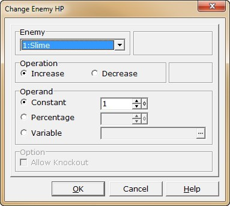

### Toggle ATB Wait Mode
#### Function
· Toggles the "Wait ON" / "Wait OFF" state for battle. If it was ON, it will be set to OFF, and vice-versa.
· This makes it possible to modify the ATB Wait Mode (normally done using the "Wait ON/OFF" option in the main
menu) via events.
#### Settings
· There are no settings.
### Toggle Fullscreen Mode
#### Function
· Switches between windowed and fullscreen mode. If the game was displayed in windowed mode, it will be switch to
fullscreen mode, and vice-versa.
· This makes it possible to switch between windowed and fullscreen mode (normally done using the [F4] key or the video
options) via events.
#### Settings
· There are no settings.
### Open Video Options
#### Function
· Opens the [Video Options] window.
· This makes it possible to open the video options (normally done using the [F5] key) via events.
#### Settings
· There are no settings.
### Change Enemy HP
#### Function
Changes the HP of an enemy.
#### Settings
· From [Target], choose the enemy character whose HP should be changed from the dropdown menu.
· Under [Operation] choose whether the HP should be increased or decreased.
· Under [Operand], choose one of the following methods for changing the enemy's HP.

## Page 65

Rendered page image

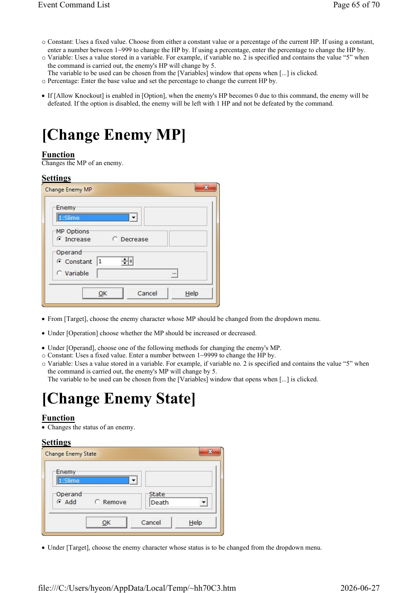

#### Embedded Images

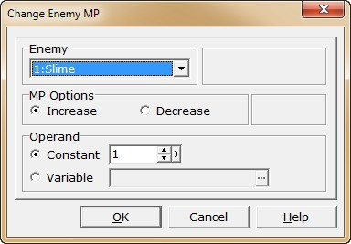

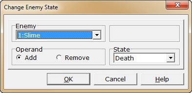

o Constant: Uses a fixed value. Choose from either a constant value or a percentage of the current HP. If using a constant,
enter a number between 1~999 to change the HP by. If using a percentage, enter the percentage to change the HP by.
o Variable: Uses a value stored in a variable. For example, if variable no. 2 is specified and contains the value “5” when
the command is carried out, the enemy's HP will change by 5.
The variable to be used can be chosen from the [Variables] window that opens when [...] is clicked.
o Percentage: Enter the base value and set the percentage to change the current HP by.
· If [Allow Knockout] is enabled in [Option], when the enemy's HP becomes 0 due to this command, the enemy will be
defeated. If the option is disabled, the enemy will be left with 1 HP and not be defeated by the command.
### Change Enemy MP
#### Function
Changes the MP of an enemy.
#### Settings
· From [Target], choose the enemy character whose MP should be changed from the dropdown menu.
· Under [Operation] choose whether the MP should be increased or decreased.
· Under [Operand], choose one of the following methods for changing the enemy's MP.
o Constant: Uses a fixed value. Enter a number between 1~9999 to change the HP by.
o Variable: Uses a value stored in a variable. For example, if variable no. 2 is specified and contains the value “5” when
the command is carried out, the enemy's MP will change by 5.
The variable to be used can be chosen from the [Variables] window that opens when [...] is clicked.
### Change Enemy State
#### Function
· Changes the status of an enemy.
#### Settings
· Under [Target], choose the enemy character whose status is to be changed from the dropdown menu.

## Page 66

Rendered page image

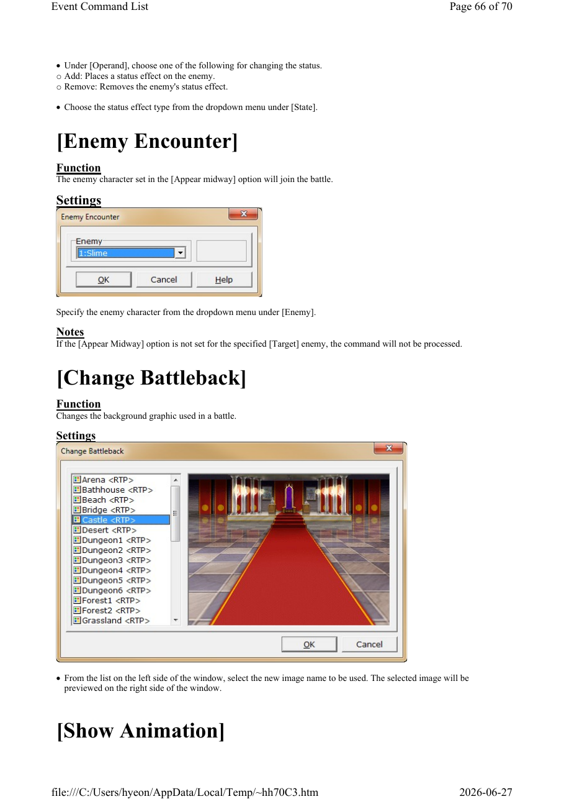

#### Embedded Images

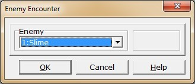

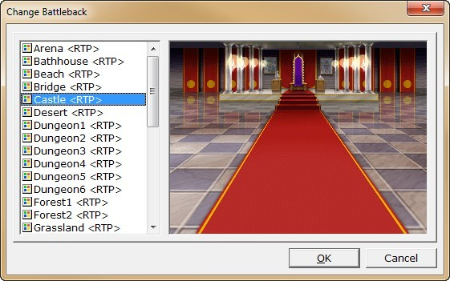

· Under [Operand], choose one of the following for changing the status.
o Add: Places a status effect on the enemy.
o Remove: Removes the enemy's status effect.
· Choose the status effect type from the dropdown menu under [State].
### Enemy Encounter
#### Function
The enemy character set in the [Appear midway] option will join the battle.
#### Settings
Specify the enemy character from the dropdown menu under [Enemy].
#### Notes
If the [Appear Midway] option is not set for the specified [Target] enemy, the command will not be processed.
### Change Battleback
#### Function
Changes the background graphic used in a battle.
#### Settings
· From the list on the left side of the window, select the new image name to be used. The selected image will be
previewed on the right side of the window.
### Show Animation

## Page 67

Rendered page image

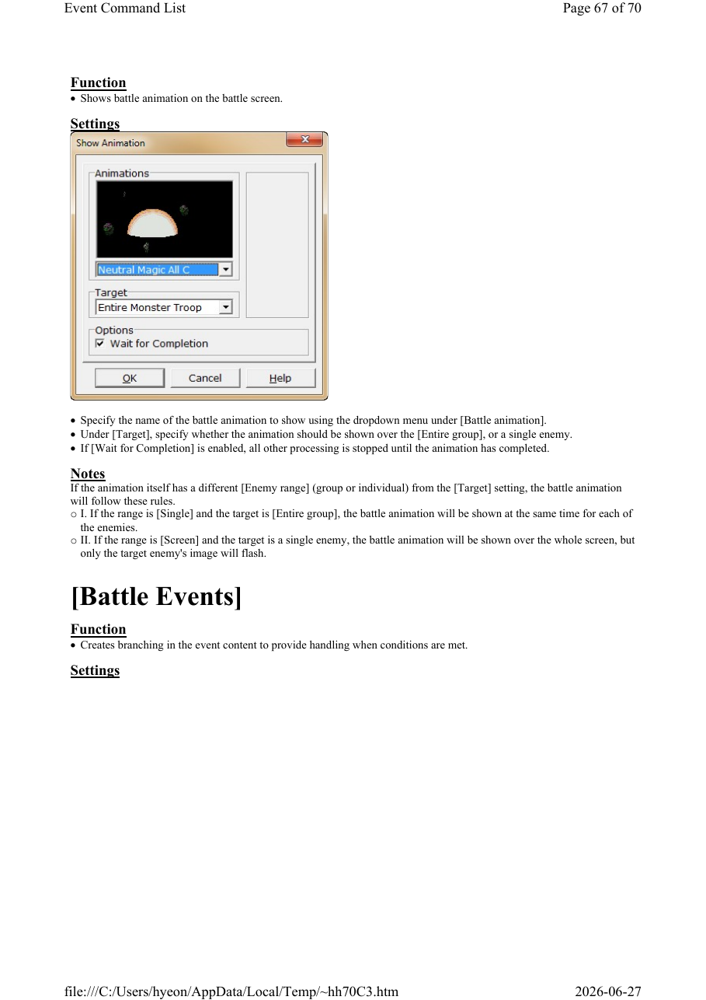

#### Embedded Images

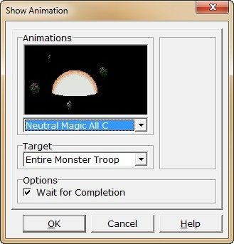

#### Function
· Shows battle animation on the battle screen.
#### Settings
· Specify the name of the battle animation to show using the dropdown menu under [Battle animation].
· Under [Target], specify whether the animation should be shown over the [Entire group], or a single enemy.
· If [Wait for Completion] is enabled, all other processing is stopped until the animation has completed.
#### Notes
If the animation itself has a different [Enemy range] (group or individual) from the [Target] setting, the battle animation
will follow these rules.
o I. If the range is [Single] and the target is [Entire group], the battle animation will be shown at the same time for each of
the enemies.
o II. If the range is [Screen] and the target is a single enemy, the battle animation will be shown over the whole screen, but
only the target enemy's image will flash.
### Battle Events
#### Function
· Creates branching in the event content to provide handling when conditions are met.
#### Settings

## Page 68

Rendered page image

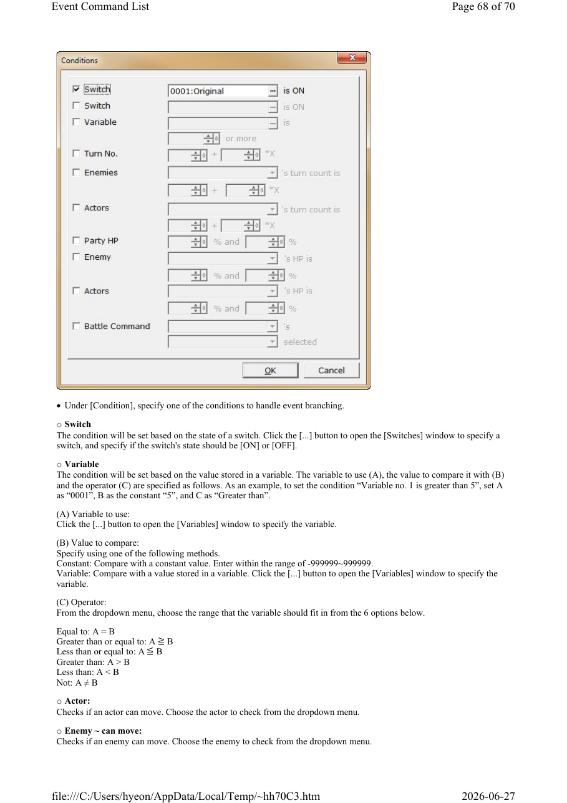

#### Embedded Images

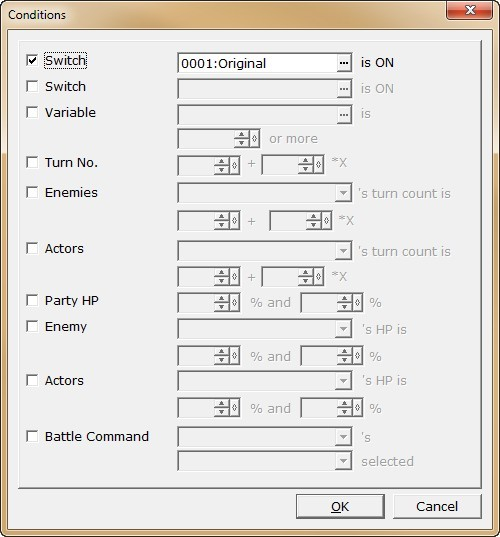

· Under [Condition], specify one of the conditions to handle event branching.
o Switch
The condition will be set based on the state of a switch. Click the [...] button to open the [Switches] window to specify a
switch, and specify if the switch's state should be [ON] or [OFF].
o Variable
The condition will be set based on the value stored in a variable. The variable to use (A), the value to compare it with (B)
and the operator (C) are specified as follows. As an example, to set the condition “Variable no. 1 is greater than 5”, set A
as “0001”, B as the constant “5”, and C as “Greater than”.
(A) Variable to use:
Click the [...] button to open the [Variables] window to specify the variable.
(B) Value to compare:
Specify using one of the following methods.
Constant: Compare with a constant value. Enter within the range of -999999~999999.
Variable: Compare with a value stored in a variable. Click the [...] button to open the [Variables] window to specify the
variable.
(C) Operator:
From the dropdown menu, choose the range that the variable should fit in from the 6 options below.
Equal to: A = B
Greater than or equal to: A ≧ B
Less than or equal to: A ≦ B
Greater than: A > B
Less than: A < B
Not: A ≠ B
o Actor:
Checks if an actor can move. Choose the actor to check from the dropdown menu.
o Enemy ~ can move:
Checks if an enemy can move. Choose the enemy to check from the dropdown menu.

## Page 69

Rendered page image

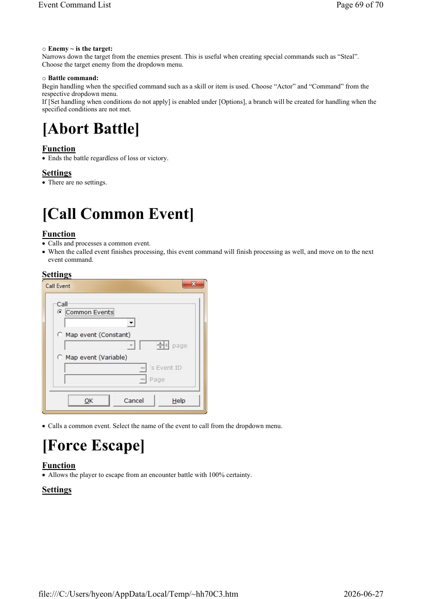

#### Embedded Images

o Enemy ~ is the target:
Narrows down the target from the enemies present. This is useful when creating special commands such as “Steal”.
Choose the target enemy from the dropdown menu.
o Battle command:
Begin handling when the specified command such as a skill or item is used. Choose “Actor” and “Command” from the
respective dropdown menu.
If [Set handling when conditions do not apply] is enabled under [Options], a branch will be created for handling when the
specified conditions are not met.
### Abort Battle
#### Function
· Ends the battle regardless of loss or victory.
#### Settings
· There are no settings.
### Call Common Event
#### Function
· Calls and processes a common event.
· When the called event finishes processing, this event command will finish processing as well, and move on to the next
event command.
#### Settings
· Calls a common event. Select the name of the event to call from the dropdown menu.
### Force Escape
#### Function
· Allows the player to escape from an encounter battle with 100% certainty.
#### Settings

## Page 70

Rendered page image

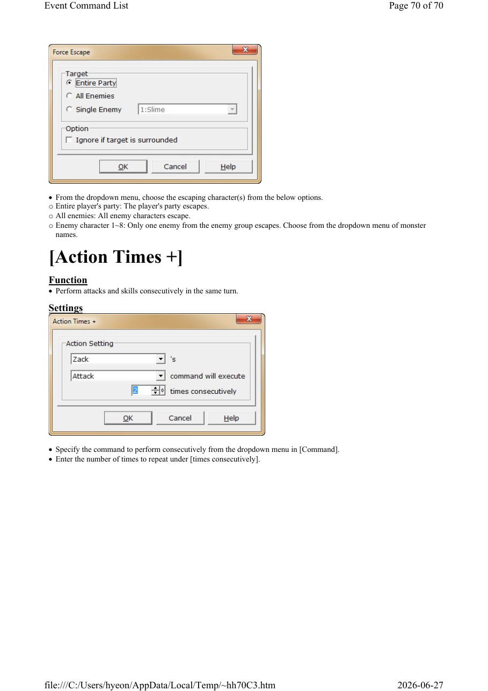

#### Embedded Images

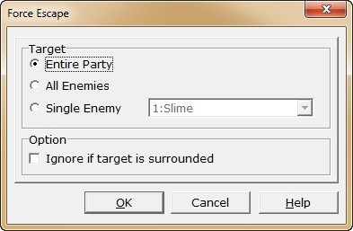

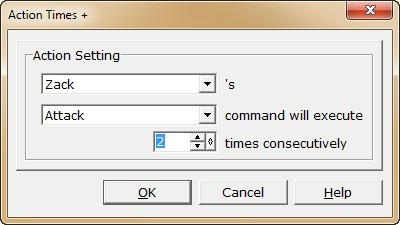

· From the dropdown menu, choose the escaping character(s) from the below options.
o Entire player's party: The player's party escapes.
o All enemies: All enemy characters escape.
o Enemy character 1~8: Only one enemy from the enemy group escapes. Choose from the dropdown menu of monster
names.
### Action Times +
#### Function
· Perform attacks and skills consecutively in the same turn.
#### Settings
· Specify the command to perform consecutively from the dropdown menu in [Command].
· Enter the number of times to repeat under [times consecutively].
