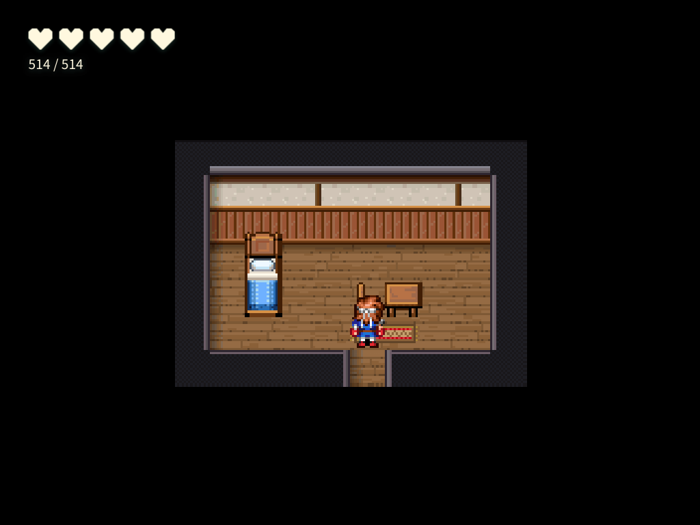
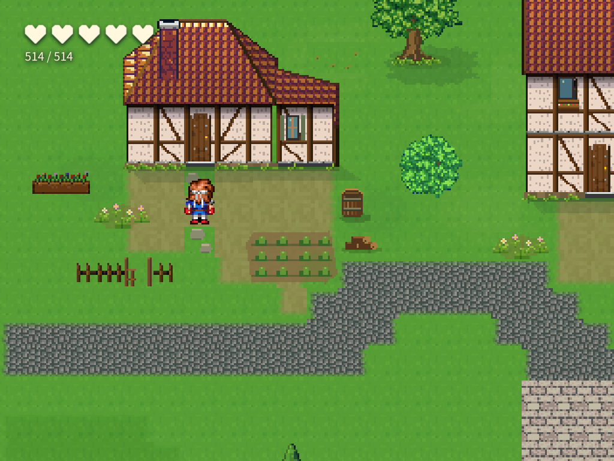

# 출구 칸 인식·이동 이벤트 검증 — 2026-10-08

사용자 질문: 한 칸 출구를 조수가 실제 출구로 인식하고 같은 칸에 이벤트까지 설치하는가?

**두 실제 조수 수행의 저장 데이터와 플레이에서 동일 칸의 playerTouch 이동을 확인했다.** 생성 도구는 남쪽 평면 틈을 `exits[].x,y,width`로 반환하며, 조수 공통 지침과 도구 설명에 이 좌표로 이동을 연결하도록 명시했다. 특정 바닥 타일 번호 전체를 출구로 태그하는 구조는 아니다. 같은 바닥 그림은 방 안에도 쓰이므로 출구는 평면의 위치로 판별한다. 목적지 정보가 없는 방 생성만으로 이벤트가 자동 생성되는 것은 아니며, 연결 작업은 `create_transfer_pair`·`link_maps`·`links` 등으로 수행한다.

## 검증 결과

| 항목 | 확인 결과 | 근거 |
|---|---|---|
| 앞선 실제 조수의 출구·이벤트·SQLite 대조 | 10/10 통과 | [저장본 감사](sqlite-exit-event-audit.json) |
| 반환 출구 좌표·밟기 이동 설치·폭 거절·원자성·공용 문서 전달 | 16/16 통과 | [최종 도구 검사](controls-final.json) |
| 앞선 완료된 실모델 저장본 플레이 | 56/56 통과 | [앞선 기록](../assistant-portals-width-20261007/REPORT.md) |
| 이번 실모델의 저장된 체크포인트 플레이 | 55/55 통과, 오류 0 | [플레이 요약](checkpoint-runtime/SUMMARY.md), [영수증](new-native-runtime-recheck-checkpoint-exit.json) |
| 타입 검사 | 오류 0, 회귀 없음 | [최종 gate 로그](typecheck-final.log) |
| 관련 테스트 6파일·39개 | JSON 결과는 main: 33통과/6실패, 변경: 33통과/동일6실패. 새 실패 0. 변경 실행 종료는 143 | [최종 비교](focused-test-comparison-final.json) |
| 전체 gates | 미완료: Vitest 워커 8GB 힙 OOM, 보고서 없음 | [원래 실패 로그](full-gates-oom.log) |

앞선 저장본에서는 실제 출구 (4,6)에 `ev_interior_exit`의 playerTouch/below 페이지가 있고, 귀환 목적지는 집 문앞 (6,9)다. 그 데이터를 SQLite 프로젝트 행·맵 행·저장 직후 결과·재로드 결과와 대조했다. 조수의 실제 `upsert_event` 호출도 같은 좌표였다. 저장 내용이나 플레이 결과를 수선하지 않았다.

이번에도 같은 원래 자연어 과제를 실제 입력창으로 보냈다. 첫 시도는 입력 전 기동 실패(모델 요청 0), 다음 시도는 실제 모델 수행 중 480초 제한으로 중단됐다. [원래 실패 결과](new-native-result.json)와 [도구 호출 기록](new-native-trace.json)을 보존한다. 조수는 남쪽 출구 (5,6), 폭 1을 만들고 `create_transfer_pair`로 같은 칸에 이동 이벤트를 썼다. 실내 출구의 바닥 좌표를 doorAt으로 잘못 선언한 첫 연결은 거절됐고, 다음 호출에서 바르게 연결했다.

[이번 저장 이벤트](checkpoint-exit-event.json)는 출구 (5,6)에 playerTouch/below 이동을 갖고 있으며, 돌아갈 때는 원래 집 문앞의 밟기 이벤트 바로 앞 안전한 착지 (6,10)에 선다. 집의 밟는 문앞은 (6,9)다. 출구와 착지는 다른 칸이므로 즉시 되돌아가는 루프가 없다. SQLite의 맵 행과 플레이에 쓴 맵 내용이 같은 것도 확인했다.

중단된 턴의 SQLite를 `portal-recheck --attempt checkpoint-exit --checkpoint`로 **읽기만 하여** 출하 플레이어(`player.html`, 실제 export shim)에서 방향키로 왕복했다. 모델 호출·정본 변경은 0이다. [체크포인트 정체성](new-native-checkpoint-snapshot.json)에 projectId·revision·저장 SHA와 `completedTurn:false`가 기록되어 있다. [당시 관측기](checkpoint-observer.ts)의 SHA는 플레이 영수증과 일치한다.

## 직접 읽은 플레이 화면

필수 그림 6장을 직접 읽고 [출구 범위의 시각 영수증](exit-visual-review.json)에 이미지 SHA를 기록했다. 방의 출구 한 칸, 착지 여유, 집 문앞 귀환을 확인했다. 미완료 들판의 구성 완성도를 출구 검증 합격에 포함하지 않았다.

## 실패·한계의 보존

- 앞선 완료된 모델 시도의 SQLite 전체 문서 SHA 불일치는 여전히 실패다. 맵·DB의 재로드 보존과 전체 저장 SHA는 구분한다.
- 이번 대형 맵 과제의 기동 실패와 실제 턴 시간 초과를 전체 성공으로 바꾸지 않았다. 체크포인트 플레이 통과는 원래 과제의 완료 선언이 아니다.
- 전체 테스트가 OOM으로 중단됐으므로 전체 스위트 무회귀를 주장하지 않는다. 화면 계약 gate도 exit 143으로 결과를 내지 못했다.
- 관련 테스트 최종 JSON은 39개 전체 결과를 기록했지만 실행기가 exit 143으로 끝났다. 테스트 항목의 기준본 대조와 실행기 정상 종료를 구분하며, 관련 테스트 gate 전체 통과로 보고하지 않는다.
- 관련 테스트의 첫 실행은 기존 6실패에 부하 중 시간 초과 1건이 추가됐다. 해당 항목 재관측 후 최종 같은 6파일을 120초 case 제한으로 실행하여 main의 기존 6실패와 일치함을 확인했다. 기준선 파일·기대값·테스트 점수는 변경하지 않았다.
- 타입 gate가 이번 변경의 readonly 경고 배열 오류 1건을 발견하여 경고 배열 사본을 반환하도록 수정했고, 최종 타입 gate는 exit 0이었다. 공용 문서 전달과 도구 검사는 최신 main의 마법 학교·사용자 역할표 지원을 보존한 통합 소스에서 다시 통과했다.
- 한 칸 기본값과 실제 연결 폭 검사로 일반 조수 경로를 교정했다. 임의의 저수준 이벤트 편집을 전부 금지하는 기능이나 모든 미래 LLM 응답의 무오류 보장은 아니다.

시험은 분리된 SQLite 프로젝트를 사용했으며 사용자 프로젝트와 공용 콘텐츠 DB에 시험 맵을 설치하지 않았다.
