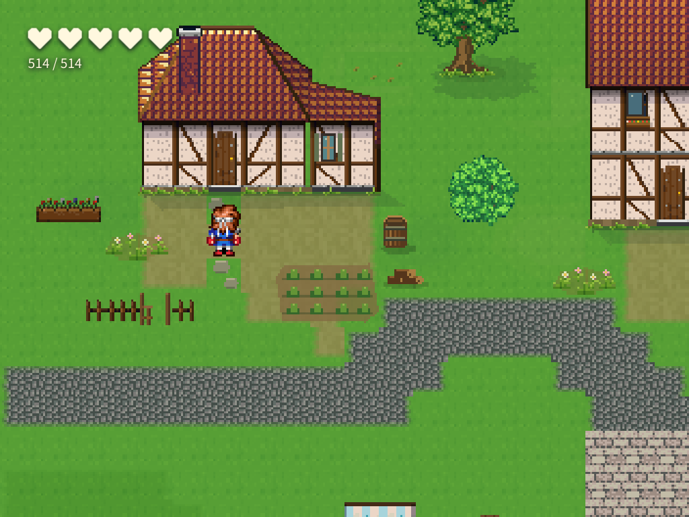
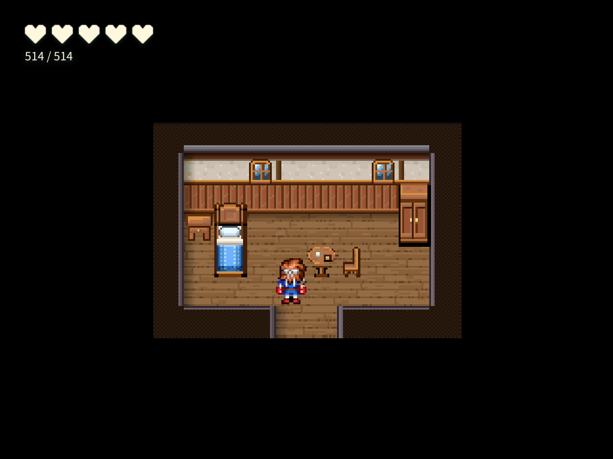
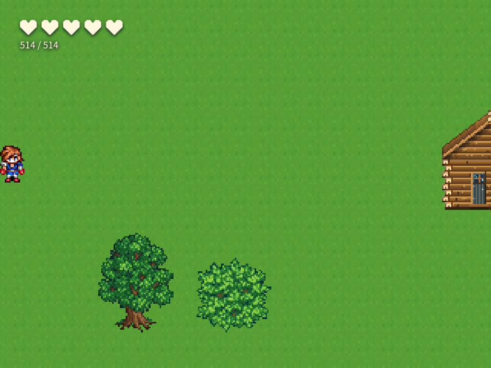

# 조수 출입구 수정과 실제 수행 — 2026-10-07

## 판정

**사용자 재검수 정정:** 실내 남쪽 틈이 가로 두 칸인데 외부 문은 한 칸이다. 앞선 시각 합격은 이 폭 불일치를 놓쳤으므로 이 결과의 시각 판정을 불합격으로 정정한다. 기존 `visual-review.json`은 최초 기록으로 보존한다. 왕복 통행 통과는 문 폭 일치의 근거가 아니다.

이 사례에서 **첫 집 ↔ 실내와 마을 ↔ 들판 왕복은 통과**했다. 전체 수행 하네스는 **SQLite 문서 해시 불일치로 합격하지 못했다**. 맵·이벤트·데이터베이스와 시작 위치는 재로드 전후 같았다. 한 사례이므로 모델별 반복 성공률은 측정하지 않았다.

## 수정

- `place_door`는 문 그림 하단과 밟는 문앞을 구분한 `transferEndpoint`를 반환한다.
- `create_transfer_pair`와 `link_maps`가 같은 출입구 도달·봉쇄 검사를 사용한다. 안전한 위치가 없으면 두 맵 모두 보존한 채 실패한다.
- `doorAt`을 넘긴 문앞은 옆 칸으로 자동 이동하지 않는다. 착지는 인접 네 방향에서 실제 왕복 통행과 이벤트 점유를 검사한다.
- 기존 출입구의 접근 검사도 실제 `canMove`와 맵 범위를 확인한다. 연결 재실행은 안정 ID를 유지한다.
- Pi 안내에 문 그림·문앞·착지·귀환을 함께 저작하도록 추가했다.

## 실제 입력과 수행

`assistant-capability portals`로 별도 SQLite에 빈 40×30 버들항 맵과 보존 표본을 만들었다. 실제 입력창에서 자연어를 보내 기본 분류와 Pi 실행을 통과했다. 제공자는 `google-antigravity`, 모델은 `gemini-3.8-flash`, 완료까지 363,015ms였다. 원문은 [fixture.json](fixture.json), 실제 호출과 도구 기록은 [trace.json](trace.json)에 있다. 사용자의 프로젝트와 공용 DB에는 쓰지 않았다.

조수는 서로 다른 원본 집 3채, 첫 집의 손 도트 실내와 가구, 동쪽 들판과 이동 이벤트 4개를 만들었다. 실내 가구 배치가 한 번 거절된 뒤 같은 실행 안에서 좌표를 고쳐 완료했다. 코딩 에이전트가 결과 맵을 수선하거나 모델을 다시 호출하지 않았다.

| 연결 | 밟는 칸 | 반대편 착지 |
|---|---|---|
| 첫 집 입장 | 마을 (6,9), 그림 하단 (6,8) | 실내 (4,5) |
| 집에서 귀환 | 실내 (4,6) | 마을 (6,10) |
| 동쪽 출구 | 마을 (39,15) | 들판 (0,16) |
| 서쪽 귀환 | 들판 (0,15) | 마을 (39,16) |

## 검수 근거

- [도구 반례](controls.json): 6/6 통과. 두 연결 도구의 도달 불가 거절·원자성, 문앞 고정, 안정 ID 재실행. 실모델 점수와 분리했다.
- [최초 결과](result.json): 데이터 검사 9/10 통과. 집 3채 원본 래스터, 정확한 첫 집 문앞, 동쪽 맵 끝, 실내 가구, 시작 위치·표본 보존 통과. 전체 SQLite SHA 검사 실패.
- 최초 플레이 관측은 관측 코드가 명령의 `kind: transfer`를 대기 op에 섞어 실패했다. 최초 판정은 보존했다.
- [첫 재관측](runtime-recheck.json)은 방향 지속 입력이 상태 조회 중 목표 칸을 지나쳐 49/56 비트가 실패했다. 맵 결함으로 합산하지 않았다.
- 방향키 한 번 누르기로 바꾼 관측의 첫 시작은 외부 SIGTERM(exit 143)으로 브라우저 관측 전에 종료됐다. 결과 그림이 없으며 합격으로 세지 않았다.
- [같은 저장본의 최종 플레이 재관측](runtime-recheck-key-taps-r2.json): 모델 호출 0회, 전용 `player.html`, 실제 키보드 입력, **56/56 비트 통과·런타임 오류 0건**. 집·들판 입장과 귀환, 착지 후 즉시 재전이하지 않음을 확인했다. [런타임 요약](runtime-key-taps-r2/SUMMARY.md)을 먼저 읽고 지정된 PNG 6개를 검수했다. 관측 당시 코드는 [observer-key-taps-r2.ts](observer-key-taps-r2.ts)로 보존했다.
- [시각 판정](visual-review.json)은 적용·재로드·문앞·실내·들판·양쪽 귀환 PNG 해시에 묶었다. 문 접근로와 착지에 가구가 없고, 침대·탁자·의자와 남쪽 출구가 실제로 보였다.

## 남은 제한

동쪽 출구는 길 끝에서 떨어진 잔디 한 칸이다. 들판 착지도 경계 위에 있다. 왕복 통행은 되지만 출구를 찾아가기 위한 시각 표시와 길 연결은 약하다. 마을 전체의 완성도 합격으로 해석하지 않는다.

[저장 영수증](persistence.json)의 전체 SHA는 적용 후 `611fb503…`에서 재로드 후 `97c285c5…`로 달라졌다. [접힌 문서 비교](reload-document-diff.json)에서 바뀐 경로는 `beodeul_ground.$blob`과 `beodeul_architecture.$blob` 두 곳이다. 재로드 값은 최초 입력 전 값으로 돌아왔다. 이전 blob 본문은 SQLite 정리로 없어 바이트 차이의 원인을 입증하지 못했다. 이 실패를 면제하거나 안전한 정규화로 단정하지 않는다.

## 실제 캡처

### 첫 집 문앞

### 실내 착지

### 들판 착지

