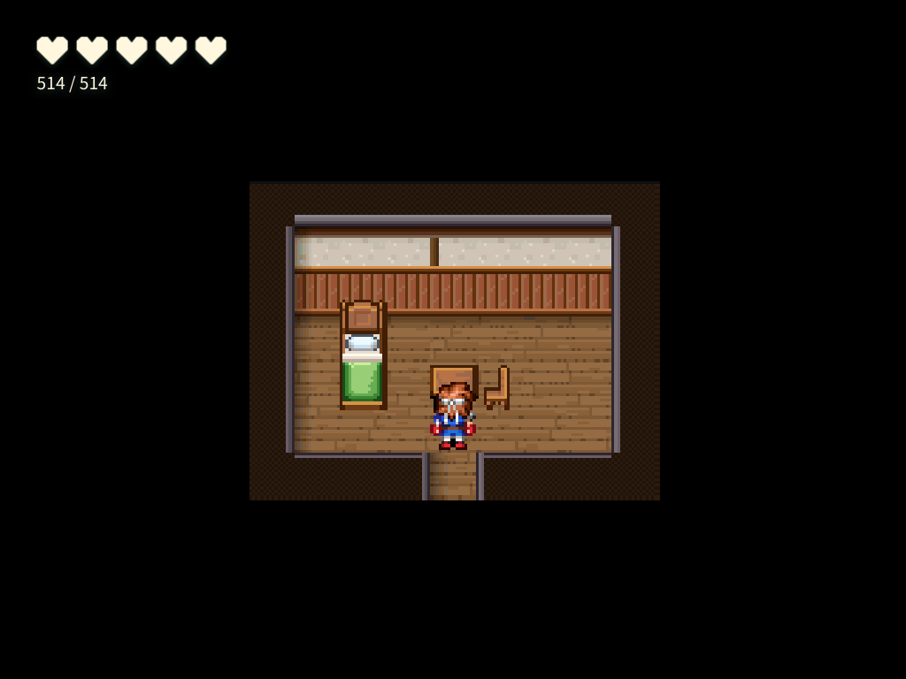
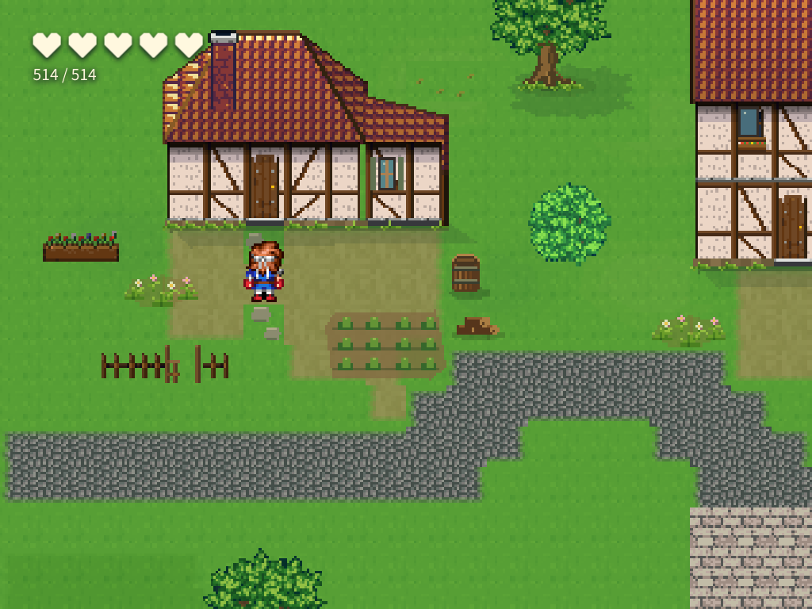

# 한 칸 문·한 칸 출구 교정 — 2026-10-07

사용자가 앞선 결과의 한 칸 외부 문과 두 칸 실내 출구 불일치를 지적했다. 앞선 시각 합격은 [불합격으로 정정](../assistant-portals-20261007/user-review-amendment.json)했고 원래 결과·검수 영수증은 보존했다.

## 바뀐 동작

- `build_hand_interior_room`은 남쪽 평면의 실제 열린 폭과 `exitWidth`(기본 1)를 비교한다. `####..####`은 기본 요청에서 거절하며 맵을 변경하지 않는다. `start` 한 칸 선언으로 두 칸 틈을 숨기지 못한다.
- `create_transfer_pair`·`link_maps`의 `doorAt` 한 칸 문 계약은 상대 손 도트 실내의 설치된 구조 폭과 비교한다. 가구로 한쪽을 막아도 두 칸 틈은 거절한다.
- 명시적인 넓은 대문용 `exitWidth`는 유지한다. 기존 넓은 공용 예제에는 실제 폭을 명시하고 한 칸 집 문에 그대로 복사하지 않도록 가르친다.
- 공용 번들에 폭 계약 문서를 추가했다. 이미 같은 판본을 가진 프로젝트에도 빠진 문서를 추가하고 저자가 쓴 원문·그림은 보존한다. 조수 공통 정책·도구 설명·실내 저작 스킬에 같은 규칙을 넣었다.

## 실제 조수 수행

[원래 자연어 입력](fixture.json)은 앞선 시험과 같으며, 입력에 ‘한 칸 출구’ 지시를 덧붙이지 않았다. 실제 입력창의 Pi 경로와 `gemini-3.8-flash` / `google-antigravity`를 사용했다. 한 번의 수행 시간은 277,135ms였다. 모의 응답·결과 수선은 없다.

[도구 입력](room-tool-inputs.json)에서 조수는 처음부터 `exitWidth:1`, `###.###`을 썼다. 같은 실행에서 가구가 방 밖에 놓이는 오류를 고쳐 9×7로 다시 지을 때도 `####.####` 한 칸을 유지했다. 설치된 지도 자체의 남쪽 틈과 귀환 이벤트도 한 칸으로 확인했다. 공용 원본 집 3채, 시작 위치와 보존 표본이 유지됐다.

### 한 칸 실내 출구 — 실제 플레이 캡처

### 대응하는 원본 집 문앞

## 관측 결과

| 항목 | 결과 | 근거 |
|---|---|---|
| 도구 거절·원자성·공용 문서 전달 | 14/14 통과 | [controls.json](controls.json) |
| 실제 입력·문앞·출구 폭·보존 | 10/11 통과, 저장 SHA 항목 실패 | [원래 result.json](result.json) |
| 실제 집/실내 및 마을/들판 왕복 | 56/56 통과, 런타임 오류 0 | [SUMMARY](runtime-collision-door/SUMMARY.md), [별도 관측 영수증](runtime-recheck-collision-door.json) |
| 적용·재로드·문앞·착지·귀환 그림 8장 | 시각 통과 | [해시를 묶은 검수](visual-review.json) |
| 전체 SQLite 문서 해시 | 실패 유지 | [persistence.json](persistence.json) |

조수는 이번에 동일 우선순위 `playerTouch` 문을 `upsert_event`로 만들었다. 런타임은 문에 부딪히는 입력에서도 해당 이동을 발동한다. 최초 경로 관측기가 검사 대상 문까지 장애물에 넣어 플레이를 시작하지 못했으므로, 마지막 목표 문만 경로에서 허용하도록 관측기를 고쳤다. [관측기 원본](portalProof.observer.ts)의 해시는 영수증과 일치한다. **같은 저장 결과를 다시 플레이했으며 새 모델 호출·맵 변경은 0이다.** 원래 실패 결과도 덮어쓰지 않았다.

SQLite 재로드는 동일 프로젝트에서 이뤄졌고 맵·DB는 같지만 전체 저장 문서 SHA는 다르다(`sameTarget:true`, `reloadEqual:true`, `sameStoredDocument:false`). 전체 하네스는 실패로 유지한다. 시각 검수 명령도 다른 관문 실패 때문에 exit 1을 반환했다. packaged 및 Electron 빌드는 exit 0이었다. gates·vitest·전체 typecheck는 실행하지 않았다.

이 기록은 교정 후 실제 조수 수행 한 번의 결과다. 반복 성공률은 측정하지 않았다. 연결 폭 검사는 `doorAt`을 쓰는 쌍 도구에 적용되며, 저수준 `upsert_event` 자체가 모든 폭 불일치를 차단한다는 의미는 아니다. 기본 실내 생성 도구의 폭 검사와 공통 지침은 저수준 이벤트를 쓰는 이번 수행에도 적용됐다.

파일은 원본 캡처·관측 자료의 바이트를 그대로 복사했다. [evidence-hashes.json](evidence-hashes.json)에 파일별 SHA를 기록했다. 사용자 프로젝트와 공용 정본 DB에는 시험 맵을 설치하지 않았다.
