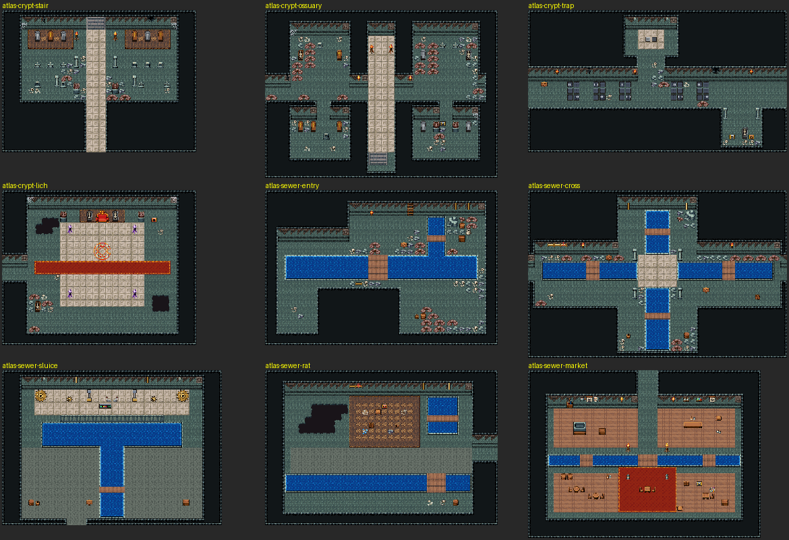

# 아틀라스 던전 — 적대적 시각 QA

매 10장 안팎마다 렌더(`tiledata/atlas-dungeons/images`)와 디버그 겹침(격자·입구·목표·출구·막힌 목표·고립 칸·가장 빈 화면)을
직접 보고 결함을 적는다. 기계 검사: 도달성(입구→목표·출구, 고립 바닥 0), 빈칸 게이트
(`emptiness.py --kind dungeon`, 최대 빈 정사각 ≤4, 한 화면 ≤40%), strictFloor(액체·겹침·벽면 소품 위치).

## 1회차 — 해적 소굴 + 시작의 동굴 3 + 버려진 은광 6

| 맵 | 결함 | 조치 |
|---|---|---|
| dungeon-pirate-cove | 배가 널판 뗏목(가짜 배) | 푸른물결항 3돛 범선(30×11) 스탬프로 교체, 난간 틈 2칸 + 널다리로 승선 |
| dungeon-pirate-cove | 입구가 벽면 줄 위 | (0,7) 로 이동 |
| dungeon-pirate-cove | 앞 갑판이 닿지 않음 / 갑판 한 칸 고립 | 뒷갑판 계단 통행 가능으로, 고립 칸 막음 |
| dungeon-pirate-cove | 대포 포구가 물 위로 삐져나옴 | 난간으로 교체 |
| dungeon-pirate-cove | 떠 있는 바위 덩이가 사라짐(40칸 미만 공허 → 바닥) | 바위 덩이 삭제, 벽에 붙인 돌출부로 |
| dungeon-pirate-cove | 남서 동굴이 끊겨 보물 고립 | 동굴 삭제, 보물을 북서 야영지로 |
| atlas-mine-shaft | 동굴 시트에서 `c` 는 구덩이가 아니라 물 | 금테 구덩이 `o` + 새 널다리 `$` |
| atlas-mine-core | P 단 가운데 타일이 그루터기(보스 자리) | D 단으로 교체 |
| (은광 전반) | 소품이 물 위·덩이 가장자리 밖에 놓임 | strictFloor: 액체·겹침 금지, 반경 3 안 빈칸으로 옮김(경고 기록) |
| (은광 전반) | 고립 칸을 290(통행 가능 돌)로 메워 여전히 고립 | 물가면 물로, 아니면 막히는 int:rocks 로 |
| (동굴 전반) | 넓은 동굴 바닥이 게이트 실패(한 화면 50%+) | 방 + 통로 구조로 다시 그리고 벽 사이 암반을 늘림, 모자라면 벽에 붙는 큰 조각 우선 채움 |

## 2회차 — 망자의 지하 묘지 5 + 옛 왕도 하수도 5

| 맵 | 결함 | 조치 |
|---|---|---|
| atlas-crypt-noble | 석관이 바닥에 흩어진 듯 보이고 빈칸 채움이 석관 사이에 잔해를 뿌림(한 화면 57%) | 석관 줄마다 낮은 단(D)을 깔고 양끝 부장 항아리, 신랑은 판석(q) + 붉은 카펫, 채움 끔 → 26% ([겹침](qa1-crypt-noble-overlay.png)) |
| atlas-crypt-noble | 북쪽 "올라가는 계단 자리" 출구에 계단 그림이 없음(가짜 출구) | 북서 벽면에 돌계단(^)을 그리고 그 앞을 입구로 |
| atlas-crypt-ossuary | 남쪽 계단이 맵 끝 바닥 위 + 난간이 쇠창살 그림 | 회랑 끝 안쪽에 내려가는 돌계단(_)만, 난간 삭제 |
| atlas-crypt-ossuary | 화로가 회랑 밖 공허 칸에 놓임 | 회랑 안 (16,5)/(19,5) 로 |
| atlas-crypt-trap | 보상 방이 쇠창살 뒤 → 목표·바닥이 고립 | 창살 대신 문기둥 석주 둘, 방 안으로 걸어 들어감 |
| atlas-crypt-lich | 옥좌·열린 석관이 벽면 줄에 걸침 | 단 위 첫 걷는 줄로 옮김 |
| atlas-sewer-cross | 가운데 교차 "돌다리"가 사방 물에 떠 있어 목표 3곳 막힘 | 무늬 석판 교차 광장으로(양쪽 턱과 이어짐), 남북 출구는 턱 위로 |
| atlas-sewer-sluice | 저수로가 방 폭 전체를 막아 남쪽 81칸 고립 → 공허로 메워짐 | 저수로 양옆에 턱을 남기고 방을 줄임, 남쪽은 물길 양옆 턱으로만 들어옴 |
| atlas-sewer-sluice / rat | 젖은 바닥(k) 넓은 판이 회색 빈 판으로 보임(게이트만 속이는 칠) | k 판 삭제, 방 높이를 줄이고 관리인 짐·모험가 짐으로 채움 |
| atlas-sewer-market | 북쪽 통로 5칸 폭 + 좌판 사이 빈 칸(최대 빈 정사각 5) | 통로 3칸, 좌판 널마루를 통로까지 넓힘 |

남은 약점: 하수도 들머리·해골 회랑의 빈칸 채움 잔해(붉은 돌무더기)가 벽을 따라 줄지어 보인다.
