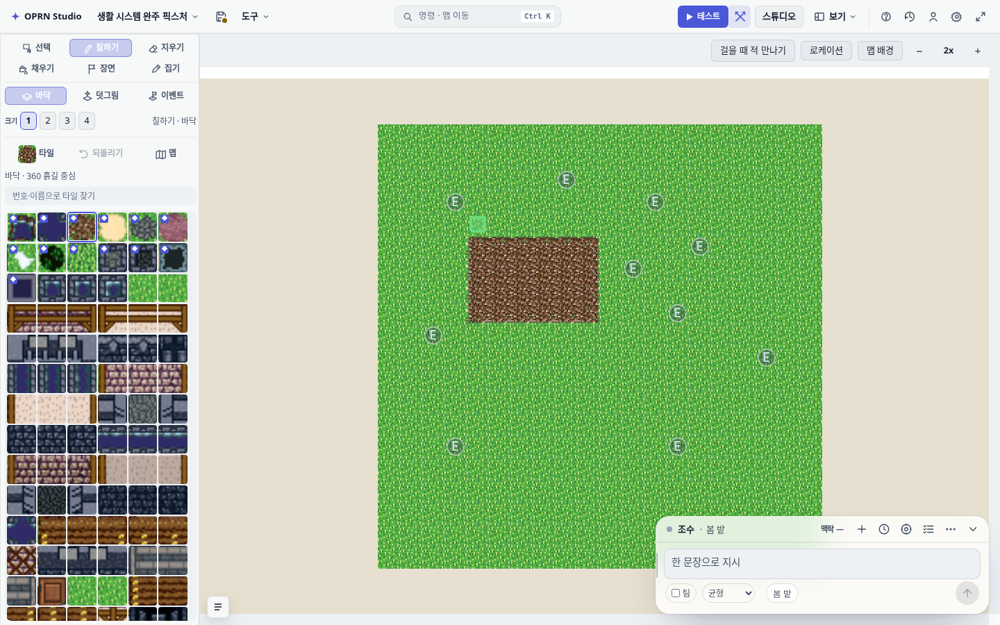

# 브라우저 탭이 로컬 폴더 정본을 연다 — 실측

- 서버: http://127.0.0.1:43487 (127.0.0.1 전용, 토큰으로 보호)
- 프로젝트 폴더: /tmp/oprn-web-canon
- 브리지: window.oprn (HTTP 전송, closeIsHostDriven=false)
- status: ready / projectDir 일치: true
- 편집기 부팅: edit-canvas true, db-required-panel false
- 프로젝트 저장: saved (리비전 1 → 3)
- **브라우저가 쓴 자산**: 4c4b6a3be131… — 폴더의 파일 존재 true, assets 표 기록 true, HTTP 재서빙 일치 true
- **브라우저가 남긴 커밋**: "브라우저 탭이 남긴 기록" — commits 0 → 2
- 제목(참고): "생활 시스템 완주 픽스처" → "생활 시스템 완주 픽스처" — 살아 있는 편집기의 자동 저장이 같은 문서를 쓰므로 제목 한 줄은 경합한다(자산·커밋·리비전이 경합 없는 증거다).
- 4xx/5xx 응답: 409 /rest/v1/map_edit_locks ×2, 404 /auth/status ×2, 405 /__oprn/edit-activity ×1

위 4xx 는 정본 경로 밖이다 — `/rest/v1/map_edit_locks` 는 원격 전용 기능(Supabase 설정이 있을 때만)이고,
`/auth/status`·`/__oprn/edit-activity` 는 아직 vite 플러그인으로만 있는 동반 서비스 엔드포인트다(설계 7.4).
읽기·쓰기·자산·백업은 모두 브리지로 통과했다.

