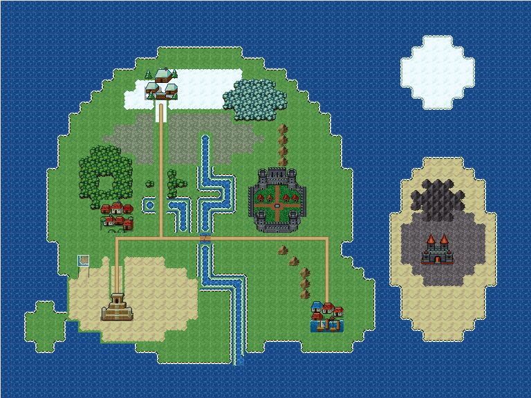
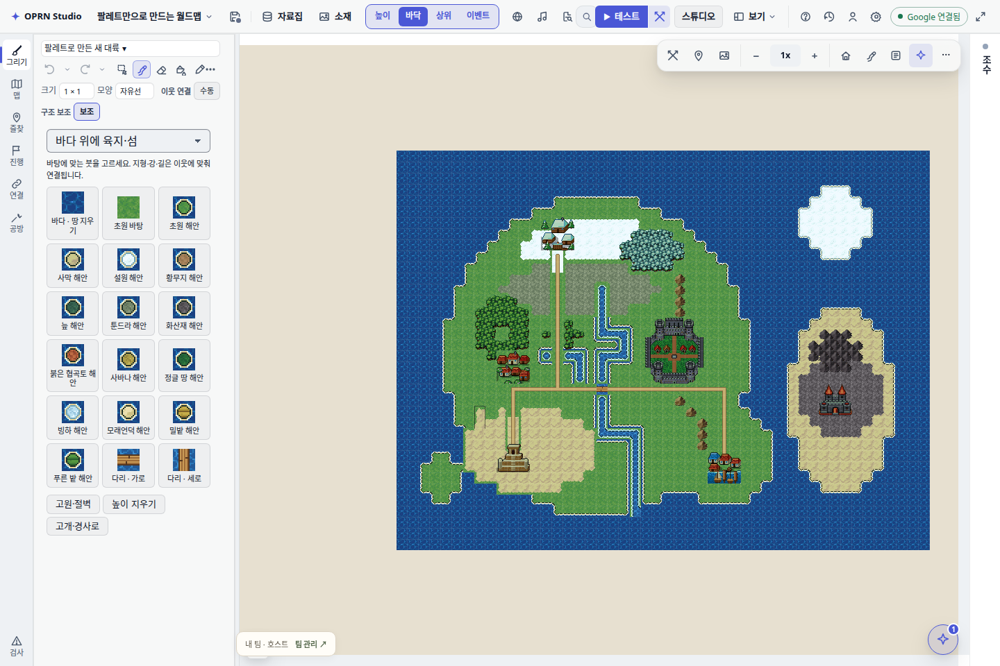

# 월드맵 팔레트 저작 · 2026-10-05

## 결과

바다만 있는 48×36 맵에서 실제 에디터 팔레트·마우스로 육지/섬, 설원/사막/화산재,
강, 투명 숲/산, 길, 다리, 승인된 거점 6개를 배치했다. 높이 5칸과 경사로 2칸도 실제 relief 데이터다.
전체 지도 가져오기·edit_world_terrain·브라우저 store 직접 쓰기를 사용하지 않았다.
관찰은 읽기 도구(get_project_summary/show_map_region)와 SQLite 조회다.





## 정본 저장과 재로드

| 대상 | 값 |
|---|---|
| 새 저작 프로젝트 | `d37612d4-9453-4395-8a09-fe65a7192e01` |
| 저장 폴더 | `/home/main/z-project/rpg-zzu-worldmap-iconsets/qa-runs/worldmap-authoring-20261005/project-r7` |
| 저장소 | 위 폴더의 `project.sqlite` + `assets/` |
| 맵 | `map_43fedda3-401a-4420-a7bf-cac983a82297` · 팔레트로 만든 새 대륙 |
| 최종 revision | 9 |
| SHA256 | `d4d2503bf41038c9c308a5469dc07e8462cfb9632b961eff8061aaf504f013da` |
| 재로드 | 새 브라우저 context의 실제 project.load 응답 및 SQLite 맵 전체가 저장 결과와 일치 |

[native.json](native.json)은 빈 지도부터 거점 배치까지의 원본 기록이다.
첫 높이 시도는 작은 십자 언덕에 폭 2 경사로를 놓아 거부됐다(해당 기록의 ramps=0).
월드맵 고개 붓 기본 폭을 1칸으로 고친 뒤 같은 지도에서 실제 팔레트로 배치했다.
[native-height.json](native-height.json)에 ramps=2, 지면/거점/높이 배열 보존, 저장/새 context 재로드 일치가 있다.
완료 근거는 두 기록과 최종 맵 감사 결과를 함께 사용한다.
현재 전체 저작 실행기는 경사로가 0칸이면 실패한다.

기존 「서녘 대륙」에는 새 공용 붓을 뒤에 추가했다.
프로젝트 `65d2e492-1fbf-43ef-8895-9c82427ed6ea`, 저장 폴더
`/home/main/z-project/rpg-zzu-worldmap-iconsets/qa-runs/harnesses/assistant-capability/worldmap-film-20261005-03/default/project`,
revision 15 / SHA256 `5d95a70e0b7b5c913fcdf59cfc3102b3042daab315ddfbf6f955f035ab39ba2a`.
[canonical-original.json](canonical-original.json): 기존 모든 맵 배열 일치, 칸 통행 차이 0,
네 방향 이동 차이 0, 저장소를 닫고 다시 열어 맵/문서 일치.
원격 LegacyDb/Supabase에 쓰지 않았다.

## 공용과 도구

- 공용 지형 PNG 3,543칸 / 연결 그룹 77개 / 대표 붓 79개 / 기존 사람이 승인한 판타지 거점 36개.
- 8방향 256 입력을 47개 경계 상태로 연결하고, 길은 16개 사방 연결을 사용한다.
- 새 프로젝트와 기존 생성 맵에 배선한다. 참고문서 80개를 60/20 두 용도로 나누며 이미지 바이트는 정적 에셋 경로다.
- [common-source.json](common-source.json): 실제 SQLite에서 추출한 사전과 번들 일치,
  79개 좌표 사전/3,528칸/18,992개 입력 마스크 검증, PNG 해시와 투명 숲/바다 막힘 확인.
- [tools.json](tools.json): create_map의 바다 바탕, fill_region의 해안/강/길/위층 숲 연결,
  설치 반복 시 중복 없음. 직접 도구 실행이며 새 모델 호출 기록은 아니다.
- [regeneration.json](regeneration.json): 최소 코드 fixture에서 재료 칸 수가 바뀌어도
  손으로 놓은 공용 지형/숲이 같은 소스 칸과 연결 그룹으로 남고 이식이 중복되지 않는다.
- [saved-map-audit.json](saved-map-audit.json): 실제 최종 저장 지도에서 거점 6개의 원본 전체 배열 일치,
  바다/강 막힘, 다리 통행, 마을→수도 도로 연결. 다리를 강으로 바꾼 사본에서는 그 도로가 끊긴다.

아래층 경계 붓은 선택한 바탕(바다/초원/사막/설원)을 포함한다.
숲/산은 투명 위층이며 아래 땅을 보존한다. 다른 바탕을 자동 추정하지 않는다.
기존 대륙의 자연스러운 고원/해안 전체를 새 붓이 똑같이 재현한다는 근거는 아니다.

## 영상과 실행

MP4: `/home/main/.codex/visualizations/2026/10/04/01a10489-8664-78a0-a938-e3e94c281bb4/worldmap-authoring/palette-authoring.mp4`

69.6초 / 1600×1004 / H.264 / 1배속. 실제 네이티브 UI 저작 두 녹화에서
기동/대기와 초기 높이 시도를 잘라 이어 붙였다. 첫 녹화의 초기 높이 작업은 원본/receipt에 남는다.
후반은 수정한 폭 1 고개의 실제 배치와 저장이다. 마지막 실제 프레임을 3초 유지했다.
[recording.json](recording.json)에 원본 경로와 정확한 구간이 있다. 새 AI 모델 실행 영상은 아니다.
앞서 조수가 기본 월드맵/포켓몬풍 지도를 만든 실제 MP4는 `worldmap-assistant-proof` 산출물에 보존되어 있다.

실행 입구:

```bash
OPRN_QA_BROWSER=chromium node scripts/qa/worldmap-palette-authoring-native.mjs <실제 프로젝트 폴더> <산출 폴더>
node scripts/qa/worldmap-palette-height-native.mjs <같은 실제 프로젝트 폴더> <산출 폴더>
```

`npm run build:packaged` exit 0. 마지막 코드 빌드는 폭 1 경사로 선택을 포함한다.
전체 gates/vitest/typecheck는 세션 실행 제한에 따라 돌리지 않았다.
실패한 네이티브 촬영 r1~r8은 qa-runs에 보존한다. 네트워크 오류, 전체 프로젝트 미러의 브라우저 메모리 초과,
촬영 스크립트의 숫자/미러 형식 오류, 조수 패널이 배율 버튼을 가린 경우를 성공 근거로 쓰지 않았다.
