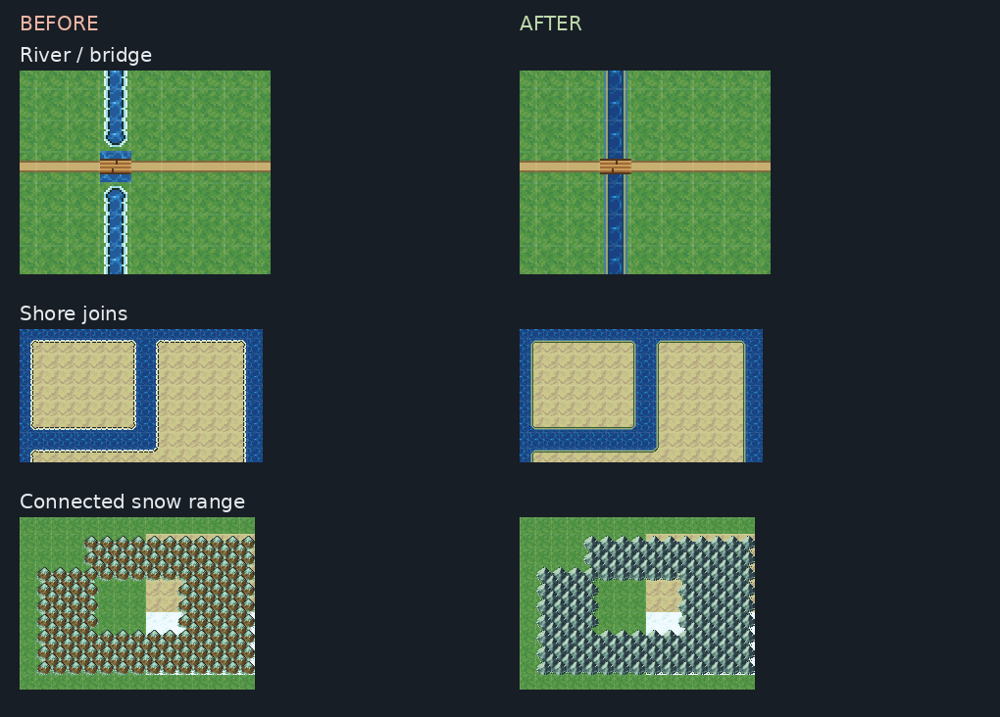

# 월드맵 오토타일 적대적 시각 QA — 2026-10-05

검수 대상은 PR #2177의 재사용 월드맵 팔레트다. 기존 완료 영수증을 합격으로 간주하지 않고 실제 편집기와 출하 플레이어를 다시 열었다. `before-after.png`는 실제 편집기 캡처를 확대·배열한 비교 그림이다. 독립 렌더러로 대체하지 않았다.



## 실제로 발견한 결함과 수정

| 결함 | 근거 | 수정 |
|---|---|---|
| 해안 사분면 접합에 틈·밝은 액자 | 외곽과 직선의 두 접합면에서 픽셀 기호 6개 불일치 | 명시 격자의 접합을 `o o f e i . . .`로 통일, 물빛·기슭·그늘 색으로 조정 |
| 다리 앞에서 강이 닫힘 | 이전 저장 지도/검수 지도에 강 6칸 잘못된 끝 모양 | 강·다리의 물 연결을 통합, 다리 밑 수면도 47상태로 저작 |
| 강→바다 입구의 사각 색 차이 | `before-mouth.png`, 수정 후 `after-final/water.png` | 강과 바다의 수면 질감 통일 |
| 용암/독수에 파란 물 경계 | 실제 액체 검수 지도 | 용암·독수 재료별 경계/거품/그늘 색 |
| 거점을 찍은 뒤 숲 모서리가 남음 | 이전 정본 숲 4칸 연결 불일치 | 정확 스탬프 안쪽은 보존하고 바깥 숲·산만 재연결; native·구조물 도구·층 블록·지우기에 반영 |
| 설산 면이 고립 봉우리의 바둑판이 됨 | `before/forest.png`와 47상태 검수 | 연결 산맥 윤곽과 명시 눈 팔레트 사용 |
| 거점 ‘이 자리 지우기’가 주변 숲을 복원하지 못함 | `stamp-restore-before/native.json`: 실제 우클릭 복원 `undoExact:false` | 복원/다시 찍기의 바깥 연결도 재계산, 복원한 안쪽 원본 번호는 보존 |

기존 소스 0…3542와 사람 선택 아이콘 번호를 유지했다. 새 다리 변형 280칸을 뒤에 추가해 소스 3,823칸 / 대표 붓 83개가 됐다. 기존 프로젝트의 아이콘 이식 슬롯과 새 소스 슬롯이 겹치면 새 타깃 주소에 이식하며, 아이콘 그림·메타·통행을 덮지 않는다. 새 프로젝트와 기존 프로젝트의 배선은 모두 멱등으로 확인했다.

## 검수 범위와 결과

- 실제 편집기 네 지도: 해안의 고립·대각·1칸 지협·U자/오목 만·호수 구멍·맵 끝·혼합 바닥; 강의 십자·가로/세로 다리·1/2칸 하구·용암/독수; 숲/산 9종과 초원/사막/설원; 길 16상태와 바탕 경계.
- 소스 그림의 47상태 × 해안/강/숲/산/설산 = 235개 3×3 문맥을 실제 열어 검수했다. `source-contact/`는 **원본 아틀라스 검토 시트**이며 native 캡처로 주장하지 않는다.
- 독립 낱말/8방향 좌표 계산은 production mask/shape 함수를 호출하지 않는다. `before/audit.json`의 잘못된 10칸과 접합 기호 6개 → `after-final/audit.json`에서 3,689칸 검사 / 불일치 0 / 접합 불일치 0.
- `after/native.json`: 실제 팔레트/마우스/키보드로 다리 지우기, 해안 파기, 위층 지우기, 전체 마을 키트 찍기, undo/redo. 정확 원복·아래층 보존·새 브라우저 재로드 확인. 최종 그림은 `after-final/`에 있다.
- `tools.json`: production `stamp_layer_block`와 `tile_erase` 직접 호출에서 정확 9칸 스탬프와 바깥 숲 연결, 아래층 보존 확인. **이번 도구 검수는 새 모델 호출이 아니다.**
- 구조물 우클릭 복원: 수정 전 정확 원복 실패 → 수정 후 정확 원복·바닥 보존·저장 revision 14·새 브라우저 동일 SHA 통과. 수정 전/후 기록은 `stamp-restore-before/`, `stamp-restore-after/`다. 검수 작업은 undo로 돌려놓고 저장·새 브라우저 재로드한다.
- 출하 플레이어 11개 비트 통과 / 런타임 오류 0. 결과는 [`runtime/SUMMARY.md`](runtime/SUMMARY.md), 실제 입력/좌표는 [`runtime/manifest.json`](runtime/manifest.json)이다. 편집기의 Play 버튼을 사용하지 않았다. 오프닝 종료 뒤 가로·세로 다리의 진입·물 방향 차단·반대편 도착을 검사한다.

## 정본 저장 대상

콘텐츠 설치는 실행 중인 DB에 직접 SQL로 쓰지 않고, 닫힌 프로젝트를 official local-store API로 열어 백업→저장→닫기→재로드했다. `canonical-r1.json`에는 최초 수정한 강 2칸·숲 4칸이 기록되어 있다.

| 대상 | project id | 저장/재로드 근거 |
|---|---|---|
| 팔레트로 만든 새 대륙 | `d37612d4-9453-4395-8a09-fe65a7192e01` | `qa-runs/worldmap-authoring-20261005/project-r7/project.sqlite`, 최종 revision 11, `canonical.json` |
| 기존 서녘 대륙 | `65d2e492-1fbf-43ef-8895-9c82427ed6ea` | `qa-runs/harnesses/assistant-capability/worldmap-film-20261005-03/default/project/project.sqlite`, revision 17, `original-preserved.json`; 기존 지도 배열 전부 동일 |
| 네 적대적 검수 지도 복사본 | `e1fb8b8b-f276-4158-a378-de9dc15da5b1` | `qa-runs/worldmap-autotile-visual-20261005/after-project/project.sqlite`; native 기록의 저장 SHA와 새 브라우저 load SHA를 직접 비교 |

새 대륙 정본 SHA256: `4983c246460c7f7799213bfa177a9bf61f62599320701dfbd2fecb20f4fa46ec`.
검수 프로젝트 문서 SHA256: `6b0bb7c2d11bbbc50eb07824fd6e5c481b1227cfb0e78e05484e50bbc9acc4af`.
이벤트·relief·아이콘 이식·다른 지도는 보존됐고, LegacyDb/Supabase에 새 사본을 쓰지 않았다.

## 실행 중 발견한 내보내기/검수 문제

원본 editor JSON은 약 111MiB였다. official `prepareWebExport`에서도 사용하지 않는 355개 타일셋이 남아 약 90MiB여서 Chromium이 타이틀에서 종료했다. `webExport.ts`는 실제 맵의 타일셋과 이식 원본의 전이 의존성만 복제하게 바꿨다. 현재 공식 내보내기는 **15,004,914 bytes**, 6개 지도·3개 타일셋이다. `export-checked.json`에 지도 전체 동일성, 이식 원본 보존, 타일셋 목록과 업로드 파일 62개의 바이트/SHA가 있다. 저작 프로젝트 원본은 축소하지 않았다.

초기 실패를 합격으로 덮지 않았다.

- `after/native-r1-failed.json`: 저장 영수증보다 일찍 재로드한 검수 순서 문제. 저장 완료와 실제 바닥/위층 비교를 기다린 뒤 재검사했다.
- `runtime-dev-failed/`, `runtime-raw-failed/`: 큰 editor 문서 부팅 실패.
- `runtime-assets-input-failed/`: QA 복사본의 이미지 ref에 해당하는 파일을 누락해 404가 발생했다. fixture 작성기가 official asset API로 바이트도 복사하게 수정했다.
- `runtime-opening-input-failed/`: 오프닝이 끝나기 전 강제로 지도를 바꿔 입력 잠금을 검사한 잘못된 순서. 오프닝을 실제 키 입력으로 끝내고 handoff 제거를 기다린다. 다리 통행 결함으로 오인하지 않았다.
- `runtime-opening-sequence-failed/`: 시작 Enter를 두 번 보내 첫 장면을 건너뛴 검수 순서 문제. 오프닝 표면을 기다린 다음 실제 Escape로 종료하도록 수정했다.
- `stamp-restore-before/`: 실제 제품의 복원 결함. 새 수정 전/후를 별도 기록한다.

## 재실행

저장 대상은 먼저 닫고 실행한다. 전용 QA 복사본과 task 전용 패키지를 쓴다.

```bash
npx tsx scripts/qa/worldmap-autotile-visual-fixture.mts <원본 프로젝트 폴더> <별도 QA 프로젝트 폴더> <증거 폴더>
node scripts/qa/worldmap-autotile-visual-native.mjs <QA 프로젝트 폴더> <native 증거 폴더>
node scripts/qa/worldmap-autotile-visual-native.mjs <QA 프로젝트 폴더> <복원 증거 폴더> stamp-remove-only
npx tsx scripts/qa/worldmap-autotile-visual-audit.mts <QA 프로젝트 폴더> <audit.json>
python3 scripts/qa/worldmap-autotile-contact.py <소스 검토 폴더>
npm run build:packaged
npm run build:player
npx tsx scripts/qa/worldmap-autotile-export.mts <QA 프로젝트 폴더> <shipping.json> <export.json> <패키지 폴더> [누락 이미지가 있는 원본 프로젝트 폴더]
# 패키지 폴더에는 dist/export-player의 플레이어 파일과 내보내기 에셋을 함께 제공한다.
node scripts/qa/worldmap-autotile-runtime-packaged.mjs <shipping.json> <runtime 증거 폴더> <패키지 폴더>
```

빌드와 이 주제의 실제 브라우저 QA를 실행했다. 전체 gates/vitest/typecheck는 프로젝트 세션 규칙에 따라 실행하지 않았다.

## 남은 시각적 판단

현재 범위의 연결·편집·복원·저장·게임 통행 결함을 검사한 결과다. 16px 질감 반복과 기존 거점/지형의 미적 조화까지 최종 상용 아트로 합격시킨 것은 아니다. 공용 붓 83개 전부와 17개 세계관의 모든 조합을 육안 검수했다고 주장하지 않는다. 승인 아이콘을 새로 그리거나 대신 선택하지 않았다.
