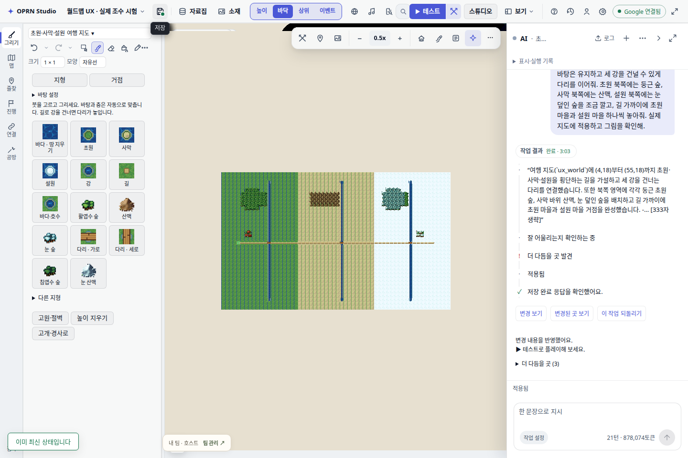
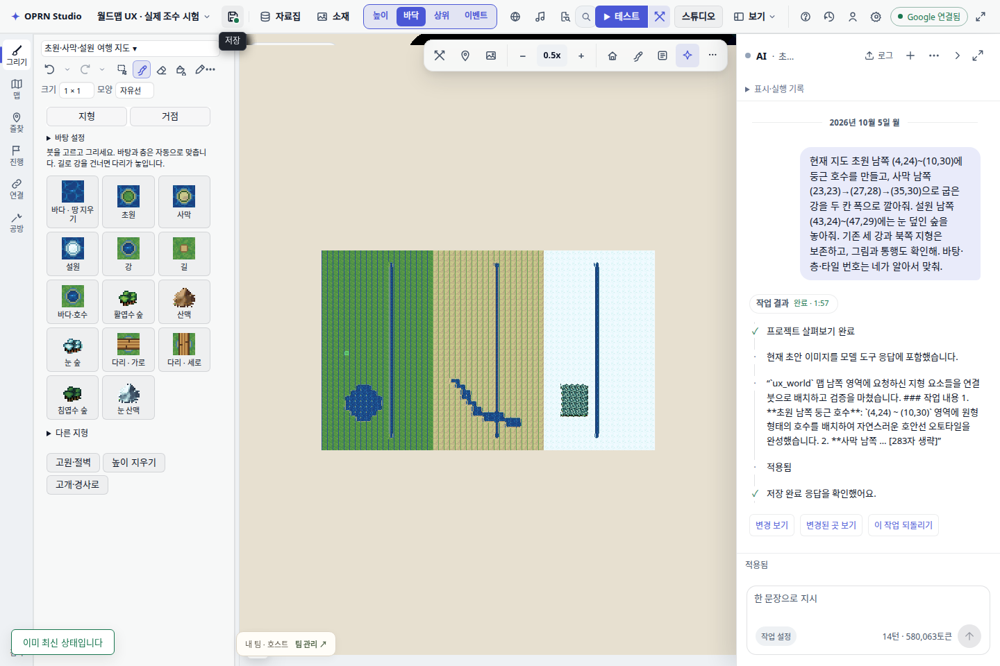
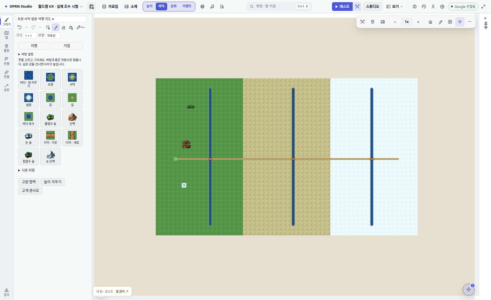
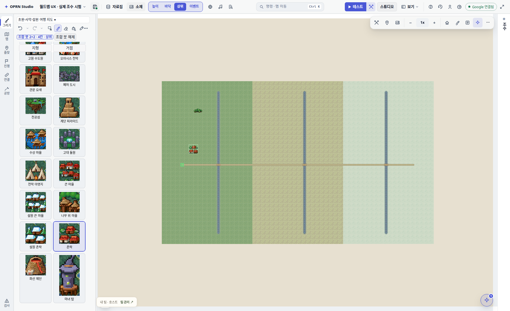

# 월드맵 자동 붓 · 실제 AI 조수 UX 검수

2026-10-05. `gemini-3.8-flash` 제품 기본 모델, 실제 native 입력창/전송 버튼과 `/v1/agent/run`을 사용했다.
모델 전송·답변을 대체하지 않았다. 도구 이벤트/모델/프롬프트는 `assistant-proof.json`, `varied-proof.json`에 있다.

## 변경

- 지형/거점 탭, 자주 쓰는 지형 우선, 다른 지형/직접 바탕 설정 접기.
- 숲/산을 같은 선반에서 선택하면 층 전환. 거점은 전체 그림과 짧은 이름을 두 열로 표시.
- 바탕 자동이 기본: 길·강·호수는 초원/사막/설원에 맞는 변형을 칸마다 고른다.
- 길이 강을 건너면 진행 방향의 다리. 다리 지우기는 강, 길/강/호수 지우기는 원래 바탕.
- 지우개 뒤에 지형 붓을 고르면 칠하기로 복귀. 직접 바탕 설정은 유지.
- 조수는 현재 연결 붓 지도에 fill_region을 안내받고, 빠른 조립 문서 1 MD + 2 이미지를 읽는다.
  원/경로 채우기는 요청 마스크 밖으로 확장하지 않는다. 명시적 바탕 재료·정확 스탬프는 보존.
- 조수 오버레이가 열린 상태에서도 지도 배율/도구줄을 클릭할 수 있다.

## 실제 조수 결과

| 항목 | 처음 경로 | 개선 경로 |
|---|---:|---:|
| 도구 완료 이벤트 | 86 | 40 |
| 배치 호출 | 16 | 7 |
| 52칸 횡단 길 + 세 다리 | 바탕별 길 6회 + 다리 3회 이상 | fill_region 1회 |

첫 실행의 `author_world_bridge`는 다른 칩셋 전용이라 실패했다. 모델은 이후 수동 재료로 시공했다.
계획 턴에서 쓰기 도구가 범위 밖이라는 응답은 정상 계획 제한이며, 실행 단계에는 쓰기 도구가 열린다.
개선 경로: 52칸의 재료/바탕과 좌우 통행 모두 일치, 경로 밖 아래층 보존.
숲/산/거점은 위층, 두 거점의 원본 배열은 제품 inspect 도구에서 일치.
모델이 설원에 일반 숲을 먼저 놓고 그림을 본 뒤 눈 숲으로 수정한 과정도 원본 이벤트에 남겼다.
호수·곡선 강·설원 숲의 별도 시험은 원 마스크 37칸(불일치 0), 새 강의 사막 바탕 일치,
설원 숲 30칸, 기존 세 강 보존을 별도 저장 데이터로 확인했다(`varied-audit.json`).






## native 손 편집

`native.json`: 8항목 모두 true, page error 0.
조수 펼친 채 배율 선택 / 세 바탕 길·다리 / 숲 층·바닥 보존 / 전체 거점 배열 /
다리 지우기 / undo / 직접 바탕 설정 / 전체 context 종료 후 SQLite 재로드.
초기 오버레이 인터셉트와 지우개에서 붓 전환 실패도 보존했다.
`native-initial-failure.json`, `overlay-initial-failure.json`.

## 정본 저장과 재로드

호스트가 관리하는 SQLite API로 UI 저장, 전체 브라우저 context 종료 후 실제 project.load 응답과 maps를 비교했다.
모든 자체 호스트는 종료했다. 파일은 저장소 밖 공유 정본을 덮지 않는 독립 시험 프로젝트다.

| 작업 | project id | 저장 폴더(이 워크트리 기준) | revision | 재로드 |
|---|---|---|---:|---|
| 횡단 길·거점 | d73b111f-1dd9-4cea-ae1b-9105704010c0 | qa-runs/worldmap-brush-ux-20261005/automatic/project | 7 | 일치 |
| 호수·곡선 강·설원 숲 | fc38705e-4f30-4b72-af1f-2e44177f4ebf | qa-runs/worldmap-brush-ux-20261005/varied/project | 7 | 일치 |
| native 손 편집 | e92cdb03-69df-4c0f-9ce1-47c51554bb23 | qa-runs/worldmap-brush-ux-20261005/native-fixed/project | 9 | 일치 |

저장 SHA는 각 proof/native JSON에 있다. 처음 경로의 저장은 성공했으나 renderer 번들을 교체하는 중
옛 호스트의 새 context가 로드에 실패했다. 이 실행의 재로드를 통과로 세지 않았다(`baseline-proof.json`).
새 자료의 공용 배포는 번들 `worldmapAuthoringReferences.json` + worldmap_selected ensure 경로다.
현재 새/기존 프로젝트에 wmi-authoring-auto가 들어오는 실제 호스트 로드도 확인했다.

## 재현

```sh
npx tsx --tsconfig tsconfig.json scripts/qa/worldmap-ux-fixture.mts <독립 폴더>/project
npm run build:packaged
node scripts/qa/worldmap-ux-live.mjs <독립 폴더> '<자연어 프롬프트>'
node scripts/qa/worldmap-ux-native.mjs <별도 손 편집 폴더>
```

실제 시트 출처는 정본 r7의 참고문서를 export-tileset-references로 추출해 읽고 실제 그림을 열었다.
빌드 성공. AGENTS의 이번 세션 테스트 실행 제한에 따라 gates/vitest/typecheck는 실행하지 않았다.
이미 승인된 그림·아이콘·타일 번호는 바꾸지 않았다.

## 남은 범위

- 자동 배경 그림은 제공된 초원/사막/설원 변형이다. 바다 횡단은 다리를 따로 설계한다.
- 모델의 첫 재료 선택까지 항상 옳다는 근거는 없다. 실제 시각/통행 검사가 필요하다.
- 이 기록의 도구 호출 감소는 두 고정 프롬프트의 실측이며 전체 요청 성공률이 아니다.
- native/조수 시험은 편집기와 저장 경로 검수다. 새 출하 player 게임 검수로 표기하지 않는다.
- 영상 원본: qa-runs/worldmap-brush-ux-20261005/automatic/assistant.webm. MP4는 이를 6배속으로 변환했다.
